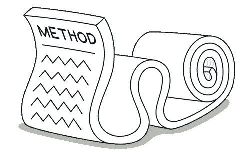
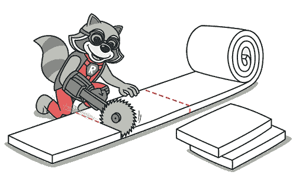
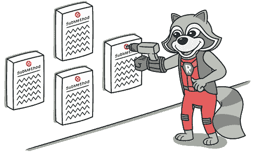

# 长方法

> 原文：[`refactoringguru.cn/smells/long-method`](https://refactoringguru.cn/smells/long-method)

### 症状和征兆

方法包含的代码行数过多。一般来说，任何超过十行的方法都应该引发你的疑问。

### 问题原因

就像加州旅馆一样，方法总是不断添加内容，但从未删除任何东西。由于编写代码比阅读它更容易，这种“味道”在方法变成丑陋的过大怪物之前往往不会被注意到。

在心理上，创建一个新方法通常比向现有方法添加内容更难：“但这只是两行，没必要为此创建一个完整的方法……”这意味着又添加了一行，然后又一行，最终产生了纠缠的意大利面代码。

### 处理

一般经验法则是，如果你觉得需要对方法内部的某些内容进行注释，应该将这段代码提取到一个新方法中。即使是一行代码，如果需要解释，也可以并且应该被拆分为一个单独的方法。如果这个方法有一个描述性的名称，没人需要查看代码来了解它的功能。

+   为了减少方法体的长度，使用提取方法。

+   如果局部变量和参数干扰了提取方法，可以使用用查询替换临时变量、引入参数对象或保留整体对象。

+   如果之前的方法都没有帮助，尝试通过用方法对象替换方法将整个方法移动到一个单独的对象。

+   条件运算符和循环是代码可以移动到单独方法的良好线索。对于条件，使用分解条件。如果循环妨碍了代码，尝试提取方法。

### 回报

+   在所有类型的面向对象代码中，方法简短的类最持久。方法或函数越长，理解和维护的难度就越大。

+   此外，长方法为不必要的重复代码提供了完美的隐藏空间。

### 性能

增加方法数量会影响性能吗？正如许多人所声称的那样？在几乎所有情况下，影响微乎其微，甚至不值得担忧。

此外，既然你有清晰易懂的代码，如果有必要，你更有可能找到真正有效的方法来重构代码并获得实际的性能提升。

</images/refactoring/banners/tired-of-reading-banner-1x.mp4?id=7fa8f9682afda143c2a491c6ab1c1e56>

</images/refactoring/banners/tired-of-reading-banner.png?id=1721d160ff9c84cbf8912f5d282e2bb4>

你的浏览器不支持 HTML 视频。

### 厌倦了阅读？

不奇怪，阅读我们这里所有文本需要 7 小时。

试试我们的交互式重构课程。它提供了一种更轻松的学习新知识的方法。

*让我们看看…*
