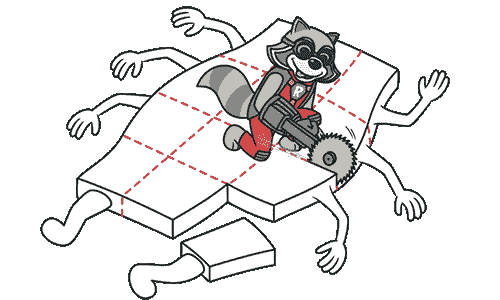
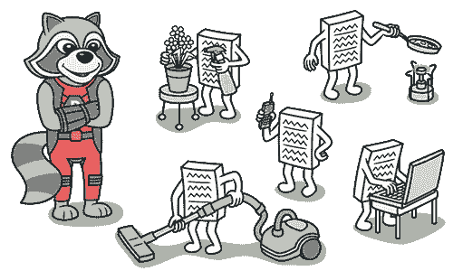

# 大型类

> 原文：[`refactoringguru.cn/smells/large-class`](https://refactoringguru.cn/smells/large-class)

### 征兆与症状

一个类包含许多字段/方法/代码行。

### 问题原因

类通常开始时很小，但随着程序的增长，它们会变得臃肿。

就像长方法一样，程序员通常发现将新功能放入现有类的心理负担较轻，而不是为该功能创建新类。

### 处理方案

当一个类承担太多（功能）角色时，考虑将其拆分：

+   提取类有助于当大型类的一部分行为可以分离为独立组件时。

+   提取子类有助于当大型类的一部分行为可以用不同方式实现或在少数情况下使用时。

+   提取接口有助于在需要列出客户端可以使用的操作和行为时。

+   如果大型类负责图形界面，您可以尝试将其部分数据和行为移动到一个独立的领域对象中。在此过程中，可能需要在两个地方存储一些数据的副本，并保持数据的一致性。重复观察数据提供了一种解决方法。

### 收益

+   对这些类的重构让开发人员不必记住类的大量属性。

+   在许多情况下，将大型类拆分成多个部分可以避免代码和功能的重复。

</images/refactoring/banners/tired-of-reading-banner-1x.mp4?id=7fa8f9682afda143c2a491c6ab1c1e56>

</images/refactoring/banners/tired-of-reading-banner.png?id=1721d160ff9c84cbf8912f5d282e2bb4>

您的浏览器不支持 HTML 视频。

### 厌倦阅读了吗？

难怪阅读我们这里所有文本需要 7 个小时。

尝试我们的交互式重构课程。它提供了一种不那么乏味的学习新知识的方法。

*让我们看看……*
