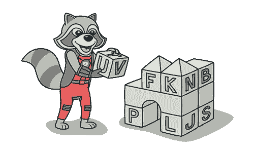

# 原始迷恋

> 原文：[`refactoringguru.cn/smells/primitive-obsession`](https://refactoringguru.cn/smells/primitive-obsession)

### 征兆和症状

+   为简单任务（例如货币、范围、电话号码的特殊字符串等）使用原始类型而不是小对象。

+   使用常量编码信息（例如常量`USER_ADMIN_ROLE = 1`以指代具有管理员权限的用户）。

+   将字符串常量用作数据数组中的字段名。

### 问题的原因

像其他大多数代码气味一样，原始迷恋是在脆弱时刻产生的。“只不过是一个存储数据的字段！”程序员说道。创建一个原始字段比创建一个全新的类要简单得多，对吧？于是就这样做了。然后又需要另一个字段，并以同样的方式添加。结果，类变得庞大而笨重。

原始数据类型常常用于“模拟”类型。因此，代替一个单独的数据类型，你拥有一组数字或字符串，形成某个实体允许值的列表。然后通过常量将这些特定数字和字符串赋予易于理解的名称，这就是它们广泛传播的原因。

另一个糟糕的原始使用示例是字段模拟。该类包含一个大型多样数据数组，且将字符串常量（在类中指定）用作获取此数据的数组索引。

### 处理方法

+   如果你有多种原始字段，可能可以将其中一些逻辑上分组到自己的类中。更好的是，将与这些数据相关的行为也移动到类中。为此任务，请尝试用对象替换数据值。

    

+   如果原始字段的值用于方法参数，请使用引入参数对象或保留整个对象。

+   当复杂数据被编码在变量中时，请使用用类替换类型代码、用子类替换类型代码或用状态/策略替换类型代码。

+   如果变量中有数组，请使用用对象替换数组。

### 收益

+   由于使用对象而非原始类型，代码变得更加灵活。

+   更好地理解和组织代码。特定数据的操作在同一地方，而不是分散开来。再也不用猜测这些奇怪常量的原因以及它们为何在数组中。

+   更容易找到重复代码。

</images/refactoring/banners/tired-of-reading-banner-1x.mp4?id=7fa8f9682afda143c2a491c6ab1c1e56>

</images/refactoring/banners/tired-of-reading-banner.png?id=1721d160ff9c84cbf8912f5d282e2bb4>

您的浏览器不支持 HTML 视频。

### 厌倦阅读？

难怪，阅读我们这里所有的文本需要 7 小时。

试试我们的交互式重构课程。这是一种不那么乏味的学习新知识的方法。

*让我们看看…*
