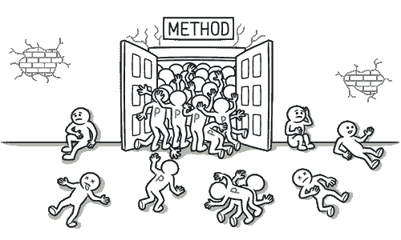

# 长参数列表

> 原文：[`refactoringguru.cn/smells/long-parameter-list`](https://refactoringguru.cn/smells/long-parameter-list)

### 征兆与症状

方法的参数超过三到四个。

### 问题的原因

在将几种类型的算法合并到一个方法中后，可能会出现长参数列表。长列表可能是为了控制将运行哪个算法以及如何运行而创建的。

长参数列表也可能是为了使类之间更独立而产生的副产品。例如，创建方法所需特定对象的代码已从方法中移动到调用该方法的代码中，但创建的对象作为参数传递给方法。因此，原始类不再了解对象之间的关系，依赖性减少。但如果创建多个这样的对象，每个对象都将需要自己的参数，这就意味着更长的参数列表。

随着列表的增长，这样的列表很难理解，变得矛盾且难以使用。方法可以使用其自身对象的数据，而不是长长的参数列表。如果当前对象不包含所有必要数据，可以将另一个对象（将获取必要数据的对象）作为方法参数传递。

### 处理

+   检查传递给参数的值。如果某些参数只是另一个对象的方法调用的结果，使用用方法调用替换参数。该对象可以放在其自身类的字段中，或作为方法参数传递。

+   与其将来自另一个对象的一组数据作为参数传递，不如将对象本身传递给方法，使用保留整个对象。

+   但如果这些参数来自不同的来源，可以通过引入参数对象将它们作为一个单一参数对象传递。

### 回报

+   更可读、更简洁的代码。

+   重构可能会揭示先前未注意到的重复代码。

### 何时忽略

+   如果这样做会导致类之间的不必要依赖，请不要去掉参数。

</images/refactoring/banners/tired-of-reading-banner-1x.mp4?id=7fa8f9682afda143c2a491c6ab1c1e56>

</images/refactoring/banners/tired-of-reading-banner.png?id=1721d160ff9c84cbf8912f5d282e2bb4>

您的浏览器不支持 HTML 视频。

### 读累了吗？

毫不奇怪，阅读我们这里的所有文本需要 7 小时。

尝试我们的交互式重构课程。它提供了一种更不乏味的学习新知识的方法。

*让我们看看…*
