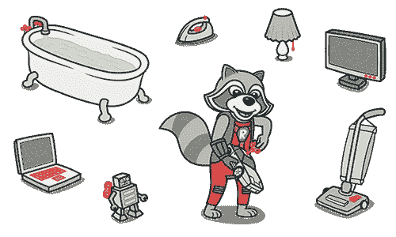

# `switch`语句

> 原文：[`refactoringguru.cn/smells/switch-statements`](https://refactoringguru.cn/smells/switch-statements)

### 征兆与症状

您有一个复杂的`switch`操作符或一系列`if`语句。

### 问题的原因

`switch`和`case`操作符的相对少用是面向对象代码的一个标志。单个`switch`的代码往往会分散在程序的不同位置。当添加一个新条件时，你必须找到所有的`switch`代码并进行修改。

一般来说，当你看到`switch`时，你应该考虑多态性。

### 处理

+   为了将`switch`隔离并放入正确的类中，您可能需要提取方法，然后移动方法。

+   如果`switch`基于类型代码，例如当程序的运行模式被切换时，请使用用子类替换类型代码或用状态/策略替换类型代码。

+   在指定继承结构后，请使用用多态性替换条件。

+   如果操作符中的条件不太多，且它们都以不同参数调用同一方法，那么多态性将是多余的。在这种情况下，您可以将该方法拆分为多个较小的方法，使用用显式方法替换参数，并相应地更改`switch`。

+   如果条件选项之一为`null`，请使用引入空对象。

### 收益

+   改善代码组织。

### 何时忽略

+   当`switch`操作符执行简单操作时，没有必要进行代码更改。

+   `switch`操作符通常由工厂设计模式（工厂方法或抽象工厂）使用，以选择一个创建的类。

</images/refactoring/banners/tired-of-reading-banner-1x.mp4?id=7fa8f9682afda143c2a491c6ab1c1e56>

</images/refactoring/banners/tired-of-reading-banner.png?id=1721d160ff9c84cbf8912f5d282e2bb4>

您的浏览器不支持 HTML 视频。

### 厌倦阅读了吗？

难怪，阅读我们这里所有的文本需要 7 小时。

尝试我们的交互式重构课程。这提供了一种不那么乏味的学习新知识的方法。

*我们来看看…*
