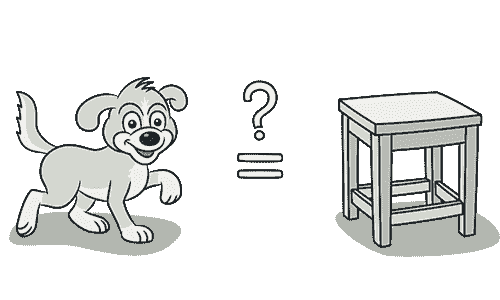
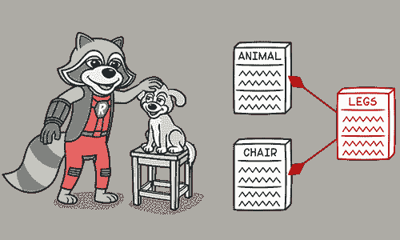

# 拒绝遗产

> 原文：[`refactoringguru.cn/smells/refused-bequest`](https://refactoringguru.cn/smells/refused-bequest)

### 征兆与症状

如果子类仅使用从父类继承的一部分方法和属性，层次结构就会失衡。未使用的方法可能被忽略或重新定义并引发异常。

### 问题的原因

有人仅仅因为想重用超类中的代码而激励自己创建类之间的继承关系。但超类和子类完全不同。

### 处理方法

+   如果继承没有意义，而子类与超类真的毫无关联，就应消除继承，转而使用用委托替代继承。

+   如果继承是合适的，请在子类中去掉不必要的字段和方法。从父类中提取子类所需的所有字段和方法，放入新的超类，并让两个类都从它继承（提取超类）。

### 回报

+   改善代码的清晰度和组织性。您将不再疑惑为什么`Dog`类继承自`Chair`类（尽管它们都有四条腿）。

</images/refactoring/banners/tired-of-reading-banner-1x.mp4?id=7fa8f9682afda143c2a491c6ab1c1e56>

</images/refactoring/banners/tired-of-reading-banner.png?id=1721d160ff9c84cbf8912f5d282e2bb4>

您的浏览器不支持 HTML 视频。

### 读书累了吗？

难怪，这里所有文本的阅读时间需要 7 小时。

尝试我们的交互式重构课程。它提供了一种不那么乏味的学习新知识的方法。

*让我们看看…*
