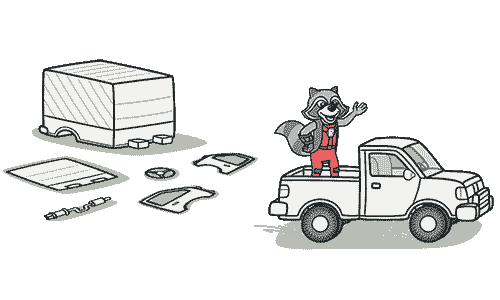

# 拥有不同接口的替代类

> 原文：[`refactoringguru.cn/smells/alternative-classes-with-different-interfaces`](https://refactoringguru.cn/smells/alternative-classes-with-different-interfaces)

### 症状与体征

两个类执行相同的功能，但方法名称不同。

### 问题的原因

创建其中一个类的程序员可能并不知道已经存在一个功能等效的类。

### 治疗

尝试用一个共同的分母来描述类的接口：

+   重命名方法 s，使它们在所有替代类中保持一致。

+   移动方法、添加参数和参数化方法，使方法的签名和实现保持一致。

+   如果类的功能只有部分重复，尝试使用提取超类。在这种情况下，现有类将成为子类。

+   在你确定使用哪种治疗方法并实施后，你可能能够删除其中一个类。

### 收益

+   你消除了不必要的重复代码，使得结果代码更加精简。

+   代码变得更加可读和易懂（你不再需要猜测创建第二个类的原因，而它执行与第一个类完全相同的功能）。

### 何时忽略

+   有时合并类是不可能的，或者困难到毫无意义。例如，当替代类在不同的库中，每个库都有自己的类版本时。

</images/refactoring/banners/tired-of-reading-banner-1x.mp4?id=7fa8f9682afda143c2a491c6ab1c1e56>

</images/refactoring/banners/tired-of-reading-banner.png?id=1721d160ff9c84cbf8912f5d282e2bb4>

你的浏览器不支持 HTML 视频。

### 读得累了吗？

不奇怪，阅读我们这里所有的文本需要 7 小时。

尝试我们的交互式重构课程。这提供了一种不那么乏味的学习新知识的方法。

*我们来看看…*
