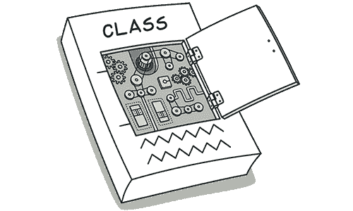
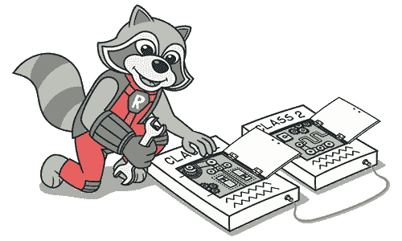

# 分歧变更

> 原文：[`refactoringguru.cn/smells/divergent-change`](https://refactoringguru.cn/smells/divergent-change)
> 
> *分歧变更*类似于霰弹手术，但实际上是相反的异味。*分歧变更*是指对单个类进行许多更改。*霰弹手术*指的是对多个类同时进行单个更改。

### 征兆与症状

当你修改一个类时，发现需要改变许多无关的方法。例如，添加新产品类型时，你需要更改查找、显示和订购产品的方法。

### 问题原因

这些分歧修改通常是由于糟糕的程序结构或“复制粘贴编程”造成的。

### 治疗

+   通过提取类拆分类的行为。

+   如果不同的类有相同的行为，您可能希望通过继承来合并这些类（提取超类和提取子类）。

### 收益

+   改善代码组织。

+   减少代码重复。

+   简化支持。

</images/refactoring/banners/tired-of-reading-banner-1x.mp4?id=7fa8f9682afda143c2a491c6ab1c1e56>

</images/refactoring/banners/tired-of-reading-banner.png?id=1721d160ff9c84cbf8912f5d282e2bb4>

你的浏览器不支持 HTML 视频。

### 厌倦阅读？

难怪，阅读这里所有文本需要 7 小时。

尝试我们的互动重构课程。它提供了一种更轻松的学习新知识的方法。

*让我们看看……*
