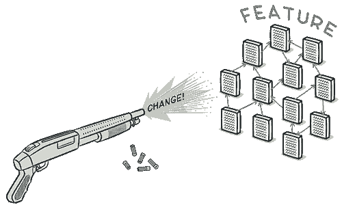
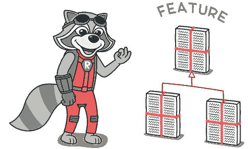

# 散弹手术

> 原文：[`refactoringguru.cn/smells/shotgun-surgery`](https://refactoringguru.cn/smells/shotgun-surgery)
> 
> *散弹手术*与 Divergent Change 相似，但实际上是相反的臭味。*Divergent Change*是指对单个类进行许多更改。*散弹手术*则是指对多个类同时进行单一更改。

### 征兆与症状

进行任何修改都需要你对许多不同的类进行许多小更改。

### 问题原因

单一责任被分割到大量类中。这可能发生在对 Divergent Change 的过度应用之后。

### 处理方法

+   使用移动方法和移动字段将现有类行为移动到单一类中。如果没有适合的类，请创建一个新的。

+   如果将代码移动到同一类使原来的类几乎为空，请尝试通过内联类消除这些现在多余的类。

### 收益

+   更好的组织。

+   更少的代码重复。

+   更容易维护。

</images/refactoring/banners/tired-of-reading-banner-1x.mp4?id=7fa8f9682afda143c2a491c6ab1c1e56>

</images/refactoring/banners/tired-of-reading-banner.png?id=1721d160ff9c84cbf8912f5d282e2bb4>

你的浏览器不支持 HTML 视频。

### 读得累了吗？

难怪，阅读我们这里所有文本需要 7 小时。

尝试我们的交互式重构课程，它提供了更少乏味的学习新内容的方法。

*我们来看…*
