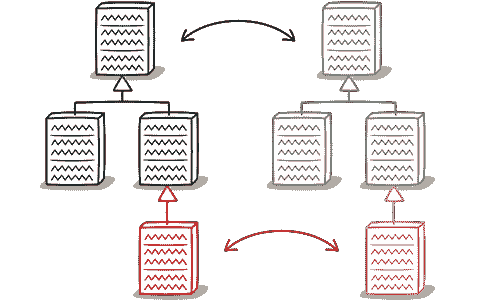
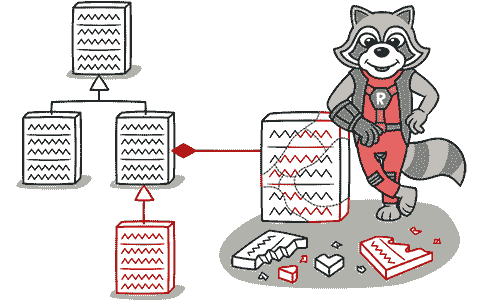

# 并行继承层级

> 原文：[`refactoringguru.cn/smells/parallel-inheritance-hierarchies`](https://refactoringguru.cn/smells/parallel-inheritance-hierarchies)

### 标志与症状

每当你为一个类创建子类时，你会发现自己需要为另一个类创建子类。

### 问题的原因

一切都很好，只要层级保持较小。但随着新类的添加，进行更改变得越来越困难。

### 处理方法

+   你可以通过两个步骤来去重并行类层级。首先，让一个层级的实例引用另一个层级的实例。然后，使用 移动方法 和 移动字段 来移除被引用类中的层级。

### 收益

+   减少代码重复。

+   可以改善代码的组织。

### 何时忽略

+   有时，拥有并行类层级只是为了避免程序架构中更大的混乱。如果你发现去重层级的尝试产生了更丑陋的代码，那就退出，撤回你所有的更改，习惯那段代码。

</images/refactoring/banners/tired-of-reading-banner-1x.mp4?id=7fa8f9682afda143c2a491c6ab1c1e56>

</images/refactoring/banners/tired-of-reading-banner.png?id=1721d160ff9c84cbf8912f5d282e2bb4>

你的浏览器不支持 HTML 视频。

### 厌倦阅读了吗？

难怪，阅读我们这里所有的文本需要 7 小时。

尝试我们的交互式重构课程。它提供了一种更轻松的方式来学习新知识。

*我们来看看…*
