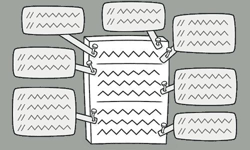
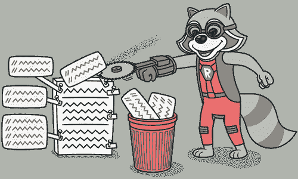

# 注释

> 原文：[`refactoringguru.cn/smells/comments`](https://refactoringguru.cn/smells/comments)

### 迹象与症状

方法中充满了解释性注释。

### 问题原因

注释通常是出于最好的意图而创建的，当作者意识到自己的代码不够直观或明显时。在这种情况下，注释就像是遮盖鱼腥味代码气味的除臭剂，这些代码是可以改进的。

> 最好的注释是方法或类的好名称。

如果你觉得没有注释就无法理解某段代码，请尝试改变代码结构，使得注释变得不必要。

### 处理方法

+   如果注释旨在解释复杂的表达式，则应使用提取变量将表达式拆分为易于理解的子表达式。

+   如果注释解释了一段代码，则可以通过提取方法将该部分代码转换为单独的方法。新方法的名称通常可以直接取自注释文本。

+   如果一个方法已经被提取，但仍然需要注释来解释该方法的作用，请给该方法一个自解释的名称。为此请使用重命名方法。

+   如果需要对系统正常工作所必需的状态进行规则断言，请使用引入断言。

### 收益

+   代码变得更加直观和明显。

### 何时忽略

注释有时是有用的：

+   当解释**为什么**以某种特定方式实现某个功能时。

+   当解释复杂算法时（当尝试了所有简化算法的方法但仍然无法奏效时）。

</images/refactoring/banners/tired-of-reading-banner-1x.mp4?id=7fa8f9682afda143c2a491c6ab1c1e56>

</images/refactoring/banners/tired-of-reading-banner.png?id=1721d160ff9c84cbf8912f5d282e2bb4>

您的浏览器不支持 HTML 视频。

### 读累了吗？

毫不奇怪，阅读我们这里所有的文本需要 7 小时。

尝试我们的交互式重构课程。这提供了一种不那么乏味的学习新知识的方法。

*让我们看看……*
