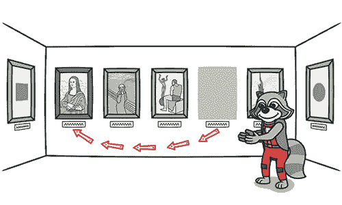

# 重复代码

> 原文：[`refactoringguru.cn/smells/duplicate-code`](https://refactoringguru.cn/smells/duplicate-code)

### 迹象和症状

两段代码片段看起来几乎相同。

### 问题的原因

重复代码通常发生在多个程序员同时在同一个程序的不同部分工作时。由于他们在处理不同的任务，他们可能不知道同事已经编写了可以满足自己需求的类似代码。

还有更微妙的重复，当代码的特定部分看起来不同但实际上执行相同的工作。这种重复可能难以发现和修复。

有时重复是故意的。当急于赶工期而现有代码“差不多合适”时，初级程序员可能会忍不住复制粘贴相关代码。在某些情况下，程序员只是懒得整理代码。

### 处理方法

+   如果在同一类中的两个或多个方法中发现相同代码：请使用提取方法，并在两个地方调用新方法。

    

+   如果在同一层次的两个子类中发现相同代码：

    +   对于两个类都使用提取方法，然后对在方法中使用的字段使用提升字段。

    +   如果重复代码位于构造函数内部，请使用提升构造函数主体。

    +   如果重复代码相似但并不完全相同，请使用表单模板方法。

    +   如果两个方法执行相同的操作但使用不同的算法，请选择最佳算法并应用替换算法。

+   如果在两个不同的类中发现重复代码：

    +   如果类不属于一个层次结构，请使用提取超类创建一个单一的超类，以维护这些类的所有先前功能。

    +   如果创建超类困难或不可能，请在一个类中使用提取类，并在另一个类中使用新组件。

+   如果存在大量条件表达式并且执行相同的代码（仅在条件上有所不同），请使用合并条件表达式将这些操作合并为一个条件，并使用提取方法将条件放入一个易于理解的单独方法中。

+   如果在条件表达式的所有分支中执行相同的代码：请使用合并重复条件片段将相同的代码放置在条件树外。

### 收益

+   合并重复代码简化了代码结构并使其更短。

+   简化 + 短小 = 更易于简化和更便宜的代码支持。

### 何时忽略

+   在非常少见的情况下，合并两个相同的代码片段可能会使代码变得不够直观和明显。

</images/refactoring/banners/tired-of-reading-banner-1x.mp4?id=7fa8f9682afda143c2a491c6ab1c1e56>

</images/refactoring/banners/tired-of-reading-banner.png?id=1721d160ff9c84cbf8912f5d282e2bb4>

您的浏览器不支持 HTML 视频。

### 厌倦阅读了吗？

不难理解，阅读我们这里所有的文本需要 7 小时。

尝试我们的互动重构课程。这是一种不那么乏味的学习新知识的方法。

*让我们看看…*
