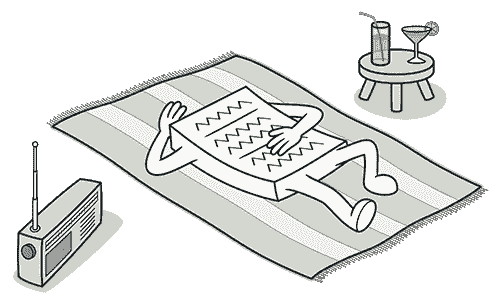
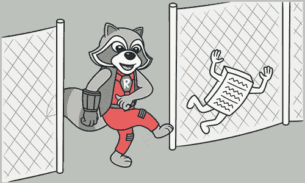

# 懒惰类

> 原文：[`refactoringguru.cn/smells/lazy-class`](https://refactoringguru.cn/smells/lazy-class)

### 症状与体征

理解和维护类总是需要时间和金钱。因此，如果一个类没有足够的价值来吸引你的注意，它就应该被删除。

### 问题的原因

也许某个类被设计得非常完整，但经过一些重构后变得异常简小。

或者它可能是为了支持从未完成的未来开发工作而设计的。

### 处理方法

+   几乎无用的组件应该进行内联类处理。

+   对于功能较少的子类，尝试合并层次结构。

### 收益

+   减少代码大小。

+   更轻松的维护。

### 何时忽略

+   有时，*懒惰类*被创建是为了界定未来开发的意图，在这种情况下，尽量在代码的清晰度和简洁性之间保持平衡。

</images/refactoring/banners/tired-of-reading-banner-1x.mp4?id=7fa8f9682afda143c2a491c6ab1c1e56>

</images/refactoring/banners/tired-of-reading-banner.png?id=1721d160ff9c84cbf8912f5d282e2bb4>

您的浏览器不支持 HTML 视频。

### 读书读累了吗？

难怪，阅读我们这里的所有文本需要 7 个小时。

尝试我们的互动重构课程。它提供了一种不那么乏味的学习新知识的方法。

*让我们看看……*
