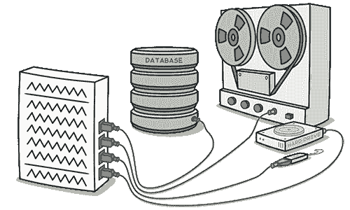

# 数据类

> 原文：[`refactoringguru.cn/smells/data-class`](https://refactoringguru.cn/smells/data-class)

### 迹象与症状

数据类是指仅包含字段和访问这些字段的简单方法（获取器和设置器）的类。这些类只是其他类使用的数据容器。这些类不包含任何额外功能，无法独立操作它们所拥有的数据。

### 问题原因

当一个新创建的类仅包含少数公共字段（甚至可能只有少量的获取器/设置器）时，这是一件很正常的事情。但对象真正的强大之处在于它们可以包含对其数据的行为类型或操作。

### 处理方法

+   如果一个类包含公共字段，请使用封装字段将其隐藏，以确保访问只能通过获取器和设置器进行。

+   对于存储在集合（如数组）中的数据，请使用封装集合。

+   审查使用该类的客户端代码。在其中，你可能会发现更适合放在数据类本身的功能。如果是这样，使用移动方法和提取方法将此功能迁移到数据类。

+   在类中充满经过深思熟虑的方法后，你可能希望去掉那些提供过于广泛访问类数据的旧数据访问方法。为此，使用移除设置方法和隐藏方法可能会有所帮助。

### 收益

+   提高代码的理解和组织。对特定数据的操作现在集中在一个地方，而不是随意散布在代码中。

+   帮助你发现客户端代码的重复。

</images/refactoring/banners/tired-of-reading-banner-1x.mp4?id=7fa8f9682afda143c2a491c6ab1c1e56>

</images/refactoring/banners/tired-of-reading-banner.png?id=1721d160ff9c84cbf8912f5d282e2bb4>

您的浏览器不支持 HTML 视频。

### 厌倦阅读了吗？

不奇怪，阅读我们这里所有文本需要 7 小时。

尝试我们的交互式重构课程。它提供了一种更轻松的学习新知识的方法。

*让我们看看…*
