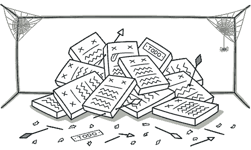

# 死代码

> 原文：[`refactoringguru.cn/smells/dead-code`](https://refactoringguru.cn/smells/dead-code)

### 迹象和症状

一个变量、参数、字段、方法或类不再被使用（通常是因为它已过时）。

### 问题的原因

当软件需求发生变化或进行了修正时，没有人有时间清理旧代码。

这样的代码也可能出现在复杂条件中，当某个分支变得不可达（由于错误或其他情况）。

### 处理

找到死代码的最快方法是使用一个好的[IDE](https://en.wikipedia.org/wiki/Integrated_development_environment)。

+   删除未使用的代码和不需要的文件。

+   对于不必要的类，如果使用了子类或超类，可以应用内联类或折叠层次。

+   要删除不需要的参数，请使用移除参数。

### 收益

+   减少代码大小。

+   更简单的支持。

</images/refactoring/banners/tired-of-reading-banner-1x.mp4?id=7fa8f9682afda143c2a491c6ab1c1e56>

</images/refactoring/banners/tired-of-reading-banner.png?id=1721d160ff9c84cbf8912f5d282e2bb4>

您的浏览器不支持 HTML 视频。

### 厌倦了阅读？

不奇怪，阅读我们这里的所有文本需要 7 小时。

尝试我们的互动重构课程。它提供了一种不那么乏味的学习新知识的方法。

*让我们看看…*
