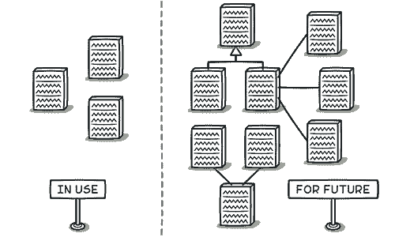

# 投机通用性

> 原文：[`refactoringguru.cn/smells/speculative-generality`](https://refactoringguru.cn/smells/speculative-generality)

### 征兆和症状

有一个未使用的类、方法、字段或参数。

### 问题的原因

有时代码是“以防万一”创建的，以支持预期未来将实现的功能。但实际上，这些功能并未实现，导致代码变得难以理解和维护。

### 处理

+   要移除未使用的抽象类，请尝试折叠层次结构。

+   不必要的功能委托给另一个类可以通过内联类来消除。

+   未使用的方法？使用内联方法来消除它们。

+   带有未使用参数的方法应通过移除参数进行检查。

+   未使用的字段可以直接删除。

### 收益

+   更精简的代码。

+   更易于支持。

### 何时忽略

+   如果您正在开发框架，创建在框架本身中未使用的功能是完全合理的，只要该功能是框架用户所需的。

+   在删除元素之前，请确保它们未在单元测试中使用。这种情况发生在测试需要某种方式从类中获取特定内部信息或执行特殊测试相关操作时。

</images/refactoring/banners/tired-of-reading-banner-1x.mp4?id=7fa8f9682afda143c2a491c6ab1c1e56>

</images/refactoring/banners/tired-of-reading-banner.png?id=1721d160ff9c84cbf8912f5d282e2bb4>

您的浏览器不支持 HTML 视频。

### 读得疲惫了吗？

不奇怪，阅读我们这里所有的文本需要 7 小时。

尝试我们的交互式重构课程。它提供了一种不那么乏味的学习新知识的方法。

*让我们看看…*
