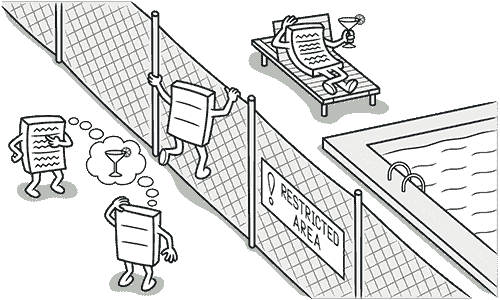
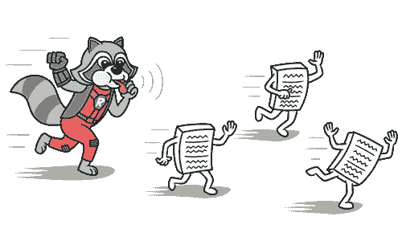
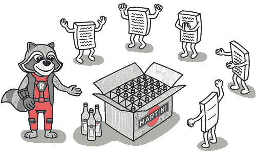

# 特征嫉妒

> 原文：[`refactoringguru.cn/smells/feature-envy`](https://refactoringguru.cn/smells/feature-envy)

### 征兆和症状

一个方法访问其他对象的数据多于其自身的数据。

### 问题的原因

这种异味可能在字段移动到数据类后出现。如果是这种情况，您可能还想将对数据的操作移到此类中。

### 处理方法

基本规则是，如果事物同时变化，应该将它们放在同一个地方。通常使用这些数据的函数与数据一起被修改（尽管可能有例外）。

+   如果一个方法显然应该移动到另一个地方，使用移动方法。

+   如果只有方法的一部分访问另一个对象的数据，使用提取方法将相关部分移走。

+   如果一个方法使用来自多个其他类的函数，首先确定哪个类包含大部分使用的数据。然后将该方法放入此类中，连同其他数据。或者，使用提取方法将该方法拆分成可以放置在不同类中的几个部分。

### 回报

+   更少的代码重复（如果数据处理代码放在一个中心位置）。

+   更好的代码组织（处理数据的方法与实际数据相邻）。

### 何时忽略

+   有时行为被故意与持有数据的类分开。通常的好处是能够动态改变行为（参见策略、访问者及其他模式）。

</images/refactoring/banners/tired-of-reading-banner-1x.mp4?id=7fa8f9682afda143c2a491c6ab1c1e56>

</images/refactoring/banners/tired-of-reading-banner.png?id=1721d160ff9c84cbf8912f5d282e2bb4>

您的浏览器不支持 HTML 视频。

### 厌倦阅读？

不奇怪，阅读我们这里所有的文本需要 7 小时。

尝试我们的交互式重构课程。它提供了一种不那么乏味的学习新知识的方法。

*让我们看看…*
