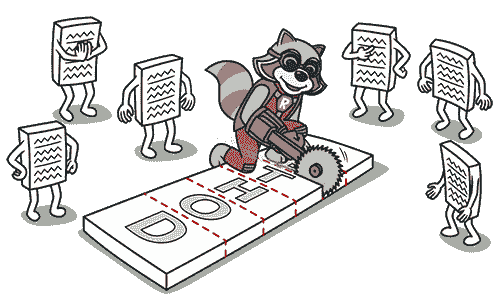
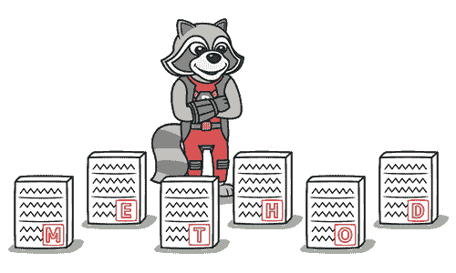

# 不适当的亲密关系

> 原文：[`refactoringguru.cn/smells/inappropriate-intimacy`](https://refactoringguru.cn/smells/inappropriate-intimacy)

### 征兆和症状

一个类使用另一个类的内部字段和方法。

### 问题的原因

密切关注那些在一起花费过多时间的类。好的类应该尽可能少地了解彼此。这种类更容易维护和重用。

### 处理

+   最简单的解决方案是使用移动方法和移动字段，将一个类的部分移动到使用这些部分的类中。但只有在第一个类确实不需要这些部分时，这种方法才有效。

    

+   另一种解决方案是对该类使用提取类和隐藏委托，以使代码关系“正式”。

+   如果类之间是相互依赖的，您应该使用将双向关联更改为单向。

+   如果这种“亲密”关系存在于子类和父类之间，请考虑用继承替代委托。

### 回报

+   改进代码组织。

+   简化支持和代码重用。

</images/refactoring/banners/tired-of-reading-banner-1x.mp4?id=7fa8f9682afda143c2a491c6ab1c1e56>

</images/refactoring/banners/tired-of-reading-banner.png?id=1721d160ff9c84cbf8912f5d282e2bb4>

您的浏览器不支持 HTML 视频。

### 读累了吗？

难怪，阅读我们这里所有的文本需要 7 个小时。

尝试我们的交互式重构课程。它提供了一种不那么乏味的学习新知识的方法。

*让我们看看…*
