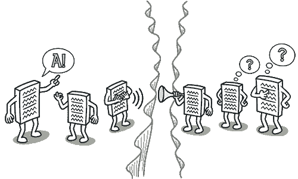
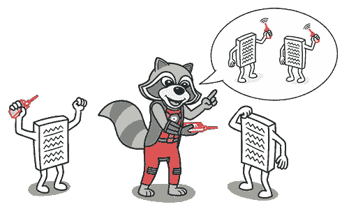
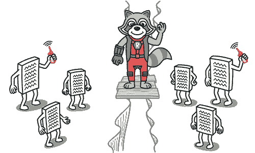

# 消息链

> 原文：[`refactoringguru.cn/smells/message-chains`](https://refactoringguru.cn/smells/message-chains)

### 迹象和症状

在代码中，你会看到一系列类似于`$a->b()->c()->d()`的调用。

### 问题原因

消息链发生在一个客户端请求另一个对象时，该对象又请求另一个对象，依此类推。这些链意味着客户端依赖于类结构中的导航。这些关系的任何变化都需要修改客户端。

### 治疗

+   要删除消息链，请使用隐藏委托。

+   有时候，思考最终对象的用途更为重要。也许使用提取方法将此功能移至链的开头，通过使用移动方法会更有意义。

### 收益

+   减少链中类之间的依赖关系。

+   减少冗长代码的数量。

### 何时忽略

+   过于激进的委托隐藏可能导致代码中难以看到实际功能所在。这是另一个说法，避免中间人气味也同样重要。

</images/refactoring/banners/tired-of-reading-banner-1x.mp4?id=7fa8f9682afda143c2a491c6ab1c1e56>

</images/refactoring/banners/tired-of-reading-banner.png?id=1721d160ff9c84cbf8912f5d282e2bb4>

你的浏览器不支持 HTML 视频。

### 厌倦阅读了吗？

难怪，这里所有的文本需要花费 7 小时阅读。

尝试我们的交互式重构课程，它提供了一种不那么繁琐的学习新知识的方法。

*让我们看看…*
