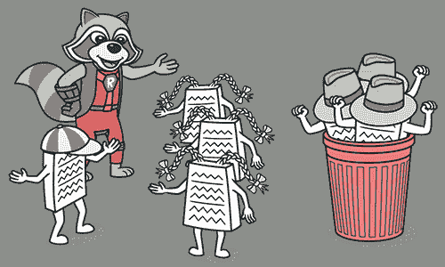

# 中介

> 原文：[`refactoringguru.cn/smells/middle-man`](https://refactoringguru.cn/smells/middle-man)

### 迹象和症状

如果一个类仅执行一个操作，将工作委派给另一个类，那么它存在的意义是什么？

### 问题原因

这种气味可能是过度消除消息链的结果。

在其他情况下，这可能是由于一个类的有用工作逐渐转移到其他类而导致的。这个类就像一个空壳，除了委派外什么也不做。

### 处理

+   如果大多数方法的类都委派给另一个类，那么就应该移除中介。

### 收益

+   代码更简洁。

### 何时忽略

不要删除出于某种原因创建的中介：

+   可能添加了中介以避免类之间的依赖关系。

+   一些设计模式故意创建中介（例如 代理 或 装饰器）。

</images/refactoring/banners/tired-of-reading-banner-1x.mp4?id=7fa8f9682afda143c2a491c6ab1c1e56>

</images/refactoring/banners/tired-of-reading-banner.png?id=1721d160ff9c84cbf8912f5d282e2bb4>

您的浏览器不支持 HTML 视频。

### 厌倦阅读了吗？

难怪，阅读我们这里所有的文本需要 7 小时。

尝试我们的交互式重构课程。它提供了一种不那么乏味的学习新知识的方法。

*我们来看一下…*
