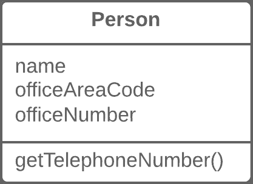
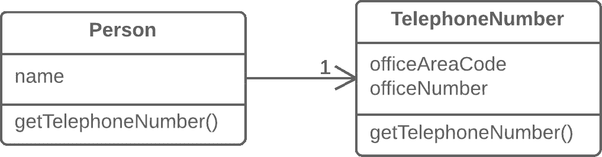

# 提取类

> 原文：[`refactoringguru.cn/extract-class`](https://refactoringguru.cn/extract-class)

### 问题

当一个类完成两个类的工作时，会产生尴尬。

### 解决方案

相反，创建一个新类，将负责相关功能的字段和方法放入其中。

前后

### 为什么重构

类通常一开始是清晰且易于理解的。它们各自做好自己的工作，而不会干扰其他类的工作。但随着程序的扩展，方法和字段被添加……最终，一些类承担的责任超出了最初的设想。

### 好处

+   这个重构方法将帮助维护对*单一责任原则*的遵循。你的类的代码将更加明显和易于理解。

+   单一责任的类更加可靠，并且对变化更具容忍性。例如，假设你有一个负责十个不同任务的类。当你改变这个类以使其在某一方面更好时，你可能会破坏它在其他九个方面的功能。

### 缺点

+   如果你在使用这个重构技术时“过度”了，你将不得不求助于内联类。

### 如何重构

在开始之前，决定你想如何拆分类的责任。

1.  创建一个新类以包含相关功能。

1.  在旧类和新类之间创建关系。最佳情况下，这种关系是单向的；这使得重用第二个类没有任何问题。尽管如此，如果你认为有必要建立双向关系，随时可以设置。

1.  使用移动字段和移动方法来处理你决定移动到新类的每个字段和方法。对于方法，从私有方法开始，以减少产生大量错误的风险。尽量逐步迁移，并在每次移动后测试结果，以避免最后堆积大量的错误修复。

    完成移动后，再次查看结果类。一个责任已更改的旧类可以重命名以提高清晰度。再次检查是否可以消除任何双向类关系。

1.  还要考虑新类的外部可访问性。你可以通过将其设为私有，完全隐藏类，以通过旧类的字段来管理它。或者，你可以将其设为公共，让客户端直接更改值。你的决策取决于在对新类中的值进行意外直接更改时，对旧类行为的安全性。

</images/refactoring/banners/tired-of-reading-banner-1x.mp4?id=7fa8f9682afda143c2a491c6ab1c1e56>

</images/refactoring/banners/tired-of-reading-banner.png?id=1721d160ff9c84cbf8912f5d282e2bb4>

您的浏览器不支持 HTML 视频。  

### 读得累了吗？  

不奇怪，阅读我们这里所有文本需要 7 小时。  

尝试我们的重构互动课程，它提供了一种更轻松的学习新知识的方法。

[*让我们看看…*  
