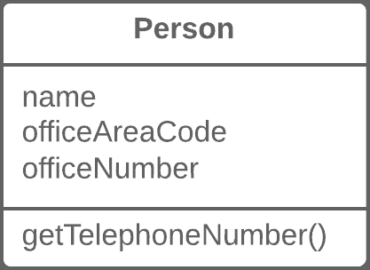

# 内联类

> 原文：[`refactoringguru.cn/inline-class`](https://refactoringguru.cn/inline-class)

### 问题

一个类几乎没有做任何事情，也没有负责任何事情，且没有计划额外的职责。

### 解决方案

将所有特性从一个类移动到另一个类。

之前之后

### 为什么要重构

+   通常在一个类的特性被“移植”到其他类后，这种技术是必要的，这样原来的类几乎无事可做。

### 好处

+   消除不必要的类可以释放计算机的操作内存——以及你头脑中的带宽。

### 如何重构

1.  在接收类中，创建捐赠类中存在的公共字段和方法。方法应引用捐赠类的等效方法。

1.  将所有对捐赠类的引用替换为对接收类的字段和方法的引用。

1.  现在测试程序，确保没有添加错误。如果测试显示一切正常，开始使用移动方法和移动字段将所有功能完全移植到接收类。继续进行，直到原始类完全为空。

1.  删除原始类。

</images/refactoring/banners/tired-of-reading-banner-1x.mp4?id=7fa8f9682afda143c2a491c6ab1c1e56>

</images/refactoring/banners/tired-of-reading-banner.png?id=1721d160ff9c84cbf8912f5d282e2bb4>

您的浏览器不支持 HTML 视频。

### 读得累了吗？

难怪，阅读这里的所有文本需要 7 小时。

尝试我们的互动重构课程。它提供了一种不那么乏味的学习新知识的方法。

*让我们看看…*
