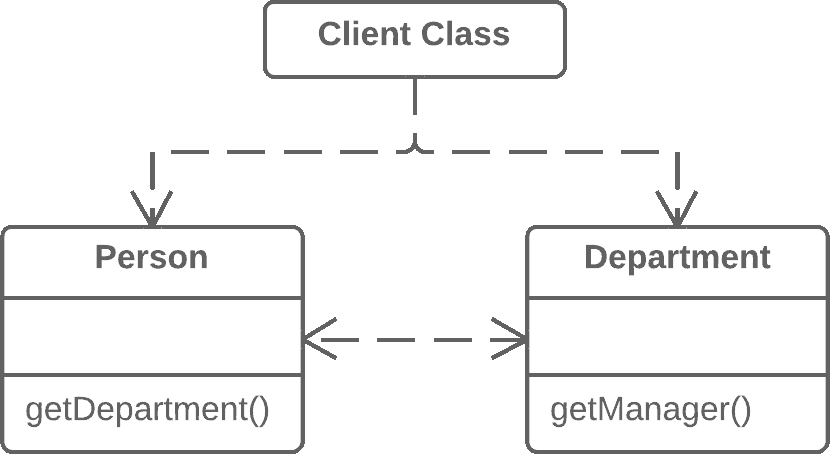
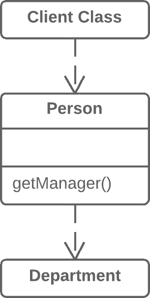

# 隐藏委托

> 原文：[`refactoringguru.cn/hide-delegate`](https://refactoringguru.cn/hide-delegate)

### 问题

客户端从对象 A 的字段或方法中获取对象 B。然后客户端调用对象 B 的方法。

### 解决方案

在类 A 中创建一个新方法，将调用委托给对象 B。现在客户端对类 B 并不了解，也不依赖于类 B。

在之前！在之后！

### 为什么重构

首先，让我们看看术语：

+   *服务器*是客户端可以直接访问的对象。

+   *委托*是包含客户端所需功能的最终对象。

当客户端从另一个对象请求一个对象时，就会出现调用链，然后第二个对象请求另一个对象，以此类推。这些调用序列使客户端参与到类结构的导航中。这些相互关系的任何变化都需要在客户端进行相应的更改。

### 优势

+   将委托隐藏于客户端。客户端代码越少需要了解对象之间关系的细节，对程序的修改就越容易。

### 缺点

+   如果你需要创建过多的委托方法，*服务器类*有可能成为一个不必要的中介，导致过多的中介者。

### 如何重构

1.  为每个被客户端调用的*委托类*方法，在*服务器类*中创建一个方法，将调用委托给*委托类*。

1.  更改客户端代码，使其调用*服务器类*的方法。

1.  如果你的更改使客户端不再需要*委托类*，你可以从*服务器类*中移除对*委托类*的访问方法（最初用于获取*委托类*的方法）。

</images/refactoring/banners/tired-of-reading-banner-1x.mp4?id=7fa8f9682afda143c2a491c6ab1c1e56>

</images/refactoring/banners/tired-of-reading-banner.png?id=1721d160ff9c84cbf8912f5d282e2bb4>

您的浏览器不支持 HTML 视频。

### 厌倦阅读了吗？

难怪，阅读我们这里所有的文本需要 7 小时。

尝试我们的交互式重构课程。它提供了一种更轻松的学习新知识的方法。

*让我们看看…*
