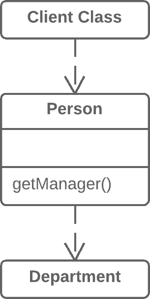
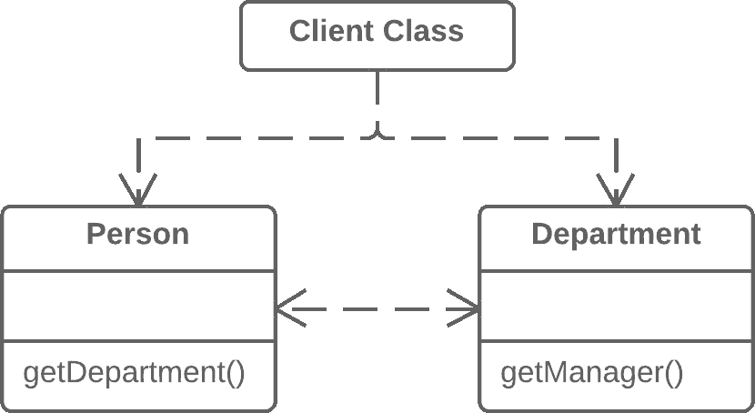

# 去掉中介

> 原文：[`refactoringguru.cn/remove-middle-man`](https://refactoringguru.cn/remove-middle-man)

### 问题

一个类有太多方法只是简单地委托给其他对象。

### 解决方案

删除这些方法，并强迫客户端直接调用最终方法。

之前之后

### 为什么要重构

为了描述这个技术，我们将使用隐藏委托中的术语：

+   *服务器*是客户端可以直接访问的对象。

+   *委托*是包含客户端所需功能的最终对象。

有两种类型的问题：

1.  *服务器类*本身不执行任何操作，仅仅增加了不必要的复杂性。在这种情况下，考虑一下这个类是否真的需要。

1.  每当向*委托*添加新功能时，您需要在*服务器类*中为其创建一个委托方法。如果进行了大量更改，这将相当繁琐。

### 如何重构

1.  创建一个获取*委托类*对象的 getter，以便从*服务器类*对象访问。

1.  在*服务器类*中用对*委托类*方法的直接调用替换对委托方法的调用。

</images/refactoring/banners/tired-of-reading-banner-1x.mp4?id=7fa8f9682afda143c2a491c6ab1c1e56>

</images/refactoring/banners/tired-of-reading-banner.png?id=1721d160ff9c84cbf8912f5d282e2bb4>

您的浏览器不支持 HTML 视频。

### 读累了吗？

不奇怪，阅读我们这里的所有文本需要 7 个小时。

尝试我们的互动重构课程。它提供了一种不那么乏味的学习新知识的方法。

*让我们看看……*
