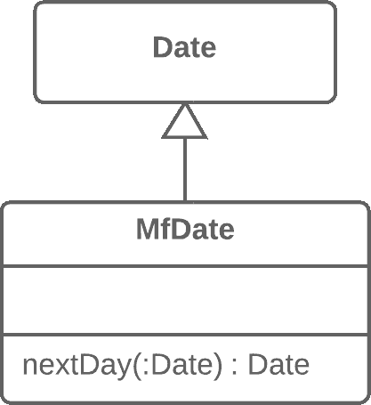

# 引入本地扩展

> 原文：[`refactoringguru.cn/introduce-local-extension`](https://refactoringguru.cn/introduce-local-extension)

### 问题

一个工具类不包含你需要的一些方法。但你无法将这些方法添加到类中。

### 解决方案

创建一个包含方法的新类，并使其成为工具类的子类或包装类。

前后

### 为什么重构

你正在使用的类没有你需要的方法。更糟糕的是，你无法添加这些方法（例如，因为这些类在第三方库中）。有两种解决方案：

+   从相关类创建一个**子类**，包含方法并从父类继承其他一切。这样更简单，但有时会受到工具类本身的阻碍（由于`final`）。

+   创建一个**包装类**，包含所有新方法，并在其他地方委托给工具类的相关对象。此方法工作量较大，因为你不仅需要代码来维护包装器与工具对象之间的关系，还需要大量简单的委托方法，以模拟工具类的公共接口。

### 好处

+   通过将附加方法移到单独的扩展类（包装类或子类）中，可以避免使客户端类充满不合适的代码。程序组件更加连贯，也更易于重用。

### 如何重构

1.  创建一个新的扩展类：

    +   选项 A：使其成为工具类的子类。

    +   选项 B：如果你决定创建一个包装器，请在其中创建一个字段以存储将进行委托的工具类对象。使用此选项时，你还需要创建重复工具类公共方法的简单委托方法。

1.  创建一个构造函数，使用工具类构造函数的参数。

1.  还可以创建一个替代的“转换”构造函数，仅将原始类的对象作为参数。这将帮助将扩展替代原始类的对象。

1.  在类中创建新的扩展方法。将其他类的外部方法移动到此类中，或者如果其功能已在扩展中存在，则删除外部方法。

1.  在需要其功能的地方，用新的扩展类替换对工具类的使用。

</images/refactoring/banners/tired-of-reading-banner-1x.mp4?id=7fa8f9682afda143c2a491c6ab1c1e56>

</images/refactoring/banners/tired-of-reading-banner.png?id=1721d160ff9c84cbf8912f5d282e2bb4>

你的浏览器不支持 HTML 视频。

### 厌倦阅读？

难怪，阅读我们这里所有文本需要 7 小时。

尝试我们的互动重构课程。它提供了一种更轻松的学习新知识的方法。

*让我们看看…*
