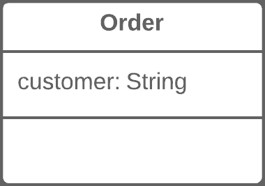
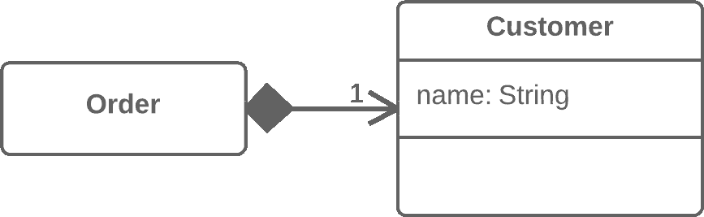

# 用对象替换数据值

> 原文：[`refactoringguru.cn/replace-data-value-with-object`](https://refactoringguru.cn/replace-data-value-with-object)

### 问题

一个类（或一组类）包含一个数据字段。该字段有自己的行为和相关数据。

### 解决方案

创建一个新类，将旧字段及其行为放入该类中，并在原始类中存储该类的对象。

之前之后

### 为什么重构

这种重构基本上是提取类的一个特例。不同之处在于重构的原因。

在提取类中，我们有一个负责不同事务的单一类，我们希望将其责任拆分开来。

用对象替换数据值时，我们有一个原始字段（数字、字符串等），由于程序的发展，这些字段不再简单，现在有了相关的数据和行为。一方面，这些字段本身并不可怕。然而，这些字段和行为的组合可能在多个类中同时存在，造成重复代码。

因此，为此我们创建一个新类，并将字段及相关的数据和行为转移到该类中。

### 好处

+   改善类内部的关联性。数据和相关行为都在一个类内。

### 如何重构

在开始重构之前，查看是否有直接引用该字段的地方。如果有，请使用自我封装字段将其隐藏在原始类中。

1.  创建一个新类，并将字段及相关的 getter 复制到该类中。此外，创建一个接受字段简单值的构造函数。该类不会有 setter，因为每次发送给原始类的新字段值都会创建一个新的值对象。

1.  在原始类中，将字段类型更改为新类。

1.  在原始类的 getter 中，调用关联对象的 getter。

1.  在 setter 中，创建一个新的值对象。如果之前在构造函数中为字段设置了初始值，可能还需要在构造函数中创建一个新对象。

### 下一步

应用这种重构技术后，明智的做法是在包含对象的字段上应用将值更改为引用。这允许存储一个与值对应的单一对象的引用，而不是为同一个值存储多个对象。

通常，当你希望一个对象负责一个现实世界的对象（如用户、订单、文档等）时，需要采用这种方法。同时，这种方法对日期、金钱、范围等对象并不实用。

</images/refactoring/banners/tired-of-reading-banner-1x.mp4?id=7fa8f9682afda143c2a491c6ab1c1e56>

</images/refactoring/banners/tired-of-reading-banner.png?id=1721d160ff9c84cbf8912f5d282e2bb4>

您的浏览器不支持 HTML 视频。

### 厌倦阅读了吗？

不奇怪，我们这里的所有文本阅读需要 7 小时。

尝试我们的交互式重构课程。它提供了一种不那么乏味的学习新知识的方法。

*我们来看看…*
