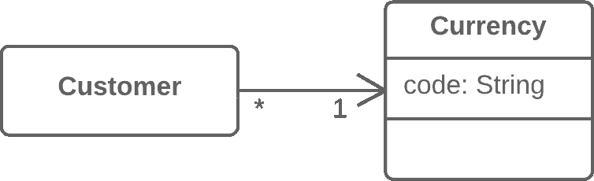

# 将引用更改为值

> 原文：[`refactoringguru.cn/change-reference-to-value`](https://refactoringguru.cn/change-reference-to-value)

### 问题

你有一个引用对象，它太小且不常更改，以至于无法合理管理其生命周期。

### 解决方案

将其转化为值对象。

之前之后

### 为什么重构

从引用切换到值的灵感可能来源于使用引用时的不便。引用需要你进行管理：

+   它们总是需要请求存储中的必要对象。

+   内存中的引用可能不方便使用。

+   与值相比，在分布式和并行系统中处理引用特别困难。

如果你更希望有不可更改的对象，而不是其状态可能在其生命周期内发生变化的对象，值尤其有用。

### 好处

+   对象的一个重要属性是它们应该是不可更改的。对于返回对象值的每个查询，应获得相同的结果。如果这一点成立，那么即使有多个对象表示相同的事物，也不会出现问题。

+   值的实现要简单得多。

### 缺点

+   如果一个值是可更改的，请确保如果任何对象发生变化，所有表示同一实体的其他对象中的值也会更新。这是如此繁琐，以至于为此目的创建一个引用更为简单。

### 如何重构

1.  使对象不可更改。对象不应该有任何设置器或其他改变其状态和数据的方法（移除设置方法在这里可能会有帮助）。数据赋值给值对象字段的唯一地方是构造函数。

1.  创建一个比较方法，以便能够比较两个值。

1.  检查你是否可以删除工厂方法并将对象构造函数设为公共。

</images/refactoring/banners/tired-of-reading-banner-1x.mp4?id=7fa8f9682afda143c2a491c6ab1c1e56>

</images/refactoring/banners/tired-of-reading-banner.png?id=1721d160ff9c84cbf8912f5d282e2bb4>

你的浏览器不支持 HTML 视频。

### 厌倦阅读？

难怪，阅读我们这里所有的文本需要 7 小时。

尝试我们的交互式重构课程。它提供了一种不那么乏味的学习新知识的方法。

*让我们看看…*
