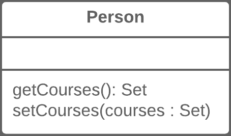
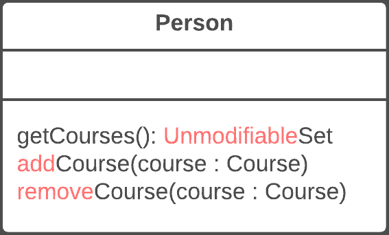

# 封装集合

> 原文：[`refactoringguru.cn/encapsulate-collection`](https://refactoringguru.cn/encapsulate-collection)

### 问题

一个类包含一个集合字段以及用于操作集合的简单 getter 和 setter。

### 解决方案

使 getter 返回的值为只读，并创建用于添加/删除集合元素的方法。

BeforeAfter

### 为什么重构

一个类包含一个字段，该字段包含一个对象集合。这个集合可以是数组、列表、集合或向量。为操作集合创建了正常的 getter 和 setter。

但是，集合应该通过一种与其他数据类型使用的协议略有不同的方式来使用。getter 方法不应该返回集合对象本身，因为这会让客户端在不知情的情况下更改集合内容。此外，这会向客户端显示对象数据的内部结构过多。获取集合元素的方法应该返回一个不允许更改集合或泄露过多结构数据的值。

此外，不应该有将值分配给集合的方法。相反，应该有用于添加和删除元素的操作。通过这种方式，拥有对象可以控制集合元素的添加和删除。

这样的协议恰当地封装了集合，从而最终减少了拥有类与客户端代码之间的关联程度。

### 好处

+   集合字段被封装在一个类中。当调用 getter 时，它返回集合的副本，这防止了在包含集合的类不知情的情况下意外更改或覆盖集合元素。

+   如果集合元素包含在基本类型内，例如数组，则可以创建更方便的方法来操作集合。

+   如果集合元素包含在非基本容器（标准集合类）中，通过封装集合可以限制对集合不必要的标准方法的访问（例如限制添加新元素）。

### 如何重构

1.  创建用于添加和删除集合元素的方法。这些方法必须接受集合元素作为参数。

1.  如果在类构造函数中未完成，则将空集合分配给该字段作为初始值。

1.  查找集合字段 setter 的调用。更改 setter，使其使用添加和删除元素的操作，或使这些操作调用客户端代码。

请注意，setter 只能用于用其他元素替换所有集合元素。因此，建议将 setter 名称(重命名方法)更改为`replace`。

1.  查找所有在调用集合获取器后集合被更改的地方。将代码更改为使用您新的添加和删除元素的方法。

1.  更改获取器，使其返回集合的只读表示。

1.  检查使用集合的客户端代码，找出在集合类内部看起来更好的代码。

</images/refactoring/banners/tired-of-reading-banner-1x.mp4?id=7fa8f9682afda143c2a491c6ab1c1e56>

</images/refactoring/banners/tired-of-reading-banner.png?id=1721d160ff9c84cbf8912f5d282e2bb4>

您的浏览器不支持 HTML 视频。

### 厌倦了阅读？

不奇怪，阅读我们这里的所有文本需要 7 小时。

尝试我们的交互式重构课程。它提供了一种更轻松的学习新知识的方法。

*让我们看看…*
