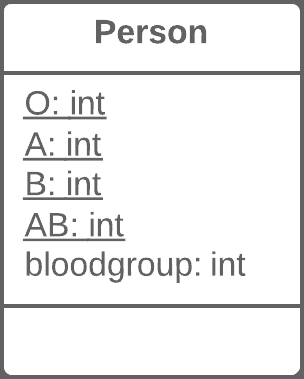
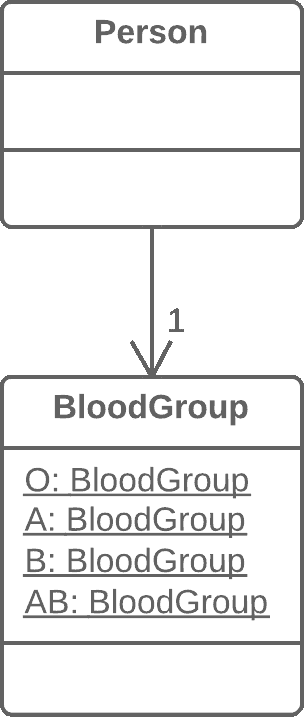

# 用类替换类型代码

> 原文：[`refactoringguru.cn/replace-type-code-with-class`](https://refactoringguru.cn/replace-type-code-with-class)
> 
> **什么是类型代码？** 类型代码发生在没有单独数据类型时，你有一组数字或字符串，这些值形成某个实体的允许值列表。这些特定的数字和字符串通常通过常量给出可理解的名称，这就是为什么这种类型代码如此常见的原因。

### 问题

一个类有一个字段包含类型代码。这个类型的值不在操作符条件中使用，也不影响程序的行为。

### 解决方案

创建一个新类，并使用它的对象来代替类型代码的值。

之前之后

### 为什么重构

类型代码最常见的原因之一是在与数据库工作时，当数据库中有字段编码了某个复杂概念的数字或字符串。

例如，你有一个`User`类，其字段`user_role`包含每个用户的访问权限信息，可能是管理员、编辑者或普通用户。因此，在这种情况下，这些信息在字段中分别编码为`A`、`E`和`U`。

这种方法的缺点是什么？字段的设置器通常不检查发送的值，这可能会在某人向这些字段发送意外或错误的值时造成大问题。

此外，这些字段无法进行类型验证。你可以向它们发送任何数字或字符串，这不会被你的 IDE 进行类型检查，甚至允许你的程序运行（然后崩溃）。

### 好处

+   我们希望将一组原始值（即编码类型的内容）转变为完整的类，从而获得面向对象编程所提供的所有好处。

+   通过用类替换类型代码，我们允许在编程语言层面上对传递给方法和字段的值进行类型提示。

    例如，当传递值到方法时，编译器以前无法区分你的数字常量和某个任意数字，但现在当传递不符合指定类型类的数据时，你会在 IDE 中收到错误警告。

+   因此，我们可以将代码移动到类型的类中。如果你需要在整个程序中对类型值进行复杂操作，现在这些代码可以“存在”于一个或多个类型类中。

### 什么时候不使用

如果编码类型的值在控制流结构（`if`、`switch`等）中使用，并控制类的行为，你应该使用两种类型代码重构技术之一：

+   用子类替换类型代码

+   用状态/策略替换类型代码

### 如何重构

1.  创建一个新类，并给它一个与编码类型目的相对应的新名称。我们称之为*类型类*。

1.  将包含类型代码的字段复制到*类型类*中，并将其设为私有。然后为该字段创建一个获取器。该字段的值将仅从构造函数中设置。

1.  对于每个编码类型的值，在*类型类*中创建一个静态方法。它将创建一个对应于此编码类型值的新*类型类*对象。

1.  在原始类中，将编码字段的类型替换为*类型类*。在构造函数和字段设置器中创建此类型的新对象。更改字段获取器，使其调用*类型类*获取器。

1.  将编码类型的值的任何提及替换为相关*类型类*静态方法的调用。

1.  从原始类中删除编码类型常量。

</images/refactoring/banners/tired-of-reading-banner-1x.mp4?id=7fa8f9682afda143c2a491c6ab1c1e56>

</images/refactoring/banners/tired-of-reading-banner.png?id=1721d160ff9c84cbf8912f5d282e2bb4>

您的浏览器不支持 HTML 视频。

### 读累了吗？

不奇怪，阅读我们这里所有文本需要 7 小时。

尝试我们的交互式重构课程。它提供了一种不那么乏味的学习新知识的方法。

*我们来看看…*
