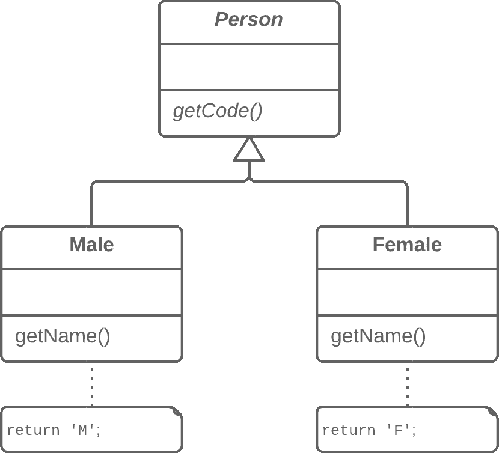
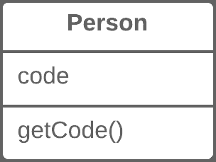

# 用字段替换子类

> 原文：[`refactoringguru.cn/replace-subclass-with-fields`](https://refactoringguru.cn/replace-subclass-with-fields)

### 问题

您有子类仅在其（返回常量的）方法上有所不同。

### 解决方案

在父类中用字段替换方法并删除子类。

之前之后

### 为什么重构

有时，重构正是避免类型代码的良方。

在某些情况下，子类层次结构可能仅在特定方法返回的值上有所不同。这些方法甚至不是计算的结果，而是严格在方法本身或方法返回的字段中设定的。为了简化类架构，可以将此层次结构压缩为一个包含一个或多个必要值的字段的单一类，具体情况而定。

在将大量功能从一个类层次结构移动到另一个地方后，这些更改可能变得必要。当前的层次结构不再那么有价值，其子类现在只是累赘。

### 好处

+   简化系统架构。如果您只想在不同的方法中返回不同的值，创建子类就是多此一举。

### 如何重构

1.  对子类应用用工厂方法替换构造函数。

1.  将子类构造函数调用替换为超类工厂方法调用。

1.  在超类中，声明字段以存储每个返回常量值的子类方法的值。

1.  创建一个受保护的超类构造函数以初始化新字段。

1.  创建或修改现有的子类构造函数，以使它们调用父类的新构造函数并将相关值传递给它。

1.  在父类中实现每个常量方法，使其返回对应字段的值。然后从子类中删除该方法。

1.  如果子类构造函数具有额外的功能，使用内联方法将构造函数合并到超类工厂方法中。

1.  删除子类。

</images/refactoring/banners/tired-of-reading-banner-1x.mp4?id=7fa8f9682afda143c2a491c6ab1c1e56>

</images/refactoring/banners/tired-of-reading-banner.png?id=1721d160ff9c84cbf8912f5d282e2bb4>

您的浏览器不支持 HTML 视频。

### 读累了吗？

难怪，阅读我们这里的所有文本需要 7 个小时。

尝试我们的交互式重构课程。这提供了一种不那么乏味的学习新知识的方法。

*让我想想…*
