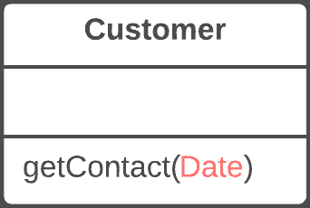

# 移除参数

> 原文：[`refactoringguru.cn/remove-parameter`](https://refactoringguru.cn/remove-parameter)

### 问题

参数在方法体中未被使用。

### 解决方案

移除未使用的参数。

之前之后

### 为什么重构

方法调用中的每个参数都迫使程序员理解该参数中包含的信息。如果一个参数在方法体中完全未使用，这种“思考”就毫无意义。

而且，在任何情况下，额外的参数都是必须执行的额外代码。

有时我们会添加一些参数，以便将来可能需要这些参数来应对方法的变化。然而，经验表明，只有在真正需要时才添加参数更为妥当。毕竟，预期的变化往往只是预期而已。

### 好处

+   方法只包含真正需要的参数。

### 什么时候不使用

+   如果该方法在子类或超类中以不同方式实现，并且你的参数在这些实现中被使用，请保持参数不变。

### 如何重构

1.  查看该方法是否在超类或子类中定义。如果是，参数在那里是否被使用？如果参数在这些实现中被使用，则应暂缓使用此重构技术。

1.  下一步对于在重构过程中保持程序功能至关重要。通过复制旧方法创建一个新方法，并从中删除相关参数。用对新方法的调用替换旧方法的代码。

1.  找到所有对旧方法的引用，并用对新方法的引用替换它们。

1.  删除旧方法。如果旧方法是公共接口的一部分，则不要执行此步骤。在这种情况下，将旧方法标记为弃用。

</images/refactoring/banners/tired-of-reading-banner-1x.mp4?id=7fa8f9682afda143c2a491c6ab1c1e56>

</images/refactoring/banners/tired-of-reading-banner.png?id=1721d160ff9c84cbf8912f5d282e2bb4>

你的浏览器不支持 HTML 视频。

### 读累了吗？

难怪，阅读我们这里所有的文本需要 7 小时。

尝试我们的互动重构课程。它提供了一种不那么乏味的学习新知识的方法。

*我们来看看…*
