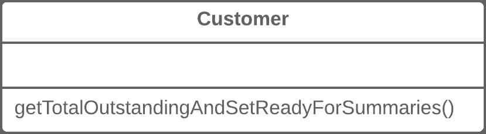
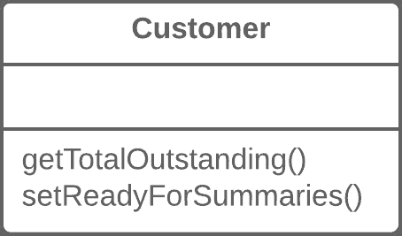

# 将查询与修改分开

> 原文：[`refactoringguru.cn/separate-query-from-modifier`](https://refactoringguru.cn/separate-query-from-modifier)

### 问题

你是否有一个返回值但也修改对象内部的某个方法？

### 解决方案

将该方法拆分为两个独立的方法。正如你所预期的，一个返回值，另一个修改对象。

之前之后

### 为什么要重构

该重构技术实现了*命令与查询职责分离*。这个原则告诉我们将负责获取数据的代码与改变对象内部某些内容的代码分开。

获取数据的代码称为*查询*。改变对象*可见状态*的代码称为*修改器*。当*查询*与*修改器*结合时，你无法在不改变条件的情况下获取数据。换句话说，你提出问题时可能会改变答案，即使在接收时。这一问题在调用查询的人可能不知道该方法的“副作用”时变得更加严重，这常常导致运行时错误。

但请记住，副作用在改变对象**可见**状态的*修改器*的情况下是危险的。这可能是例如，从对象的公共接口可访问的字段、数据库中的条目、文件等。如果*修改器*仅缓存复杂操作并将其保存在类的私有字段中，它几乎不会导致任何副作用。

### 好处

+   如果你有一个*查询*，它不改变程序的状态，你可以随意调用它，而不用担心调用该方法会导致的意外结果变化。

### 缺点

+   在某些情况下，在执行命令后获取数据是方便的。例如，从数据库中删除某些内容时，你想知道删除了多少行。

### 如何重构

1.  创建一个新的*查询方法*，以返回原方法所做的内容。

1.  修改原方法，使其仅返回调用新*查询方法*的结果。

1.  用对*查询方法*的调用替换对原方法的所有引用。在这一行之前，放置对*修改方法*的调用。如果原方法在条件运算符或循环的条件中被使用，这将避免副作用。

1.  消除原方法中返回值的代码，该方法现在已成为适当的*修改方法*。

</images/refactoring/banners/tired-of-reading-banner-1x.mp4?id=7fa8f9682afda143c2a491c6ab1c1e56>

</images/refactoring/banners/tired-of-reading-banner.png?id=1721d160ff9c84cbf8912f5d282e2bb4>

你的浏览器不支持 HTML 视频。

### 读累了吗？

不难理解，阅读我们这里的所有文本需要 7 小时。

试试我们的互动重构课程。它提供了一种不那么枯燥的学习新知识的方法。

*我们来看一下…*
