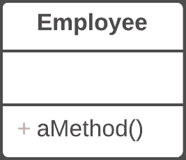
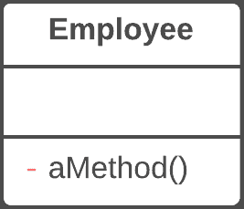

# 隐藏方法

> 原文：[`refactoringguru.cn/hide-method`](https://refactoringguru.cn/hide-method)

### 问题

一个方法未被其他类使用，或仅在其自身的类层次内使用。

### 解决方案

将方法设为私有或受保护。

前后

### 为什么重构

通常，隐藏获取和设置值的方法的需求是由于开发出更丰富的接口，提供额外的行为，尤其是当你开始时的类仅添加了简单的数据封装。

随着新行为融入类中，你可能会发现公共获取器和设置器方法不再必要，可以隐藏。如果将获取器或设置器方法设为私有并直接访问变量，可以删除该方法。

### 好处

+   隐藏方法使你的代码更易于演变。当你更改私有方法时，只需担心如何不破坏当前类，因为你知道该方法无法在其他地方使用。

+   通过将方法设为私有，你强调了类的公共接口及其保留的公共方法的重要性。

### 如何重构

1.  定期寻找可以设为私有的方法。静态代码分析和良好的单元测试覆盖可以提供很大的帮助。

1.  尽可能将每个方法设为私有。

</images/refactoring/banners/tired-of-reading-banner-1x.mp4?id=7fa8f9682afda143c2a491c6ab1c1e56>

</images/refactoring/banners/tired-of-reading-banner.png?id=1721d160ff9c84cbf8912f5d282e2bb4>

你的浏览器不支持 HTML 视频。

### 厌倦阅读？

毫不奇怪，阅读我们这里的所有文本需要 7 小时。

尝试我们的互动重构课程。它提供了一种不那么乏味的学习新知识的方法。

*让我们看看…*
