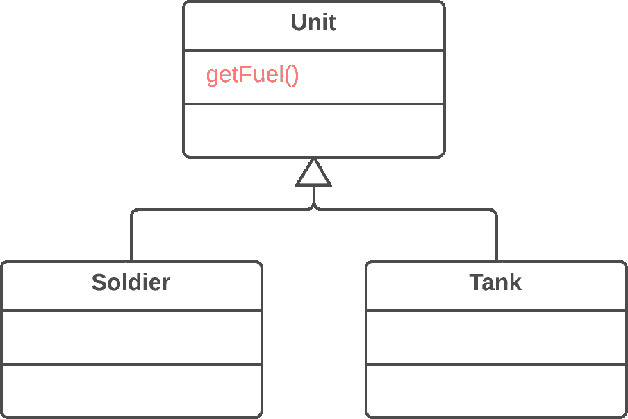
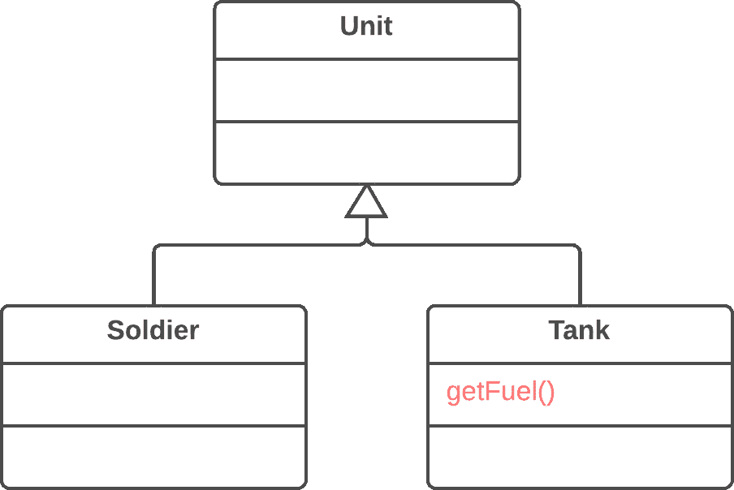

# 向下推送方法

> 原文：[`refactoringguru.cn/push-down-method`](https://refactoringguru.cn/push-down-method)

### 问题

超类中实现的行为是否只被一个（或几个）子类使用？

### 解决方案

将该行为移动到子类中。

之前之后

### 为什么重构

起初某个方法是打算为所有类通用，但实际上只在一个子类中使用。当计划的特性未能实现时，这种情况可能会发生。

这种情况也可能在从类层次结构中部分提取（或移除）功能后发生，留下一个只在一个子类中使用的方法。

如果你发现一个方法被多个子类所需，但并非所有子类都需要，创建一个中间子类并将该方法移动到其中可能会很有用。这可以避免将方法推送到所有子类中所导致的代码重复。

### 好处

+   提高类的一致性。方法位于你期望看到的地方。

### 如何重构

1.  在子类中声明该方法，并从超类中复制其代码。

1.  从超类中移除该方法。

1.  查找所有使用该方法的地方，并验证它是否从必要的子类调用。

</images/refactoring/banners/tired-of-reading-banner-1x.mp4?id=7fa8f9682afda143c2a491c6ab1c1e56>

</images/refactoring/banners/tired-of-reading-banner.png?id=1721d160ff9c84cbf8912f5d282e2bb4>

你的浏览器不支持 HTML 视频。

### 看累了吗？

难怪，阅读我们这里所有的文本需要 7 小时。

尝试我们的互动重构课程。它提供了一种不那么乏味的学习新知识的方法。

*让我们看看…*
