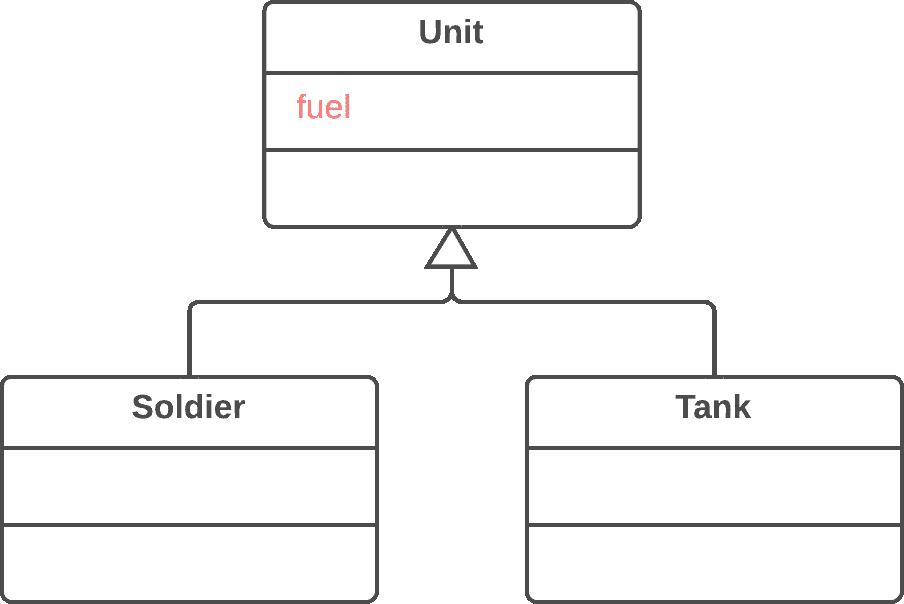
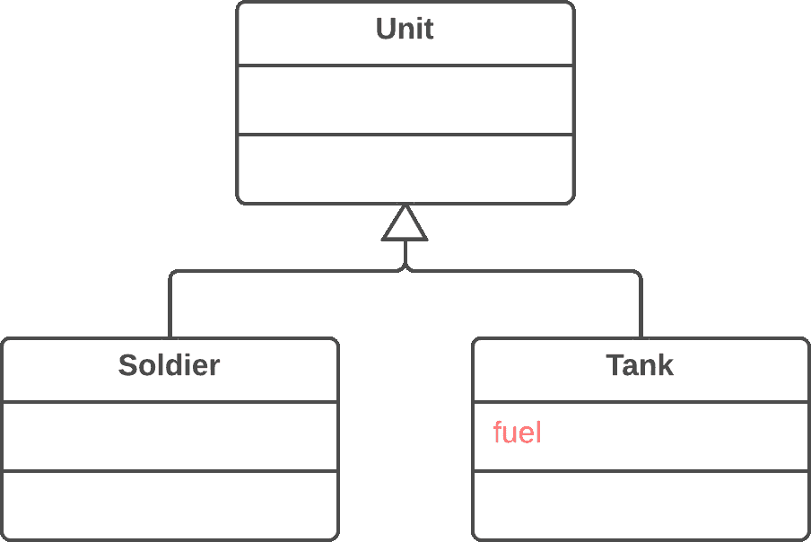

# 向下移动字段

> 原文：[`refactoringguru.cn/push-down-field`](https://refactoringguru.cn/push-down-field)

### 问题

字段是否只在少数子类中使用？

### 解决方案

将字段移动到这些子类。

之前之后

### 为什么要重构

尽管计划是为所有类通用地使用一个字段，但在现实中，这个字段只在某些子类中使用。这种情况可能发生在计划的功能未能实现时，例如。

这也可能是由于提取（或移除）类层次结构的部分功能造成的。

### 好处

+   提高内部类的一致性。字段位于实际使用的位置。

+   当同时移动到多个子类时，您可以独立开发字段。这确实会导致代码重复，是的，因此只有在您真的打算以不同方式使用字段时才向下移动字段。

### 如何重构

1.  在所有必要的子类中声明一个字段。

1.  从超类中移除字段。

</images/refactoring/banners/tired-of-reading-banner-1x.mp4?id=7fa8f9682afda143c2a491c6ab1c1e56>

</images/refactoring/banners/tired-of-reading-banner.png?id=1721d160ff9c84cbf8912f5d282e2bb4>

您的浏览器不支持 HTML 视频。

### 厌倦阅读了吗？

不奇怪，阅读我们这里的所有文本需要 7 小时。

尝试我们的交互式重构课程。它提供了一种不那么乏味的学习新知识的方法。

*让我们看看…*
