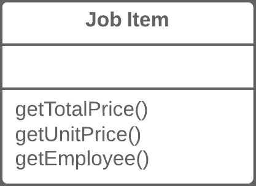
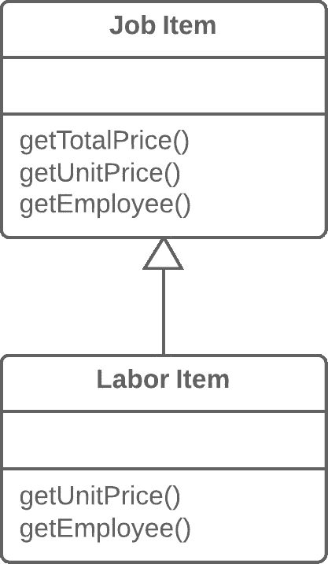

# 提取子类

> 原文：[`refactoringguru.cn/extract-subclass`](https://refactoringguru.cn/extract-subclass)

### 问题

一个类的特性只在特定情况下使用。

### 解决方案

创建一个子类并在这些情况下使用它。

之前之后

### 为什么重构

你的主类有用于实现某个罕见用例的方法和字段。虽然这种情况很罕见，但这个类对此负责，将所有相关字段和方法移动到一个完全独立的类是错误的。然而，它们可以被移动到一个子类，这正是我们将通过这种重构技术实现的。

### 好处

+   快速简便地创建子类。

+   如果你的主类当前实现多个特殊情况，可以创建几个独立的子类。

### 缺点

+   尽管看似简单，*继承*可能会导致死胡同，如果你必须分离几个不同的类层次。例如，如果你有`Dogs`类，其行为根据狗的大小和毛发不同，你可以提炼出两个层次：

    +   按大小：`Large`、`Medium`和`Small`

    +   按毛发：`Smooth`和`Shaggy`

    一切似乎都很好，除了当你需要创建一个既是`Large`又是`Smooth`的狗时，问题就会出现，因为你只能从一个类创建对象。也就是说，你可以通过使用*组合*而不是*继承*来避免这个问题（见策略模式）。换句话说，`Dog`类将有两个组件字段，大小和毛发。你将从必要的类中插入组件对象到这些字段中。因此，你可以创建一个拥有`LargeSize`和`ShaggyFur`的`Dog`。

### 如何重构

1.  从感兴趣的类创建一个新的子类。

1.  如果你需要额外的数据从子类创建对象，请创建一个构造函数并将必要的参数添加到其中。不要忘记调用构造函数的父类实现。

1.  找到对父类构造函数的所有调用。当需要子类的功能时，用子类构造函数替换父构造函数。

1.  将必要的方法和字段从父类移动到子类。通过向下推送方法和向下推送字段来完成这一过程。先移动方法通常更简单。这样，字段在整个过程中仍然可以访问：在移动之前来自父类，在移动完成后来自子类。

1.  在子类准备好后，找到所有控制功能选择的旧字段。使用多态性删除这些字段，以替代所有使用过这些字段的操作符。一个简单的例子：在 Car 类中，你有字段`isElectricCar`，并且根据这个字段，在`refuel()`方法中，汽车要么加油，要么充电。重构后，`isElectricCar`字段被移除，`Car`和`ElectricCar`类将拥有各自的`refuel()`方法实现。

</images/refactoring/banners/tired-of-reading-banner-1x.mp4?id=7fa8f9682afda143c2a491c6ab1c1e56>

</images/refactoring/banners/tired-of-reading-banner.png?id=1721d160ff9c84cbf8912f5d282e2bb4>

您的浏览器不支持 HTML 视频。

### 厌倦了阅读吗？

毫无疑问，阅读我们这里所有的文本需要 7 个小时。

尝试我们的交互式重构课程。它提供了一种不那么乏味的学习新知识的方法。

*让我们看看…*
