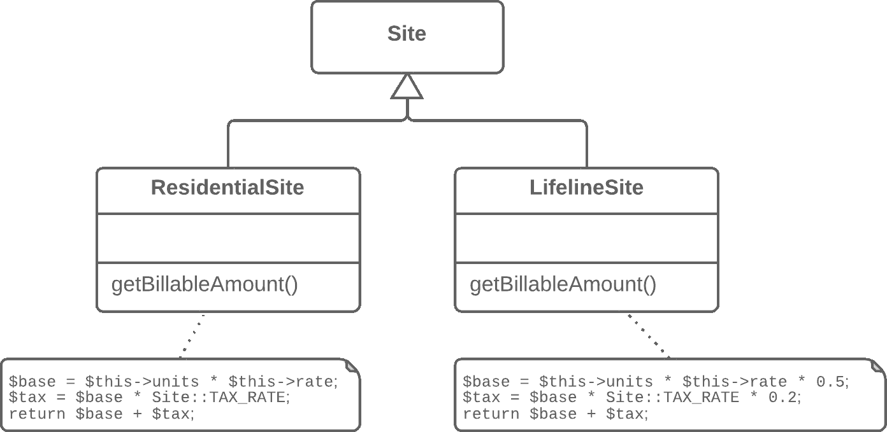
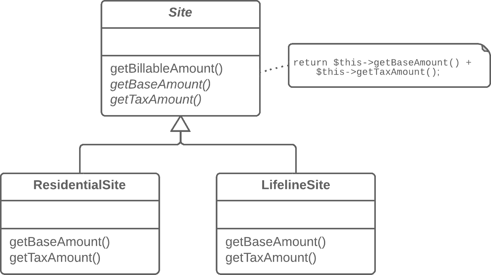

# 表单模板方法

> 原文：[`refactoringguru.cn/form-template-method`](https://refactoringguru.cn/form-template-method)

### 问题

你的子类实现了包含相似步骤的算法，这些步骤以相同的顺序进行。

### 解决方案

将算法结构和相同的步骤移动到超类中，将不同步骤的实现留在子类中。

之前之后

### 为什么重构

子类是并行开发的，有时由不同的人完成，这导致代码重复、错误以及代码维护的困难，因为每次更改都必须在所有子类中进行。

### 优势

+   代码重复并不总是指简单的复制/粘贴。有时，重复发生在更高的层面，例如当你有一个排序数字的方法和一个排序对象集合的方法，而它们之间的区别仅在于元素的比较。创建模板方法通过将共享的算法步骤合并到超类中，消除了这种重复，并将差异留在子类中。

+   形成模板方法是*开放/封闭原则*在实践中的一个例子。当出现新的算法版本时，你只需创建一个新的子类；无需对现有代码进行更改。

### 如何重构

1.  将子类中的算法拆分为描述在单独方法中的组成部分。提取方法可以帮助实现这一点。

1.  对所有子类都相同的方法可以通过上拉方法移动到超类中。

1.  不相似的方法可以通过重命名方法赋予一致的名称。

1.  将不相似方法的签名作为抽象方法移动到超类中，使用上拉方法。将它们的实现留在子类中。

1.  最后，将算法的主要方法提升到超类中。现在它应该可以与超类中描述的方法步骤一起工作，包括真实和抽象的。

</images/refactoring/banners/tired-of-reading-banner-1x.mp4?id=7fa8f9682afda143c2a491c6ab1c1e56>

</images/refactoring/banners/tired-of-reading-banner.png?id=1721d160ff9c84cbf8912f5d282e2bb4>

你的浏览器不支持 HTML 视频。

### 读腻了吗？

不奇怪，阅读我们这里所有文本需要 7 个小时。

尝试我们的互动重构课程。它提供了一种更轻松的学习新知识的方法。

*我们来看看…*
