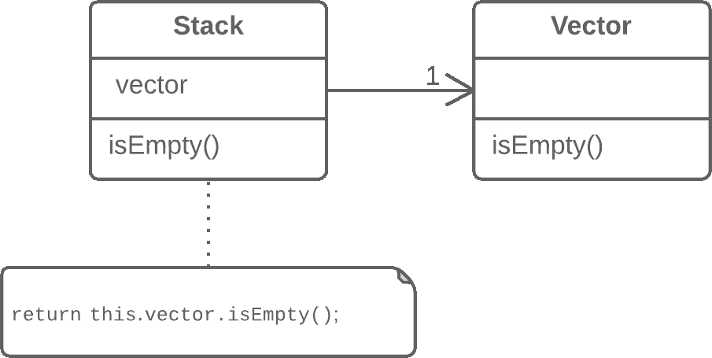

# 用委托替代继承

> 原文：[`refactoringguru.cn/replace-inheritance-with-delegation`](https://refactoringguru.cn/replace-inheritance-with-delegation)

### 问题

您有一个子类只使用超类的一部分方法（或无法继承超类数据）。

### 解决方案

创建一个字段并放入一个超类对象，委托方法给超类对象，去掉继承。

之前之后

### 为什么重构

用组合替代继承可以大幅改善类设计，如果：

+   您的子类违反了*里氏替换原则*，即如果继承只是为了组合公共代码，而不是因为子类是超类的扩展。

+   子类只使用超类的一部分方法。在这种情况下，总会有人调用本不应该调用的超类方法，这只是时间问题。

本质上，这种重构技术将两个类分开，使超类成为子类的助手，而不是其父类。子类将只拥有委托给超类对象的方法，而不是继承所有超类方法。

### 好处

+   一个类不包含从超类继承的任何不必要的方法。

+   可以将各种不同实现的对象放入委托字段中。实际上，您获得了策略设计模式。

### 缺点

+   您必须编写许多简单的委托方法。

### 如何重构

1.  在子类中创建一个字段以持有超类。在初始阶段，将当前对象放入其中。

1.  更改子类方法，使其使用超类对象而不是`this`。

1.  对于从超类继承的方法在客户端代码中被调用的情况，请在子类中创建简单的委托方法。

1.  从子类中移除继承声明。

1.  通过创建一个新对象来更改存储前超类的字段的初始化代码。

</images/refactoring/banners/tired-of-reading-banner-1x.mp4?id=7fa8f9682afda143c2a491c6ab1c1e56>

</images/refactoring/banners/tired-of-reading-banner.png?id=1721d160ff9c84cbf8912f5d282e2bb4>

您的浏览器不支持 HTML 视频。

### 读腻了吗？

难怪，阅读我们这里的所有文本需要 7 小时。

尝试我们的交互式重构课程。它提供了一种不那么乏味的学习新知识的方法。

*让我们看看…*
