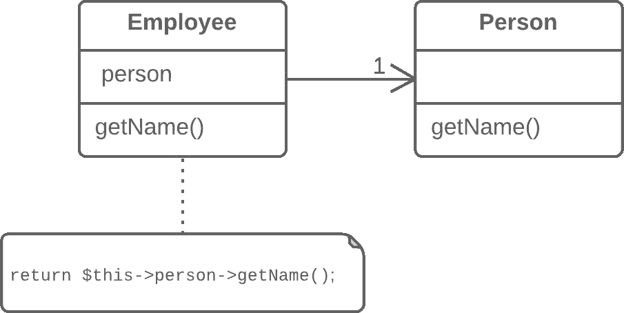
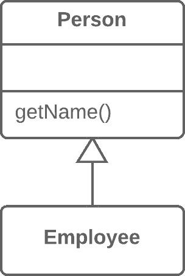

# 用继承替代委托

> 原文：[`refactoringguru.cn/replace-delegation-with-inheritance`](https://refactoringguru.cn/replace-delegation-with-inheritance)

### 问题

一个类包含许多简单方法，这些方法委托给另一个类的所有方法。

### 解决方案

使类成为委托继承者，从而使委托方法变得不必要。

之前之后

### 为什么重构

委托是一种比继承更灵活的方法，因为它允许更改委托的实现方式并放置其他类。不过，如果你只将操作委托给一个类及其所有公共方法，委托就会失去其优势。

在这种情况下，如果用继承替代委托，你可以清理类中大量的委托方法，避免为每个新委托类方法创建它们的需要。

### 好处

+   减少代码长度。这些委托方法不再是必需的。

### 何时不使用

+   如果类仅对委托类的部分公共方法进行委托，则不要使用此技术。这样做将违反*李斯科夫替换原则*。

+   仅当类仍没有父类时，才能使用此技术。

### 如何重构

1.  使类成为委托类的子类。

1.  将当前对象放入一个包含对委托对象引用的字段中。

1.  逐一删除简单委托的方法。如果它们的名称不同，可以使用重命名方法将所有方法赋予一个统一的名称。

1.  将对委托字段的所有引用替换为对当前对象的引用。

1.  删除委托字段。

</images/refactoring/banners/tired-of-reading-banner-1x.mp4?id=7fa8f9682afda143c2a491c6ab1c1e56>

</images/refactoring/banners/tired-of-reading-banner.png?id=1721d160ff9c84cbf8912f5d282e2bb4>

您的浏览器不支持 HTML 视频。

### 厌倦阅读？

难怪，阅读这里的所有文本需要 7 小时。

尝试我们的互动重构课程。它提供了一种不那么乏味的学习新知识的方法。

*让我们看看…*
