# 使用 Docker 和 Kubenetes 的 CICD（Semaphore）


# 使用 Docker 和 Kubernetes 的 CI/CD

## 第二版 - 如何以高速交付云原生应用

## 信号量

# 目录

- 前言
    - 这本书适合谁，内容涵盖了什么？
    - 第二版的变化
    - 如何联系我们
    - 关于作者

# 使用 Docker 进行开发和 CI/CD

- 1.1 使用 Docker 的好处
    - 1.1.1 在几分钟内设置开发环境
    - 1.1.2 在云端或本地轻松部署
    - 1.1.3 更少的风险发布
- 1.2 采用 Docker 的路线图
    - 1.2.1 选择第一个要 Docker 化的项目
    - 1.2.2 编写第一个 Dockerfile
    - 1.2.3 编写更多的 Dockerfile
    - 1.2.4 编写一个 Docker Compose 文件
    - 1.2.5 一个标准化的开发环境
    - 1.2.6 端到端测试和质量保证
    - 1.2.7 持续部署到暂存环境
    - 1.2.8 持续部署到生产环境
- 1.3 总结

# 2 部署到 Kubernetes

- 2.1 容器和 Pod
- 2.2 声明式与命令式系统
- 2.3 副本集轻松扩展 Pod
- 2.4 部署驱动副本集
    - 2.4.1 更改配置时会发生什么
- 2.5 使用就绪探针检测损坏的部署
- 2.6 回滚以快速恢复错误的部署
- 2.7 MaxSurge 和 MaxUnavailable
- 2.8 快速演示
- 2.9 选择器和标签
    - 2.9.1 服务作为负载均衡器
- 2.10 高级 Kubernetes 部署策略
    - 2.10.1 蓝/绿部署
    - 2.10.2 金丝雀部署
- 2.11 总结

# 3 云原生应用的3个CI/CD最佳实践

## 3.1 什么是好的CI/CD流水线

### 3.1.1 速度

### 3.1.2 可靠性

### 3.1.3 完整性

## 3.2 通用原则

### 3.2.1 在支持迭代发布的方式下架构系统发布

### 3.2.2 你构建它，你运行它

### 3.2.3 使用临时资源

### 3.2.4 自动化一切

## 3.3 持续集成最佳实践

### 3.3.1 将主要构建视为即将发布在任何时间

### 3.3.2 保持构建快速：最多10分钟

### 3.3.3 只需构建一次并通过推广结果流水线

### 3.3.4 首先运行快速和基本测试

### 3.3.5 最小化功能分支，拥抱功能标志...

### 3.3.6 使用 CI 来维护你的代码

## 3.4 持续交付的最佳实践

### 3.4.1 CI/CD 管道是部署到生产环境的唯一方式

### 3.4.2 开发人员可以一键部署到类生产环境的暂存环境只需按下按钮，开发人员可以在生产环境中部署....

### 3.4.3 始终使用相同的环境

# 4 实施 CI/CD 流水线

## 4.1 Docker 和 Kubernetes 命令

### 4.1.1 Docker 命令

### 4.1.2 Kubectl 命令

## 4.2 设置演示项目

### 4.2.1 安装先决条件

### 4.2.2 下载 Git 仓库

### 4.2.3 在本地运行微服务

### 4.2.4 查看 Kubernetes 清单

## 4.3 CI/CD 工作流程概述

### 4.3.1 CI 流水线：构建 Docker 镜像和运行测试

### 4.3.2 CD 流水线：金丝雀和稳定部署

## 4.4 使用 Semaphore 实现 CI/CD 流水线

### 4.4.1 信号量介绍

- 4.4.2 创建信号量账户
- 4.4.3 为演示仓库创建信号量项目
- 4.4.4 信号量工作流构建器
- 4.4.5 持续集成流水线
- 4.4.6 你的第一个构建
- 4.5 Kubernetes 配置
    - 4.5.1 DigitalOcean 集群
    - 4.5.2 Google Cloud 集群
    - 4.5.3 AWS 集群
- 4.6 数据库配置
    - 4.6.1 DigitalOcean 数据库
    - 4.6.2 Google Cloud 数据库
    - 4.6.3 AWS 数据库
    - 4.6.4 在 Semaphore 上创建数据库密钥
- 4.7 金丝雀流水线
    - 4.7.1 创建推广和部署流水线
- 4.8 你的第一个发布
    - 4.8.1 稳定部署流水线
    - 4.8.2 发布金丝雀
    - 4.8.3 发布稳定版
    - 4.8.4 回滚流水线
    - 4.8.5 故障排除和技巧
- 4.9 总结
- 5 结束语
    - 5.1 与世界分享本书
    - 5.2 告诉我们您的想法
    - 5.3 关于信号量

© 2022 Rendered Text。 版权所有。

本作品采用知识共享署名-非商业性使用-禁止演绎 4.0 国际许可协议进行许可。要查看此许可协议的副本，请访问 [https://creativecommons.org/licenses/by-nc-nd/4.0](https://creativecommons.org/licenses/by-nc-nd/4.0)

本书是开源的：[https://github.com/semaphoreci/book-cicd-docker-kubernetes](https://github.com/semaphoreci/book-cicd-docker-kubernetes)

在 Semaphore 网站上发布：[https://semaphoreci.com](https://semaphoreci.com)

2022 年 9 月：第二版 v2.0（修订版 0d31865）

# **分享本书：**

我刚开始阅读《使用 Docker 和 Kubernetes 的 CI/CD》这本免费电子书，作者是 @semaphoreci：[https://bit.ly/3bJELLQ](https://bit.ly/3bJELLQ)（点击推特！）

# 前言

为了最大化学习速度，我们必须尽量减少尝试的时间。
在软件开发中，云计算是增加构建创新产品速度的关键因素。

如今，云计算的使用方式正在发生巨大变化。 借用 Adrian Cockcroft¹的比喻，他曾在 Netflix 负责云架构，我们需要将云资源视为短暂和可丢弃的牲畜，而不是长寿和稳定的宠物。

然而，成功做到这一点需要我们的应用程序进行适应。 它们需要是可丢弃的和横向扩展的。 它们应该在开发和生产之间有最小的差异，以便我们可以每天多次持续部署它们。

一代新的工具使构建这种云原生软件的方式民主化了。 Docker 容器现在是以一种可以在任何云上部署、扩展和动态分发的方式打包软件的标准方式。而 Kubernetes 是在生产环境中运行容器的领先平台。 随着时间的推移，将出现具有更高级接口的新平台，但几乎可以肯定它们将基于 Kubernetes。

巨大的机会可能伴随着高昂的成本。 无数组织花费了很多工程月份来学习如何使用这个新的技术栈来交付他们的应用程序，从网络上理解不同的信息。当工程师宣布他们要转向新的工具以提高生产力时，延迟几个月推出新功能显然不是任何企业想要的结果。

亲爱的读者，这就是本书的用途。 我们的目标是帮助您快速过渡到交付云原生应用程序。 基本原则没有改变：我们仍然需要一个稳定可靠的交付流水线，可以自动配置、构建、测试和部署代码。 本书向您展示了如何以云原生的方式做到这一点，这样您就可以专注于构建出色的产品和解决方案。

# 这本书适合谁，内容涵盖了什么？

本书的主要目标是为希望实现以下目标的软件开发团队提供实用的路线图：

- 使用 Docker 容器打包他们的代码，
- 在 Kubernetes 上运行它，并且
- 持续交付所有更改。

我们不会花太多时间解释为什么您应该或不应该使用容器技术来发布您的应用程序。我们也不提供有关使用 Docker 和 Kubernetes 的一般参考。当您遇到 Docker 或 Kubernetes 的概念时，我们建议您查阅官方文档。

我们假设您对容器技术栈还比较新，并且您的目标是建立一个标准化和完全自动化的构建、测试和发布流程。

我们相信技术领导者和个人贡献者都将从阅读本书中受益。

如果您是首席技术官或其他负责向客户交付可工作软件的人，本书将为您提供一个清晰的视野，了解可靠的 CI/CD 流水线到 Kubernetes 的样子，以及构建它所需的条件。

如果您是开发人员或系统管理员，除了了解整体情况，您还将在您的项目中找到可重用的工作代码和配置。

第1章，“使用 Docker 进行开发和 CI/CD”，概述了使用 Docker 的主要好处，并提供了详细的采用路线图。

第2章，“部署到 Kubernetes”，解释了关于 Kubernetes 部署的必要知识，以便将容器交付到生产环境。

第3章，“云原生应用的最佳实践”，描述了我们在软件交付方面的文化和工具需要如何改变，以充分享受容器和云的敏捷性。

第4章，“完整的 CI/CD 流水线”，是一个逐步指南，介绍了如何使用 Semaphore 构建、测试和部署一个 Docker 化的微服务到 Kubernetes。

# 第二版的变化

第二版引入了一些变化：

- 迁移到 Kubernetes 版本 v1.20。所有命令和操作都经过了此版本的测试。
- 添加了关于在本地开发 Kubernetes 集群中访问服务的注释。
- 在 Semaphore 中添加了新的 CI/CD 功能：参数化流水线、测试结果、代码更改检测。
- DigitalOcean 部署现在使用他们的私有容器注册表服务，而不是 Docker Hub。
- 更新了 DigitalOcean、Google Cloud 和 AWS 的设置步骤。
- 使用更高分辨率更新了 UI 截图。
- 修改了部署教程以使用参数化推广。
- 其他小修复。

# 如何联系我们

在阅读本书后，我们非常希望听到您的反馈意见。您喜欢和学到了什么？有什么可以改进的地方？有什么我们可以进一步解释的吗？

发布电子书的好处是我们可以不断改进它。根据您的反馈，我们正是这样做的。

您可以通过发送电子邮件到 learn@semaphoreci.com 向我们发送反馈。

在 Twitter 上找到我们: https://twitter.com/semaphoreci

在 Facebook 上找到我们: https://facebook.com/SemaphoreCI

在 LinkedIn 上找到我们: https://www.linkedin.com/company/rendered-text

# 关于作者

Marko Anastasov是一位软件工程师、作家和企业家。Marko共同创办了 Rendered Text，这是一家Semaphore CI/CD服务背后的软件公司。他致力于将Semaphore从一个想法发展成为一个云平台，被世界上一些最好的工程团队使用。他在semaphoreci.com/blog上写关于支持持续交付的架构、实践和工具的文章。在Twitter上关注Marko的账号是@markoa。

Jérôme Petazzoni曾是构建、扩展和运营dotCloud PAAS团队的一员，之后该公司成为Docker。他在这家容器创业公司工作了七年，在容器生产环境中运行容器，这在当时是很酷的。他喜欢分享自己的知识，这使他在容器、Docker和Kubernetes方面做了数百次演讲和演示。他已经培训了成千上万的人在这些平台上自信地部署他们的应用程序，并作为一名独立顾问继续这样做。他重视多样性，并努力成为一个好的盟友，或者至少是一个体面的社会正义助手。

他还收集乐器，可以说他能用十几种乐器演奏《塞尔达的传说》的主题曲。在Twitter上关注Jérôme，账号为@jpetazzo。

Pablo Tomas Fernandez Zavalia是一位电子工程师和作家。他在布宜诺斯艾利斯市政府（bueno-saires.gob.ar）开始了他的职业生涯。毕业后，他加入了英国电信公司，担任阿根廷Web服务部门的负责人。然后他在IBM担任数据库管理员，同时也从事辅导、DevOps和云迁移工作。在空闲时间，他喜欢写作、航海和桌游。在Twitter上关注Tomas，账号为@tomfernblog。

# 使用 Docker 进行开发和 CI/CD

2013年，Solomon Hykes在圣克拉拉的PyCon大会上展示了Docker的第一个版本。 自那时以来，Docker容器的好处已经传播到软件行业的每个角落。尽管Docker（项目和公司）使容器如此受欢迎，但它们并不是第一个利用容器的项目；而且它们肯定也不是最后一个。

几年后，我们有望超越炒作，因为一些强大而高效的模式出现了，利用容器来开发和交付更好的软件，更快速。

在本章中，您将首先了解到实施 Docker 容器所能带来的好处。

然后，任何组织都可以实际地遵循一个现实的路线图，以实现这些好处。

# 1.1 使用 Docker 的好处

容器不会立即将我们的单块式遗留应用程序转变为分布式、可扩展的微服务。

容器不会一夜之间将我们所有的软件工程师转变为“DevOps 工程师”。 值得注意的是，因为 DevOps 不是由我们的工具或技能定义的，而是由一系列实践和文化变革定义的。

那么容器对我们有什么作用呢？

## 1.1.1 在几分钟内设置开发环境

使用 Docker 及其伴侣工具 Compose，您可以在任何机器上本地运行一个复杂的应用程序，时间不超过五分钟。

总和为：

```
$ git clone https://github.com/jpetazzo/dockercoins
$ cd dockercoins
$ docker-compose up
```

> 1 Linux容器的未来（2013年），https://www.youtube.com/watch?v=wW9 CAH9 nSLs

您可以在安装了Docker的任何机器上运行这三行命令（Linux， macOS， Windows），几分钟后，您将获得DockerCoins演示应用程序并运行起来。 DockerCoins创建于2015年；它有多个组件使用Python， Ruby和Node.js编写，以及一个Redis存储。 多年后，在不更改任何代码的情况下，我们仍然可以使用相同的三个命令启动它。

这意味着引入新团队成员或从一个项目切换到另一个项目现在可以快速可靠。 无论DockerCoins是否使用Python 2.7和Node.js 8，而您的其他应用程序使用Python 3和Node.js 10，或者您的系统使用不同版本的这些语言；每个容器都与其他容器和主机系统完全隔离。我们将看到如何实现这一点。

## 1.1.2 在云端或本地轻松部署

在构建容器映像之后，我们可以在任何服务器环境上一致地运行它们。自动化服务器安装通常需要特定于我们基础架构的步骤（和领域知识）。例如，如果我们使用AWS EC2，我们可能会使用AMI（Amazon Machine Images），但这些映像与Azure、Google Cloud或私有OpenStack集群上使用的映像不同（并且构建方式也不同）。

配置管理系统（如Ansible、Chef、Puppet或Salt）通过将我们的服务器及其配置描述为存储在版本控制源代码库中的清单来帮助我们。这有所帮助，但编写这些清单并不容易，并且它们不能保证可复现的执行。当切换发行版、发行版版本甚至从一个云提供商切换到另一个云提供商时，这些清单必须进行适应，因为它们可能使用不同的网络接口或磁盘命名。

一旦我们安装了Docker引擎（最流行的选项），它可以运行任何容器镜像，并有效地抽象这些环境差异。

能够轻松可靠地创建新环境，正好满足我们设置CI/CD（持续集成和持续交付）所需的条件。我们将看到如何实现这一点。最终，这意味着高级技术，如蓝/绿部署或不可变基础设施，对我们来说变得可行，而不仅仅是大型组织能够花费大量时间构建他们完美的定制工具的特权。

## 1.1.3 更少的风险发布

容器可以帮助我们减少与新版本发布相关的风险。

当我们通过运行相应的容器镜像启动应用程序的新版本时，如果出现问题，回滚非常容易。我们只需要停止容器，然后重新启动之前的版本。之前版本的镜像仍然存在，并且将立即启动。

这比尝试代码回滚要安全得多，特别是如果新版本涉及某些依赖升级。我们确定可以降级到之前的版本吗？它在软件包仓库中仍然可用吗？如果我们使用容器，我们就不必担心这个问题，因为我们的容器镜像是可用且准备好的。

这种模式有时被称为不可变基础设施，因为我们不是改变我们的服务，而是部署新的服务。最初，不可变基础设施是通过虚拟机实现的：每次发布新版本都会启动一批新的虚拟机。容器使这一过程更加简单易用。

因此，我们可以更加自信地进行部署，因为我们知道如果出现问题，我们可以轻松回退到之前的版本。

# 1.2 采用 Docker 的路线图

以下路线图适用于各种规模的组织和团队，无论他们对容器的了解程度如何。更好的是，这个路线图将在每个步骤中带来实际的好处，使您对整个过程更加自信。

听起来太好以至于难以置信吗？

在我们深入细节之前，让我们快速概述一下：

- 1. 编写一个Dockerfile。选择一个对服务影响最大的服务。
- 2. 编写更多的Dockerfile。目标是将整个应用程序放入容器中。
- 3. 编写一个Compose文件。现在任何人都可以在几分钟内在他们的机器上运行这个应用程序。
- 4. 确保所有开发人员都参与其中。他们都应该有一个良好的Docker设置。
- 5. 使用这个来促进质量保证（QA）和端到端测试。
- 6. 自动化这个过程：恭喜，你现在正在进行持续部署到暂存环境。
- 7. 最后一个逻辑步骤是持续部署到生产环境。

每个步骤都是一个独立的迭代。有些步骤很容易，其他步骤需要更多的工作；但是每个步骤都将改善你的工作流程。

## 1.2.1 选择第一个要 Docker 化的项目

我们第一个Dockerfile的一个很好的候选是一个构建起来很麻烦且更新频繁的服务。例如，我们正在构建的新的Rails应用程序，在添加功能的同时每隔几天都会添加或更新依赖项。纯Ruby依赖是可以的，但是一旦我们依赖于系统库，我们就会遇到“在我的机器上可以运行（在你的机器上不行）”的问题，比如那些在macOS上的开发人员和那些在Linux上的开发人员之间。Docker将帮助解决这个问题。

另一个好的候选是我们正在重构或更新的应用程序，我们希望确保我们使用的是最新版本的语言或框架；而不会破坏其他所有环境。

如果我们有一个组件足够复杂，需要像Vagrant这样的工具在我们的开发者机器上运行，那么这也是Docker可以帮助的一个很好的提示。虽然Vagrant是一个很棒的产品，但在许多场景中维护一个Dockerfile比维护一个Vagrant file更容易；而且运行Docker也更容易和更轻量级。

## 1.2.2 编写第一个 Dockerfile

编写第一个Dockerfile有很多种方式，没有一种是本质上正确或错误的。有些人更喜欢尽可能地与现有环境保持一致。例如，如果你当前正在使用PHP 7.2和Apache 2.4，并且有一些非常特定的Apache配置和 .htaccess文件？当然，把它们放在容器中是有道理的。但如果你更喜欢从你的 .php文件开始，使用PHP FPM来提供服务，并从单独的NGINX容器中托管静态资源，那也可以。无论哪种方式，官方的PHP镜像都可以满足我们的需求。

在这个阶段，我们需要确保负责该服务的团队在他们的机器上安装了Docker，但是在这个阶段只有少数人需要与Docker进行交互。他们将为其他人铺平道路。

下面是一个示例的Dockerfile，用于DockerCoins演示中的哈希微服务，使用Ruby编写：

```
FROM ruby
RUN gem install sinatra
RUN gem install thin
ADD hasher.rb /
CMD ["ruby", "hasher.rb"]
EXPOSE 80
```

一旦我们为应用程序拥有一个可工作的Dockerfile，我们可以将这个容器镜像作为这个特定服务或组件的官方开发环境。如果我们选择一个快速发展的版本，我们将很快看到好处，因为Docker可以完全无缝地进行库和其他依赖项的升级。现在，使用不同的语言版本重新构建整个环境变得轻而易举。如果我们在困难的升级后意识到新版本效果不好，回滚同样简单且即时，因为Docker会保留先前构建的镜像缓存。

## 1.2.3 编写更多的 Dockerfile

下一步是将整个应用程序放入容器中。

请注意，我们现在还没有讨论生产环境，即使你的第一个实验非常成功，你也可以有选择地将一些容器部署到生产环境中，只针对某些组件。特别是建议将数据库和其他有状态的服务保持在容器之外，直到你获得更多的运维经验。

但在开发过程中，我们希望将所有东西都放入容器中，包括宝贵的数据库，因为开发人员机器上的数据库不包含任何宝贵的数据。

我们可能需要编写更多的Dockerfile，但对于像Redis、MySQL、PostgreSQL、MongoDB等标准服务，我们可以使用Docker Hub上的标准镜像。这些镜像通常带有特殊的规定，使它们易于扩展和定制；例如，官方的PostgreSQL镜像将自动运行放置在适当目录中的.sql文件，以预加载我们的数据库表结构或示例数据。

一旦我们为给定应用程序的所有组件拥有Dockerfiles（或镜像），我们就准备好进行下一步了。

## 1.2.4 编写一个 Docker Compose 文件

一个 Dockerfile可以轻松构建和运行单个容器；一个Docker Compose文件可以轻松构建和运行多个容器的堆栈。

因此，一旦每个组件在容器中正确运行，我们可以使用Compose文件描述整个应用程序。

下面是DockerCoins演示的docker-compose.yml文件的内容：

```
yaml
rng:
    build: rng
    ports:
        - "8001:80"

hasher:
    build: hasher
    ports:
        - "8002:80"

webui:
    build: webui
    links:
        - redis
    ports:
        - "8000:80"
    volumes:
        - "./webui/files/:/files/"

redis:
    image: redis

worker:
    build: worker
    links:
        - rng
        - hasher
        - redis
```

这给我们提供了之前提到的非常简单的工作流程：

```
bash
$ git clone https://github.com/jpetazzo/dockercoins
$ cd dockercoins
$ docker-compose up
```

Compose将分析文件docker-compose.yml，拉取所需的镜像，并构建需要构建的镜像。然后它将创建一个私有桥接网络用于应用程序，并在该网络中启动所有容器。为什么要为应用程序使用私有网络？这不是有点过度吗？

由于Compose将为每个启动的应用程序创建一个新的网络，这使我们可以在彼此旁边运行多个应用程序（或同一应用程序的多个版本）而不会有任何干扰的风险。

这与Docker的服务发现机制配对使用，该机制依赖于DNS。当应用程序需要连接到Redis服务器时，它不需要指定Redis服务器的IP地址或其FQDN。相反，它只需使用 redis作为服务器主机名。例如，在PHP中：

```
php
$redis = new Redis();
$redis->connect('redis', 6379);
```

Docker将确保名称 redis解析为当前网络中Redis容器的IP地址。因此，多个应用程序可以分别拥有一个 redis服务，并且名称 redis将在每个网络中解析为正确的服务。

## 1.2.5 一个标准化的开发环境

一旦我们拥有了Compose文件，现在是确保每个人都参与其中的好时机；也就是说，我们所有的开发人员都拥有一个可工作的Docker安装。由于Docker桌面版，Windows和Mac用户会发现这特别容易。

我们的团队需要了解一些Docker和Compose命令；但在许多场景中，只要他们知道docker-compose up --build就可以了。这个命令将确保所有镜像都是最新的，并运行整个应用程序，在终端中显示其日志。如果我们想停止应用程序，只需按下 Ctrl-C即可。

此时，我们已经从Docker和容器中获得了巨大的好处：每个人都可以在几分钟内获得一个一致的开发环境，而不受主机系统的影响。

对于不需要跨多个服务器的简单应用程序，这几乎足够用于生产；但我们还不需要那么远，因为在与生产相关的高风险领域中，我们可以利用Docker而不必去那里。

## 1.2.6 端到端测试和质量保证

当我们想要自动化一个任务时，最好的办法是先让人来完成，并记录下必要的步骤。换句话说：首先手动完成任务，但要进行文档记录。然后，这些说明可以交给另一个人来执行。那个人可能会向我们提出一些澄清问题，这将使我们能够完善我们的手动说明。

一旦这些手动说明完全准确，我们就可以将它们转化为一个程序（一个简单的脚本通常就足够了），然后自动执行。

按照这些原则部署测试环境，并根据您组织中使用的测试类型执行CI（持续集成）和端到端测试。即使您没有自动化测试，您肯定在发布功能之前会进行某种形式的测试，即使只是在用户看到之前在暂存环境中测试应用程序。

实际上，这意味着我们将记录并自动化部署我们的应用程序，这样任何人都可以通过运行脚本来启动和运行它。

我们最终的部署脚本将比完整的配置管理清单、虚拟机镜像等要简单得多。

如果我们有一个QA团队，他们现在可以在不依赖他人部署代码的情况下测试新版本。

如果你正在进行任何类型的单元测试或端到端测试，你现在也可以通过遵循与自动化部署过程相同的原则来自动化这些任务。

现在我们有了一个完整的操作序列：构建镜像、启动容器、执行初始化或迁移钩子以及运行测试。从现在开始，我们将称之为流水线，因为所有这些操作必须按照特定的顺序进行，如果其中一个操作失败，我们就不执行后续阶段。

## 1.2.7 持续部署到暂存环境

下一步是在我们推送代码更改到代码仓库时自动运行我们的流水线。

像Semaphore这样的CI/CD系统可以连接到GitHub，并在每次有人打开或更新拉取请求时运行流水线。相同或修改后的流水线也可以在特定分支或一组特定分支上运行。

每当有相关更改时，我们的流水线将自动执行以下类似的步骤：

- 构建新的容器镜像；
- 对这些镜像运行单元测试（如果适用）；
- 在临时环境中部署它们；
- 对应用程序运行端到端测试；
- 使应用程序可供人工测试。

在本书的后续部分，我们将看到如何实际实现这样的流水线。

请注意，我们仍然不需要为所有这些工作设置容器编排。如果我们的应用程序在暂存环境中可以适应单台机器，我们无需担心设置集群。实际上，由于Docker的层系统，可以同时运行共享共同祖先的图像，这将是相同组件的连续版本的图像的情况，非常节省磁盘和内存；因此，我们有很大机会在单个Docker引擎上运行许多应用程序副本。

但现在也是开始研究编排和像Kubernetes这样的平台的正确时机。在这个阶段，我们不需要直接将其推向生产环境；但我们可以使用其中一个编排工具来部署我们应用的演示版本。

这将为我们提供一个低风险的环境，在这个环境中我们可以提升我们在容器编排和调度方面的技能，同时保持与我们生产环境相同的复杂性，减少请求和数据的量。

## 1.2.8 持续部署到生产环境

在我们从上一个阶段过渡到下一个阶段之前可能需要一段时间，因为我们需要建立信心和操作经验。

然而，此时我们已经拥有一个持续部署的流水线，它会接收每个拉取请求（或特定分支或一组分支的每个更改），并以完全自动化的方式将代码部署到一个演示集群中。

当然，我们需要学习如何收集日志和指标，以及如何应对较小的故障和重大的故障；但最终，我们将准备好将我们的流水线扩展到生产环境。

# 1.3 总结

从头开始使用新工具构建交付流水线确实需要很多工作。但是通过上面描述的路线图，我们可以一步一步地实现，并在每一步中享受到具体的好处。

在下一章中，我们将学习如何将代码部署到Kubernetes中，包括在以前的技术栈中可能无法实现的策略。

# 2 部署到 Kubernetes

当开始使用 Kubernetes 时，你通常会学习和使用的第一个命令是 `kubectl run`。有经验的 Docker 用户倾向于将其与 `docker run` 进行比较，并认为：“啊，这就是我可以简单运行容器的方式！”

事实证明，当你使用 Kubernetes 时，并不仅仅是运行一个容器。

Kubernetes 处理容器的方式在很大程度上取决于你使用的版本。你可以使用以下命令检查服务器版本：

```
$ kubectl version
```

### Kubernetes 容器的版本为 1.17 及更低版本

当使用低于 1.18 的版本时，请看看在运行一个非常基本的 `kubectl run` 命令后会发生什么：

```
$ kubectl run web --image=nginx
deployment.apps/web created
```

好的！然后你检查一下集群上创建了什么，然后...

```
$ kubectl get all
```

| 名称 | 准备状态 | 重启时间 | 年龄 |
| :--- | :--- | :--- | :--- |
| pod/web-65899c769f-dhtdx | 1/1 | 运行中 | 11秒 |
| **名称** | **类型** | **集群IP** | **外部IP** | **端口** | **年龄** |
| service/kubernetes | ClusterIP | 10.96.0.1 | 1.2.3.4 | 443/TCP | 46秒 |
| **名称** | **期望的** | **当前的** | **最新的** | **可用的** | **年龄** |
| deployment.apps/web | 1 | 1 | 1 | 1 | 11秒 |
| **名称** | **期望的** | **当前的** | **就绪的** | **年龄** |
| replicaset.apps/web-65899c769f | 1 | 1 | 1 | 11秒 |

> “我只想要一个容器！为什么我得到了三个不同的对象？”

你没有得到一个容器，而是得到了一个未知的动物园：

- 一个部署（在这个例子中称为 web），
- 一个副本集（web-65899c769f），
- 一个pod (web-65899c769f-dhtdx) 。

注意：你可以忽略上面示例中的名为kubernetes的service；这个service在kubectl run命令之前已经存在。

### Kubernetes容器的版本为1.18及更高版本

当你运行的是1.18或更高版本时，Kubernetes确实会创建一个单独的pod。看看Kubernetes在新版本上的不同之处：

```
bash
$ kubectl run web --image=nginx
pod/web已创建
```

正如你所看到的，较新的Kubernetes版本的行为基本符合经验丰富的Docker用户的预期。请注意，没有创建部署或副本集：

```
bash
$ kubectl get all
```

| 名称 | 就绪 | 状态 | 重启次数 | 年龄 |
|------|-------|--------|----------|-----|
| pod/web | 1/1 | 运行中 | 0 | 3分钟14秒 |
| **名称** | **类型** | **集群IP** | **外部IP** | **端口** | **年龄** |
| service/kubernetes | ClusterIP | 10.96.0.1 | 1.2.3.4 | 443/TCP | 4分钟16秒 |

因此，如果我们想要创建一个部署，我们必须更加明确。这个命令在所有Kubernetes版本上都按预期工作：

```
bash
$ kubectl create deployment web --image=nginx
deployment.apps/web已创建
```

底线是，我们应该始终使用最明确的命令来为我们的部署未来提供保障。

接下来，您将了解这些不同对象的角色以及它们在Kubernetes中对零停机部署的重要性。

持续集成使您对代码的工作方式有信心。为了将这种信心扩展到发布过程中，您的部署操作也需要带有安全带。

## 2.1 容器和 Pod

在Kubernetes中，部署的最小单位不是容器，而是一个Pod。Pod只是一组容器（也可以是一个容器组）在同一台机器上运行并共享一些东西。

例如，Pod中的容器可以通过本地主机进行通信。从网络的角度来看，这些容器中的所有进程都是本地的。

但是你永远不能创建一个独立的容器：你能做的最接近的是在其中创建一个只有一个容器的Pod。

这就是这里发生的情况：当你告诉Kubernetes，“创建一个NGINX！”时，你实际上是在说，“我想要一个Pod，在其中应该有一个使用nginx镜像的单个容器。”

```
# pod-nginx.yml
#使用以下命令创建它：
#     kubectl apply -f pod-nginx.yml
apiVersion: v1
kind: Pod
metadata:
  name: web
spec:
  containers:
    - image: nginx
      name: nginx
      ports:
        - containerPort: 80
          name: http
```

好吧，那么为什么它不只有一个Pod呢？为什么还需要副本集和部署？

## 2.2 声明式与命令式系统

Kubernetes是一个声明式系统（与命令式系统相反）。这意味着你不能给它下达命令。你不能说，“运行这个容器。”你只能描述你想要的，并等待Kubernetes采取行动来协调你拥有的资源和你想要的资源。

换句话说，你可以说，“我想要一个40英尺长的蓝色集装箱，带有黄色的门”，Kubernetes会为你找到这样的一个集装箱。如果不存在，它会构建一个；如果已经有一个，但是它是绿色的，带有红色的门，它会为你涂漆；如果已经有一个大小和颜色都合适的集装箱，Kubernetes不会做任何操作，因为你已经拥有了你想要的。

## 2.3 副本集轻松扩展 Pod

在软件容器的术语中，你可以说，“我想要一个名为web的pod，在其中应该有一个单独的容器，它将运行nginx镜像。”
如果该pod尚不存在，Kubernetes将创建它。如果该pod已经存在并且与您的规格匹配，Kubernetes不需要做任何操作。
在这种情况下，如何扩展您的web应用程序，使其在多个容器或pod中运行？

如果你只有一个pod，并且你想要更多相同的pods，你只能回到Kubernetes并告诉它，“我想要一个名为web2的pod，具有以下规格： … ”并且重复使用之前的规格。 然后，根据需要重复这个过程多次，以获得更多的pods。
这非常不方便，因为现在你需要跟踪所有这些pods，并确保它们都使用相同的规格保持同步。
为了简化事情，Kubernetes提供了一个更高级的构造：副本集。 副本集的规格看起来非常像pod的规格，只是它带有一个数字，表示你想要多少个具有特定规格的副本（即pods）。
所以你告诉Kubernetes，“我想要一个名为web的副本集，其中应该有3个pods，都符合以下规格： … ”然后Kubernetes会确保恰好有三个匹配的pods。 如果你从头开始，将会创建这三个pods。 如果你已经有三个pods，就不会做任何操作，因为你已经拥有的pods与你想要的匹配。

```yaml
# pod-replicas.yml
apiVersion: apps/v1
kind: ReplicaSet
metadata:
  name: web-replicas
  labels:
    app: web
    tier: frontend
spec:
  replicas: 3
  selector:
    matchLabels:
      tier: frontend
  template:
    metadata:
      labels:
        app: web
        tier: frontend
spec:
  containers:
  - name: nginx
    image: nginx
    ports:
    - containerPort: 80
```

副本集对于扩展和高可用性非常重要。

扩展是重要的，因为您可以更新现有的副本集以更改所需的副本数。 因此，Kubernetes将创建或删除Pod，以便最终达到精确的所需数量。

对于高可用性而言，它非常重要，因为Kubernetes将持续监视集群中发生的情况。 它将确保无论发生什么情况，您仍然拥有所需的数量。

如果一个节点关闭，并带走了一个web pod，Kubernetes会创建另一个pod来替代它。如果事实证明该节点并未关闭，而只是在一段时间内无法访问或无响应，那么当它恢复时，您可能会多出一个pod。 然后，Kubernetes将终止一个pod，以确保您仍然拥有精确的请求数量。

然而，如果你想改变副本集中一个pod的定义，会发生什么呢？ 例如，当你想要切换使用一个更新版本的镜像时，会发生什么？

记住：副本集的任务是，“确保有N个与此规范匹配的pod。”如果你改变了这个定义，会发生什么？突然间，没有任何与新规范匹配的pod。

到目前为止，你已经知道声明式系统应该如何工作：Kubernetes应立即创建N个与新规范匹配的pod。 旧的pod将一直存在，直到你手动清理它们。

在CI/CD流水线中，这些pod被干净且自动地移除是非常合理的，同时新pod的创建也应该以更渐进的方式进行。

## 2.4 部署驱动副本集

在CI/CD流水线中，如果pod能够被干净且自动地移除，并且新pod的创建能够以更渐进的方式进行，那将是很好的。

这正是Kubernetes中部署的确切角色。乍一看，部署的规范与副本集的规范非常相似：它包含一个Pod规范、一定数量的副本以及一些其他参数，您将在本指南中稍后了解到。

```yaml
# deployment-nginx.yml
apiVersion: apps/v1
kind: Deployment
metadata:
  name: web
spec:
  selector:
    matchLabels:
      app: nginx
  replicas: 3
  template:
    metadata:
      labels:
        app: nginx
    spec:
      containers:
      - name: nginx
        image: nginx:1.7.9
        ports:
        - containerPort: 80
```

然而，部署不直接创建或删除Pod。它们将这项工作委托给一个或多个副本集。

当您创建一个部署时，它会使用您提供的确切Pod规范创建一个副本集。

当您更新部署并调整副本数量时，它会将该更新传递给副本集。

### 2.4.1 更改配置时会发生什么

当您需要更新Pod规范本身时，事情变得有趣起来。

- 例如，您可能想要更改正在使用的镜像（因为您发布了新版本），或者更改应用程序的参数（通过命令行参数、环境变量或配置文件）。

## 通过Docker和Kubernetes实现CI/CD

当您更新Pod规范时，部署将创建一个带有更新的Pod规范的新副本集。该副本集的初始大小为零。然后，逐渐增加该副本集的大小，同时减小其他副本集的大小。

您可以想象在您面前有一个声音混合台，您将在新的副本集上淡入（增加音量），同时在旧的副本集上淡出（降低音量）

在整个过程中，请求被发送到旧和新的副本集的pod，对用户来说没有任何停机时间。

这是一个大局观，但还有许多细节使这个过程更加健壮。

## 2.5 使用就绪探针检测损坏的部署

如果你发布了一个损坏的版本，它可能会导致整个应用程序崩溃，因为Kubernetes会逐个替换旧的pod为新的（损坏的）版本。

除非你使用就绪探针。

就绪探针是您可以添加到容器规范的测试。它是一个二进制测试，只能说“它工作”或“它不工作”，并且会定期执行。默认情况下，它每10秒执行一次。

Kubernetes支持三种实现就绪探针的方式：

- 在容器内部运行命令；
- 对容器进行HTTP(S)请求；或
- 打开与容器的TCP套接字。

Kubernetes使用该测试的结果来确定容器和所属的Pod是否准备好接收流量。当您发布新版本时，Kubernetes将等待新的Pod标记自己为“准备就绪”，然后再继续下一个。

如果一个Pod因为就绪探针持续失败而永远无法达到就绪状态，Kubernetes将永远无法继续下一个。部署停止，您的应用程序在解决问题之前一直保持旧版本的运行。

注意：如果没有就绪探针，那么容器被视为就绪，只要它能够启动。因此，如果要利用该功能，请确保定义一个就绪探针！

## 2.6 回滚以快速恢复错误的部署

在滚动更新期间或之后的任何时间点，您都可以告诉Kubernetes：“嘿，我改变主意了，请返回到该部署的上一个版本。”它会立即切换“旧”和“新”副本集的角色。从那时起，它将增加旧副本集的大小（增加到部署的名义大小），同时减小另一个副本集的大小。

一般来说，这不仅限于两个“旧”和“新”的副本集。在底层，有一个被认为是“最新”的副本集，你可以将其视为“目标”副本集。这是你要迁移到的副本集；这是Kubernetes将逐步扩展的副本集。同时，可能还有许多其他副本集，对应于旧版本。

例如，你可以运行10个副本的应用程序的版本1。然后你可以开始推出版本2。在某个时候，你可能有七个运行版本1的pod，和三个运行版本2的pod。然后你可能决定发布版本3，而不等待版本2完全部署（因为它修复了之前没有注意到的问题）。而在版本3被部署时，你可能最终决定回到版本1。Kubernetes将根据应用程序的版本1、2和3相应地调整副本集的大小。

## 2.7 MaxSurge 和 MaxUnavailable

Kubernetes并不是逐个更新部署的Pod。之前，你学到了部署有“一些额外参数”的知识：这些参数包括MaxSurge和MaxUnavailable，它们表示更新应该进行的速度。

在推出新版本时，你可以想象两种策略。你可以对应用程序的可用性保守，并决定在关闭旧Pod之前启动新的Pod。只有在新的Pod启动、运行和准备就绪之后，才能终止旧的Pod。

然而，这意味着你的集群上必须有一些备用容量可用。 可能的情况是，你无法运行任何额外的Pod，因为你的集群已经满了，并且你更喜欢在启动新的Pod之前关闭旧的Pod。

MaxSurge表示在滚动更新期间你愿意运行多少额外的Pod，而MaxUnavailable表示在滚动更新期间你可以失去多少个Pod。 这两个参数都是特定于部署的：每个部署可以为它们设置不同的值。 这两个参数都可以表示为Pod的绝对数量或部署规模的百分比；这两个参数都可以为零，但不能同时为零。

在下面，您将找到MaxSurge和MaxUnavailable的一些典型值以及它们的含义。

将MaxUnavailable设置为0意味着“在新的Pod准备好提供流量之前不关闭任何旧的Pod”。

将MaxSurge设置为100%意味着“立即启动所有新的Pod”，这意味着您的集群有足够的备用容量，并且您希望尽快完成。

这两个参数的默认值都是25%，这意味着在更新大小为100的部署时，会立即创建25个新的Pod，同时关闭25个旧的Pod。 每次新的Pod启动并标记为就绪时，可以关闭另一个旧的Pod。 每次旧的Pod完成关闭并释放其资源后，可以创建另一个新的Pod。

## 2.8 快速演示

很容易看到这些参数的作用。 您不需要编写自定义的YAML文件，定义就绪探针或其他类似的东西。

你只需要告诉一个部署使用一个无效的镜像，例如一个不存在的镜像。 容器将永远无法启动，并且Kubernetes将永远不会将它们标记为“ready”。

如果你有一个Kubernetes集群（一个像minikube或Docker Desktop这样的单节点集群是可以的），你可以在不同的终端中运行以下命令来观察即将发生的事情：

- kubectl get pods -w
- kubectl get replicasets -w
- kubectl get deployments -w
- kubectl get events -w

然后，使用以下命令创建、扩展和更新部署：

```
$ kubectl create deployment web --image=nginx
$ kubectl scale deployment web --replicas=10
$ kubectl set image deployment web nginx=invalid-image
```

你可以看到部署被卡住了，但应用程序的80%容量仍然可用。

如果你运行 `kubectl rollout undo deployment web`，Kubernetes将返回到初始版本，运行nginx镜像。

## 2.9 选择器和标签

事实证明，复制集的工作并不是像之前提到的那样，确保有N个与正确规范匹配的Pod，实际上，复制集并不关注Pod的具体规范，而只关注它们的标签。

换句话说，无论Pod是运行nginx还是redis或其他任何东西，唯一重要的是它们具有正确的标签。 在本章开头的示例中，这些标签看起来像 `run=web` 和 `pod-template-hash=xxxyyyzzz`。

复制集包含一个选择器，它是一个逻辑表达式，类似于SQL中的SELECT查询。复制集确保有正确数量的Pod，必要时创建或删除Pod；但它不会更改现有的Pod。

以防你想知道：是的，完全可以手动创建带有这些标签的pod，但是可以使用不同的镜像或不同的设置运行，并欺骗你的副本集。

起初，这可能听起来是一个很大的潜在问题。 然而，在实践中，你很难意外选择“正确”（或“错误”）的标签，因为它们涉及到对pod规范的哈希函数，这个函数几乎是随机的。

### 2.9.1 服务作为负载均衡器

使用以下命令：

```
$ kubectl expose deployment web --port=80
```

该服务将有自己的内部IP地址（通过ClusterIP表示），还可以有一个可选的外部IP地址，对这些IP地址的80端口的连接将在该部署的所有pod之间进行负载均衡。

事实上，这些连接将在所有匹配服务选择器的Pod之间进行负载均衡。在这种情况下，选择器将为 `run=web`。

当您编辑部署并触发滚动更新时，将创建一个新的副本集。该副本集将创建包含标签的Pod，其中包括 `run=web`等。因此，这些Pod将自动接收连接。

这意味着在部署过程中，部署不会重新配置或通知负载均衡器启动和停止的Pod。这是通过与负载均衡器关联的服务的选择器自动完成的。

如果您想知道探测和健康检查如何发挥作用，只有当Pod的所有容器通过就绪检查时，Pod才会被添加为服务的有效端点。换句话说，只有当Pod真正准备好接收流量时，它才开始接收流量。

## 2.10 高级 Kubernetes 部署策略

有时，您可能希望在推出新版本时获得更多控制。

两种流行的技术是蓝绿部署和金丝雀部署。

### 2.10.1 蓝/绿部署

在蓝绿部署中，你希望立即将所有流量从旧版本切换到新版本，而不是像之前解释的那样逐步进行。可能有几个原因：

- 你不希望旧版本和新版本的请求混合在一起，你希望从一个版本到下一个版本的切换尽可能干净。
- 你正在同时更新多个组件（比如，Web前端和API后端），你不希望新版本的Web前端与旧版本的API后端或反之亦然进行通信。
- 如果出现问题，你希望尽可能快回滚，甚至不需要等待旧容器集重新启动。

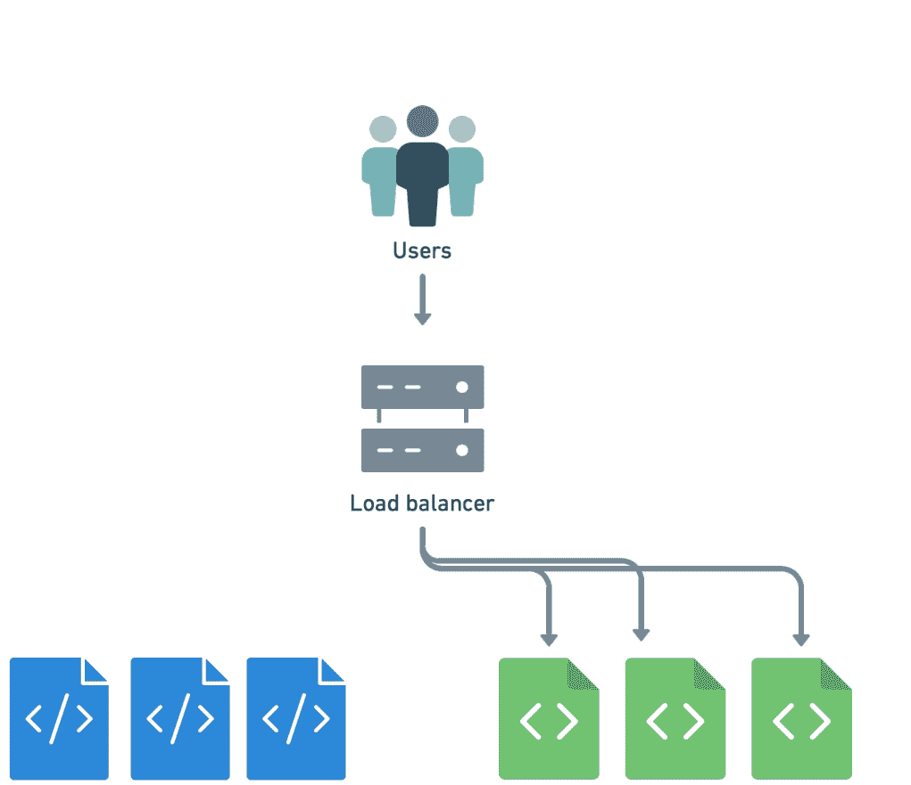

你可以通过创建多个部署（在Kubernetes意义上），然后通过更改我们服务的选择器从一个部署切换到另一个部署来实现蓝绿部署。

让我们看看这在一个快速演示中是如何工作的。

以下命令将创建两个部署，分别使用nginx和httpd容器镜像：

```bash
$ kubectl create deployment blue --image=nginx
$ kubectl create deployment green --image=httpd
```

然后，您创建一个名为web的服务，最初不会将流量发送到任何地方：

```bash
$ kubectl create service clusterip web --tcp=80
```

注意：当运行本地开发Kubernetes集群（例如MiniKube或与Docker Desktop捆绑的集群）时，您将希望将上一个命令更改为：

```bash
kubectl create service nodeport web --tcp=80
```

> 4 macOS、Linux和Windows的官方本地Kubernetes集群，用于测试和开发。https://minikube.sigs.k8s.io/docs/

NodePort类型的服务更容易在本地访问，因为服务端口会自动转发到本地主机。要查看此端口映射，请运行kubectl get services。

现在，你可以通过运行kubectl edit service web来更新服务web的选择器。这将从Kubernetes API中检索service web的定义，并在文本编辑器中打开它。查找下面的部分：

```
selector:
  app: web
```

将web替换为blue或green，根据你的喜好。保存并退出。kubectl将更新后的定义推送回Kubernetes API，完成！Service web现在将流量发送到相应的部署。

你可以通过使用kubectl get svc web检索该服务的IP地址，并使用curl连接到该IP地址来验证。

你可以完全通过命令行进行文本编辑的修改，例如使用kubectl patch如下所示：

```
$ kubectl patch service web
  -p '{"spec": {"selector": {"app": "green"}}}'
```

蓝绿部署的优势在于流量切换几乎是瞬间完成的，而且你可以通过再次更新服务定义来快速回滚到上一个版本。

### 2.10.2 金丝雀部署

金丝雀部署暗示了煤矿中使用的金丝雀，用于检测有毒气体（如一氧化碳）的危险浓度。金丝雀对有毒气体比人类更敏感。矿工会携带一个装在笼子里的金丝雀。如果金丝雀晕倒了，那意味着矿工已经到达了一个危险区域，应该在他们也晕倒之前返回。

这如何映射到软件部署？

有时候，你不能（或不愿意）影响所有用户的一个有缺陷的版本，即使只是短暂的时间。所以，你会对新版本进行部分发布。例如，你可以部署几个运行新版本的副本，或者将1%的用户发送到新版本。

然后，你可以比较当前版本和刚刚部署的金丝雀版本之间的指标。如果指标相似，你可以继续。如果延迟、错误率或其他任何指标看起来有问题，你可以回滚。

这种技术在设置时可能会相对复杂，但由于Kubernetes的标签和选择器的本地机制，它变得相对简单。

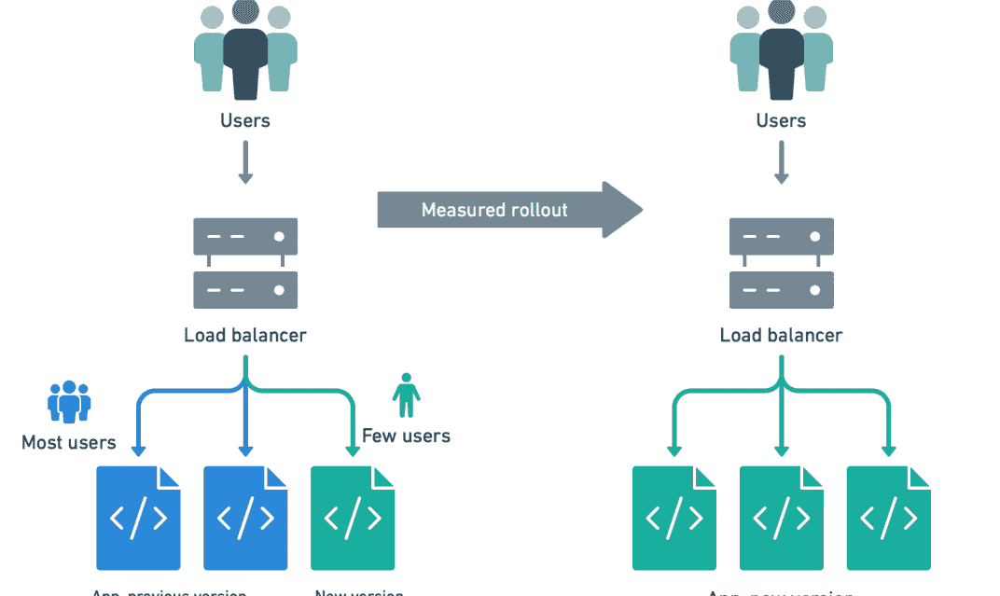

值得注意的是，在前面的示例中，我们更改了服务的选择器，但也可以更改Pod的标签。

例如，如果一个服务的选择器设置为查找具有标签`status=enabled`的Pod，你可以将这样的标签应用于特定的Pod：

```
$ kubectl label pod fronted-aabbccdd-xyz status=enabled
```

你也可以批量应用标签，例如：

```
$ kubectl label pods -l app=blue,version=v1.5 status=enabled
```

你也可以轻松地删除它们：

```
$ kubectl label pods -l app=blue,version=v1.4 status-
```

## 2.11 总结

现在你已经了解了一些可以用于更加自信地部署的技术。其中一些技术仅仅减少了部署本身造成的停机时间，这意味着你可以更频繁地部署，而不担心影响用户。

其中一些技术为你提供了一个安全带，防止糟糕的版本导致服务崩溃。还有一些技术让你更加放心，就像在玩视频游戏中的“保存”按钮，在尝试特别困难的关卡之前，知道如果出了问题，你总是可以回到之前的地方。

Kubernetes使开发人员和运维团队能够利用这些技术，从而实现更安全的部署。如果与部署相关的风险降低，意味着你可以更频繁、逐步地部署，并更容易地看到我们实施的更改的结果；而不是每周或每月只部署一次。

最终结果是开发速度更快，修复和新功能的上市时间更短，以及应用程序的可用性更好。这正是首次实施容器的整个目的。

# 云原生应用程序的3个CI/CD最佳实践

工程领导者努力以尽可能高的效率向客户交付无缺陷的产品。如今的云原生技术使团队能够以比以往更快的速度进行规模化迭代。但要体验所承诺的敏捷性，我们需要改变软件交付的方式。

“CI/CD”代表持续集成（CI）和持续交付（CD）的综合实践。这是一种可持续发布更新的时间无关的软件开发方式。当更改代码成为例行公事时，开发周期更快。工作更加充实。

公司可以每天多次改进其产品，并让客户满意。

在本章中，我们将回顾CI/CD的原则，并看看如何将其应用于开发云原生应用程序。

## 3.1 什么是一个好的CI/CD流水线

一个好的CI/CD流水线应该快速、可靠且全面。

### 3.1.1 速度

流水线速度表现在几个方面：

我们的工作正确性得到反馈的速度有多快？如果这个时间比喝一杯咖啡的时间还要长，那么将代码推送到CI就会分散注意力。这就像是让开发人员在解决问题的过程中参加会议。由于上下文切换，开发人员的工作效率会降低。

我们构建、测试和部署一个简单的代码提交需要多长时间？假设一个项目总共需要一个小时来运行CI和部署，并且有十几个工程师的团队。这样的CI/CD运行时间意味着整个团队在工作日内最多只能进行六到七次部署。换句话说，每个开发人员每天可用的部署次数不到一次。团队将采用更少频繁、因此更具风险的部署工作流程。这个工作流与当今企业需要的快速迭代形成鲜明对比。

我们能多快地建立一个新的流水线？扩展CI/CD的基础设施或重用现有配置会产生摩擦。通过将软件编写为小型服务的组合，最大限度地发挥云的优势。开发人员经常需要新的CI/CD流水线，并且他们需要快速获得。解决这个问题的最佳方法是让开发人员为自己的项目创建和拥有CI/CD流水线。

为了实现这一点，选择的CI/CD工具应该适应现有的开发工作流程。这样的CI/CD工具应该支持将所有流水线配置存储为代码。团队可以像处理其他代码一样审查、版本控制和重用流水线。但最重要的是，CI/CD应该对每个开发人员都易于使用。这样，项目不会依赖于为他人设置和维护CI的个人或团队。

### 3.1.2 可靠性

可靠的流水线总是为给定的输入产生相同的输出。并且具有一致的运行时间。间歇性故障会给开发人员带来巨大的挫败感。

工程师们喜欢独立完成任务，他们通常选择维护自己的CI/CD系统。但是运营提供按需、干净、稳定和快速资源的CI/CD是一项复杂的工作。对于一个项目或几个开发人员来说，看似运行良好的解决方案通常会在后来出现问题。随着技术栈的变化，团队和项目数量也在增长。然后，管理层中的某个人意识到通过委派这项任务，团队可以更多地专注于实际产品。在那时，如果不是更早，工程团队将从自托管的解决方案转移到基于云的CI/CD解决方案。

### 3.1.3 完整性

任何自动化的增加都是积极的变化。然而，CI/CD流水线需要运行和可视化代码更改的所有过程——从它进入代码库的那一刻直到它在生产环境中运行。这要求CI/CD工具能够对简单和复杂的工作流进行建模。这样，手动错误几乎是不可能的。

例如，通常只运行构建和测试步骤的流水线是很常见的。部署仍然是手动操作，通常由一个人执行。这是过去的遗留问题，当时CI工具无法建模交付工作流程。

今天，像 Semaphore 这样的服务提供以下功能：

- 密钥管理
- 多阶段、参数化的流水线
- 变更检测
- 容器注册表
- 连接到多个环境（暂存、生产等）
- 审计日志
- 测试结果

现在没有理由不自动化整个软件交付过程。

## 3.2 通用原则

### 3.2.1 架构系统以支持迭代发布

系统无法支持频繁的迭代发布的最常见原因是组件之间的紧密耦合。

在构建（微）服务时，关键决策在于定义它们的：1. 边界，2. 与系统其他部分的通信。

更改一个服务不应该需要更改另一个服务。如果一个服务崩溃，其他服务或者更糟糕的是整个系统不应该崩溃。具有明确定义边界的服务允许我们在一个地方更改行为，并尽快发布该更改。我们不希望一个系统中的一个更改需要在许多不同的地方更改代码。这个过程很慢，阻碍了清晰的代码所有权。一次部署多个服务是有风险的。

松散耦合的服务将相关行为放在一个地方。它对其协作的系统了解得越少越好。

松散耦合的系统在服务之间的通信设计上保守。服务通常通过进行异步远程过程调用（RPC）进行通信。它们使用少量的端点。没有共享数据库，并且所有对数据库的更改都作为CI/CD流水线的一部分进行迭代运行。

指标和监控也是迭代开发的重要支持者。能够实时检测问题使我们有信心进行更改，知道我们可以快速从任何错误中恢复。

### 3.2.2 你构建它，你运行它

在2006年的ACM采访中，亚马逊首席技术官Werner Vogels提出了“你构建它，你运行它”的思维方式^5。这个想法是开发人员应该直接与他们的软件操作联系，从而与客户保持密切联系。关键的洞察力是将开发人员纳入客户反馈循环对于提高服务质量至关重要。这最终导致了更好的业务结果。

当时，这种观点是激进的，所需的工具缺失。因此，只有最大的公司才能负担得起以这种方式构建软件。

从那时起，这种理念经受住了时间的考验。如今，最好的产品组织由小型自治团队组成。他们拥有自己服务的完整生命周期。他们有更多的自由来对用户的反馈做出反应并快速做出正确的决策。

对软件质量负责需要对其发布负责。这打破了传统开发人员和运维团队之间的壁垒。每个人都必须共同努力实现高层次的目标。

在新组建的团队中，没有专门的运维人员并不罕见。相反，采用的方法是“无运维”。编写代码的开发人员也负责交付流程。云服务提供商负责托管和监控生产服务。

### 3.2.3 使用临时资源

使用临时资源来运行CI/CD流水线有三个主要原因。

速度要求使得CI/CD不能成为瓶颈。它需要根据团队、应用程序和测试套件的增长进行扩展。一个简单的解决方案是依赖于云服务，它可以根据需求自动扩展CI/CD流水线。理想情况下，这应该采用按使用量计费的模式，这样你只需要支付你使用的部分。

临时资源有助于确保你的测试始终保持一致。基于云的CI/CD解决方案在干净且隔离的环境中运行你的代码。它们根据需要创建，并在作业完成后立即删除。

正如我们在第1章中所看到的，容器允许我们在开发、CI/CD和生产中使用相同的环境。无需设置和维护基础设施，也无需牺牲环境的准确性。

### 3.2.4 自动化一切

值得重申的是：尽可能自动化一切。

有些情况下完全自动化是不可能的。你可能有一些客户不希望系统持续更新。可能存在限制软件更新方式的法规。例如在航空航天、电信和医疗行业就是如此。

但如果这些条件不适用，并且你仍然认为你的流水线无法完全自动化 - 你几乎肯定是错的。仔细审视你的端到端流程，并找出你出于习惯手动处理的地方。制定一个可能需要的任何更改的计划，并将其自动化。

## 3.3 持续集成最佳实践

正确地进行持续集成过程是成功持续交付的先决条件。通常，当持续集成过程快速可靠时，实现完整的持续集成/持续交付并不困难。

### 3.3.1 将主要构建视为随时发布的版本

相较于进行大规模、复杂、罕见的更改，小而简单、频繁的更改是团队构建软件的一种较低风险的方式。这意味着团队通过始终准备发布而不是更多地犯错误。

你的团队的目标应该是在代码准备就绪后尽快将其部署到生产环境。如果出现问题，要对其负责并妥善处理。让团队通过对自己所做的事情有所拥有感而成长。

始终准备发布需要高度发展的测试文化。每个包含新代码的拉取请求都应该包括自动化测试。如果没有，那么快速前进就没有意义。如果你正在启动一个新项目，请花时间让每个人都达成共识，并承诺为所有代码编写自动化测试。设置整个持续集成/持续交付流程。

即使应用程序没有真正的功能，也可以使用流水线。流水线将阻止任何手动或冒险的过程渗入并减慢您的速度。

如果您有一个存在技术债务的现有项目，可以从CI流水线上承诺“没有破窗户”政策开始。当有人破坏主分支时，他们应该放下手头的工作并修复它。每个测试失败都是一个错误。需要记录、调查和修复。假设缺陷在应用程序代码中，除非测试可以证明其他情况。然而，有时测试本身就是问题所在。那么解决方案就是将其重写为更可靠的形式。

清理主构建的过程通常开始时令人沮丧。但如果您坚持并遵循这个过程，随着时间的推移，痛苦会消失。有一天，当测试失败意味着真的有一个错误时，您不必重新运行CI构建就可以继续工作。没有人需要强制冻结代码。日子又变得富有成效了。

### 3.3.2 保持构建快速：最多10分钟

让我们以两个开发团队为例，他们都在编写测试。团队A有一个运行时间约为3分钟的CI构建。团队B的构建时间为45分钟。他们都使用一个在所有分支上运行测试的CI服务。他们都以可预测的周期发布可靠的软件。但是团队A有潜力每天构建和发布100多次，而团队B最多只能做到7次。他们两个都在进行持续集成吗？

简短的回答是不。

如果CI构建时间很长，我们会保守地处理我们的工作。我们倾向于在本地计算机上保留分支更长时间。每个开发者的代码处于不同的状态。合并变得更加罕见，它们变成了庞大而冒险的事件。重构变得难以在系统需要保持健康的规模上进行。

对于一个慢速构建，每次“`git push`”都会导致巨大的干扰。我们要么等待，要么寻找其他事情来做，以避免完全闲置。如果我们切换到其他事情，我们知道当构建完成时需要再次切换回来。问题在于编程中的每次任务切换都很困难，它消耗了我们的精力。

持续集成的关键是速度。速度推动高效率。

我们希望尽快得到反馈。快速反馈循环使我们保持在一种流动的状态，这是我们在工作中的幸福源泉。

因此，建立CI过程的快速标准是很有帮助的：正确的持续集成是指从推送新代码到获取结果不超过10分钟。10分钟是开发人员可以等待而不会分心的时间。这也是持续交付的先驱之一Jez Humble采用的方法。他在会议上进行了以下非正式调查⁶。

首先，他要求听众举手，看看他们是否进行持续集成。通常，大多数听众都会举手。然后，他要求他们保持举手，看看他们团队的每个人是否每天都提交和推送到主分支。一半以上的人放下了手。然后，他要求他们保持举手，看看每次提交是否会触发自动构建和测试。剩下的一半人放下了手。最后，他问道，当构建失败时，通常在十分钟内恢复正常吗？在最后一个问题中，只有少数人举手。这些人通过了非正式的CI认证测试。

有几种策略可以用来减少CI构建时间：

- 缓存：项目依赖应在构建之间独立重用。构建Docker容器时，使用层缓存功能从注册表中重用已知层。
- 内置Docker注册表：容器本地的CI解决方案应包含内置的注册表。与使用云提供商提供的注册表相比，这可以节省很多钱。它还可以加快CI速度，通常可以节省几分钟。
- 测试并行化：大型测试套件是CI速度慢的最常见原因。解决方案是将测试分布到尽可能多的并行作业中。
- 变更检测：通过仅测试自上次提交以来发生更改的代码，可以大大加快大型测试套件的速度。

### 3.3.3 只构建一次并通过流水线推广结果

在基于容器的服务环境中，这个原则意味着只构建一次容器，然后在整个流水线中重复使用镜像。

例如，考虑一个需要并行运行测试然后部署容器的情况。期望的流水线应该在第一阶段构建容器镜像。测试和部署的后续阶段可以从注册表中重复使用容器。理想情况下，注册表应该是CI服务的一部分，以节省成本并避免网络开销。

Building container once

同样的原则也适用于从源代码创建并稍后使用的任何其他资源。最常见的是二进制包和网站资源。

除了速度，还有可靠性方面的考虑。目标是确保每个自动化测试都针对将要发布的构件运行。

为了支持这样的工作流程，你的CI系统应该能够：

- 在多个阶段执行流水线。
- 在相同、干净和隔离的环境中运行每个阶段。
- 将生成的构件版本和上传到构件或容器存储系统。
- 在流水线的后续阶段中重复使用这些构件。

这些步骤确保构建在系统中的进展过程中不会发生变化。

### 3.3.4 首先运行快速和基本测试

在许多情况下，你可以通过CI获得所需的所有反馈，而无需运行整个测试套件。

单元测试是最快的，因为它们：
- 在与系统的其余部分隔离的情况下测试小的代码单元。
- 验证核心业务逻辑，而不是从最终用户角度的行为。
- 通常不涉及数据库。

测试金字塔图是系统中测试分布的常见表示方式：

根据这个策略，一个测试套件有：
- 最多的单元测试。
- 稍微少一些的服务级别测试，包括对数据库和任何其他核心外部资源的调用。
- 很少有用户界面或端到端测试。这些用于验证系统的行为，通常是从用户的角度来看。

如果团队遵循这个策略，单元测试失败是一个基本问题的信号。在解决问题之前，剩下的高级和长时间运行的测试是无关紧要的。

因此，测试套件运行时间超过一分钟的项目应该优先考虑在CI流水线中进行单元测试。例如，这样的流水线可能如下所示：

这个策略允许开发人员在几秒钟内获得有关微小错误的反馈。它还鼓励所有团队成员在代码库增长时了解个别测试的性能影响。

还有其他策略可以与您的CI系统一起使用，以获得快速反馈：

条件阶段执行允许您在适当的时候延迟运行构建的某些部分。例如，您可以配置您的CI仅在相关组件发生变化时运行一部分端到端测试。

在上述流水线中，如果对应目录中的代码发生变化，则运行后端和前端测试。如果其中任何一个测试通过且没有失败，则运行端到端测试。

当底层代码未发生变化时，变更检测允许您跳过流水线中的步骤。通过仅运行与给定提交相关的测试，您可以加快流水线速度并降低成本。

快速失败策略在作业失败时立即提供反馈。一旦流水线中的作业失败，CI会停止所有当前正在运行的作业。当运行具有可变持续时间的并行作业时，这种方法特别有用。

自动取消排队的构建可以帮助您在推送一些更改后意识到自己犯了一个错误的情况下。因此，您立即推送一个新的修订版，但随后需要等待两倍的时间才能获得反馈。使用自动取消，您可以跳过中间修订版，同时获得对重要修订版的反馈。

### 3.3.5 最小化功能分支，采用功能标志

Git超越了之前的版本控制系统（如Subversion）的一个原因是它使分支易于管理。这激励开发人员每天创建和合并分支多次。创建这样的短期分支的目的是为了与主分支隔离开来，我们同意始终保持主分支可发布的状态。在Git分支中，开发人员可以随时提交和保存他们的工作。完成后，他们可以将所有提交压缩成一个格式良好的变更集。然后他们提交变更集以获取反馈，并最终合并它。通常也将这样的分支称为“功能分支”。在这种情况下，这个术语是误导性的。这不是这个最佳实践的内容。

通过功能分支，我们指的是与新产品开发同步存在的分支功能正在开发中。这样的分支不仅存在几个小时，而是几个月。在一个分支上工作这么长时间会带来与不频繁集成相关的所有问题。依赖和内部API很可能会发生变化。合并所需的工作量和协调量会大幅增加。困难不仅仅在于逐行合并代码。还要确保它在运行时不会引入意外的错误。

解决方案是使用功能标志。功能标志归结为：

```
ruby
if current_user.can_use_feature?("new-feature")
  render_new_feature_widget
end
```

因此，除非用户是在开发中的开发人员或一小群测试人员，否则您甚至不会加载相关代码。无论代码有多么不完整，都不会影响任何人。因此，您可以在短时间内进行迭代，并确保每个迭代都与整个系统很好地集成。这样的集成比一次性合并要容易得多。

### 3.3.6 使用 CI 来维护你的代码

如果您习惯于处理单体应用程序，构建微服务会带来一种不熟悉的情况。服务通常会达到完成的阶段，即暂时不需要进一步的工作。数月内，没有人可以触碰服务的代码库。然后，有一天，有一个紧急需求需要部署变更。CI构建意外失败：存在几个依赖项的安全漏洞，其中一些引入了破坏性变更。看似一个小的更新变成了一个高风险的操作，可能需要几天的工作时间。

为了防止这种情况发生，你可以安排每天进行CI构建。定期构建是一种很好的方式，可以及早发现依赖项的任何问题，无论你的代码变动频率如何（或者没有变动）。你还可以通过将以下内容纳入你的CI流水线来进一步支持代码的质量：

- 代码风格检查器
- 代码异味检测器
- 安全扫描器

并在单元测试之前先运行它们。

## 3.4 持续交付的最佳实践

### 3.4.1 CI/CD 管道是部署到生产环境的唯一方式

CI/CD流水线是一个编码的质量和流程标准，用于发布。通过拒绝任何违反规则的变更，流水线充当质量的守门人。它保护生产环境免受未经验证的代码的影响。它推动团队以持续改进的精神工作。

在达到生产环境之前，保持每一次变更都通过流水线是至关重要的。CI/CD流水线应该是代码达到生产环境的唯一途径。在看似特殊情况下，违反这个规则并绕过流水线使用手动程序可能是诱人的。相反，危机时刻正是流水线通过确保系统不进一步退化而提供价值的时候。当时间紧迫时，流水线应该回滚到上一个发布版本。

一旦CI/CD流水线的配置和历史与团队实际操作不一致，重新建立自动化和质量文化就变得困难。因此，投入时间使流水线变得快速，以免有人有跳过它的动力是很重要的。

### 3.4.2 开发人员可以通过按一下按钮将代码部署到类似生产环境的暂存环境中

理想的CI/CD流水线几乎是看不见的。开发人员可以在不分心的情况下从测试中获得反馈，并通过单个命令或按钮按下来部署。意图和实现之间没有延迟。任何阻碍理想状态的事物都是不可取的。

开发人员应该是部署他们代码的人。这符合“你构建它，你运行它”的一般原则。将这个任务委托给其他人只会使过程变得更慢、更复杂。构建容器化微服务的开发人员需要一个可以随意部署的暂存Kubernetes集群。或者，他们需要一种部署金丝雀版本的方法，我们将在本书中介绍。

^5 A 对话 使用 Werner Vogels, ACMQueue https://queue.acm.org/detail.cfm?id=1142065部署操作需要简化为一个简单易行且几乎不会失败的命令。更复杂的部署序列会引发人为和基础设施错误，从而减慢进展。

### 3.4.3 始终使用相同的环境

在容器出现之前，现实的建议是使流水线、暂存和生产尽可能相似。目标是确保我们在CI/CD流水线中运行的自动化测试准确反映出变更在生产环境中的行为。暂存和生产之间的差异越大，引入错误的机会就越高。

如今的容器保证了你的代码始终在相同的环境中运行。你可以在自定义的Docker容器中运行整个CI/CD流水线。而且你可以确保在流水线早期构建的容器在后续的流水线测试、暂存和生产中是完全一致的。

其他环境仍然与生产环境不同，因为复制相同的基础设施和负载是昂贵的。然而，这些差异是可以管理的，并且我们可以避免大部分由于环境不一致而导致的错误。

第1章介绍了采用Docker进行此目的的路线图。第2章介绍了一些与Kubernetes一起使用的高级部署策略。像蓝绿部署和金丝雀部署这样的策略可以降低错误部署的风险。现在我们知道了一个合适的CI/CD流水线应该是什么样子，是时候开始实施了。

# 4 实施 CI/CD 流水线

去餐厅看着菜单上那些美味的菜肴无疑是很有趣的。但最终，我们必须选择一些东西并吃掉它——出去的目的就是享用美食。到目前为止，这本书就像一个菜单，向你展示了所有可能性和它们的成分。在本章中，你已经准备好点菜了。祝你用餐愉快。

我们的目标是使用CI/CD最佳实践在Kubernetes上运行应用程序。


我们的流程将包括以下步骤：

- 构建：将应用程序打包成Docker镜像。
- 运行端到端测试：在镜像内运行端到端测试。
- 金丝雀部署：将镜像作为金丝雀部署给部分用户。
- 运行功能测试：在生产环境中验证金丝雀，以决定是否继续。
- 部署：如果金丝雀测试通过，将镜像部署给所有用户。
- 回滚：如果失败，撤销所有更改，以便稍后修复问题并重试。

## 4.1 Docker 和 Kubernetes 命令

在之前的章节中，我们已经学习了在本章中需要使用的大部分Docker和Kubernetes命令。以下是一些我们尚未见过的命令。

### 4.1.1 Docker 命令

Docker注册表存储Docker镜像。Docker CLI提供以下命令来管理镜像：

- push和 pull：这些命令的使用方式类似于Git。我们可以使用它们将镜像传输到注册表中，或从注册表中获取镜像。
- 登录: 在推送镜像之前，我们需要登录。 接受用户名、密码和可选的注册表URL。
- 构建: 从Dockerfile创建自定义镜像。
- 标记: 重命名镜像或更改其标签。
- 执行: 在已运行的容器中启动进程。 与docker run进行比较，后者创建一个新的容器。

### 4.1.2 Kubectl命令

Kubectl是Kubernetes的主要管理员CLI。在部署过程中，我们将使用以下命令：

- 获取服务: 在第2章中，我们了解了Kubernetes中的服务；这将显示集群中正在运行的服务。 例如，我们可以检查负载均衡器的状态和外部IP。
- 获取事件: 显示最近的集群事件。
- 描述: 显示有关服务、部署、节点和Pod的详细信息。
- 日志: 转储容器的标准输出消息。
- 应用: 启动声明性部署。 Kubernetes比较当前状态和目标状态，并采取必要的步骤来协调它们。
- rollout status: 显示部署进度并等待部署完成。
- exec: 类似于docker exec，在已运行的pod中执行命令。
- delete: 停止并删除pod、部署和服务。

## 4.2 设置演示项目

现在是时候放下书，忙碌几分钟了。 在本节中，您将fork一个演示存储库并安装一些工具。

### 4.2.1 安装先决条件

您需要在计算机上安装以下工具：

- git (https://git-scm.com) 用于管理代码。
- docker (https://www.docker.com) 用于运行容器。
- kubectl (https://kubernetes.io/docs/tasks/tools/install-kubectl/) 用于控制Kubernetes集群。
- curl (https://curl.haxx.se) 用于测试应用程序。

### 4.2.2 下载 Git 仓库

我们在GitHub上准备了一个演示项目，其中包含您设置CI/CD流水线所需的一切：

- 访问https://github.com/semaphoreci-demos/semaphore-demo-cicd-kubernetes
- 点击 Fork 按钮。
- 点击 Clone or download 按钮并复制URL。
- 将Git仓库克隆到您的计算机上：`git clone YOUR_REPOSITORY_URL`。

该仓库包含一个名为“addressbook”的微服务，它公开了一些API端点。它运行在Node.js和PostgreSQL上。
您将看到以下目录和文件：

- .semaphore：包含CI/CD流水线的目录。
- docker-compose.yml：用于开发环境的Docker Compose文件。
- Dockerfile：用于构建Docker的文件。
- manifests：Kubernetes清单文件。
- package.json：Node.js项目文件。
- src：微服务的代码和测试。

### 4.2.3 在本地运行微服务

使用docker-compose启动开发环境：

```
$ docker-compose up --build
```

Docker Compose根据需要构建和运行容器映像。它还会为您下载并启动PostgreSQL数据库。

包含的 Dockerfile从官方的Node.js镜像构建一个容器镜像：

```
FROM node:12.16.1-alpine3.10

ENV APP_USER node
ENV APP_HOME /app

RUN mkdir -p $APP_HOME
RUN chown -R $APP_USER $APP_HOME

USER $APP_USER
WORKDIR $APP_HOME

COPY package*.json .jshintrc $APP_HOME/
RUN npm install

COPY src $APP_HOME/src/

EXPOSE 3000
CMD ["node", "src/app.js"]
```

基于这个配置，Docker执行以下步骤：

- 拉取Node.js镜像。
- 复制应用程序文件。
- 在容器内运行npm以安装库。
- 将启动命令设置为在端口3000上提供服务。

要验证微服务是否正常运行，请运行以下命令创建一个新记录：

```
$ curl -w "" -X PUT -d "firstName=al&lastName=pacino" localhost:3000/person

{
  "id":1,
  "firstName":"al",
  "lastName":"pacino",
  "updatedAt":"2020-03-27T10:59:09.987Z",
  "createdAt":"2020-03-27T10:59:09.987Z"
}
```

列出所有记录：

```
$ curl -w "" localhost:3000/all
[
  {
    "id":1,
    "firstName":"al",
    "lastName":"pacino",
    "createdAt":"2020-03-27T10:59:09.987Z",
    "updatedAt":"2020-03-27T10:59:09.987Z"
  }
]
```

### 4.2.4 查看 Kubernetes 清单

在第3章中，我们了解到Kubernetes是一个声明性系统：我们不告诉它要做什么，而是陈述我们想要的，并相信它知道如何实现。

manifests目录包含所有的Kubernetes清单文件。 service.yml描述了LoadBalancer服务。 将流量从端口80（HTTP）转发到端口3000。

```
# service.yml
apiVersion: v1
kind: Service
metadata:
  name: addressbook-lb
spec:
  selector:
    app: addressbook
  type: LoadBalancer
  ports:
    - port: 80
      targetPort: 3000
```

deployment.yml描述了部署。 该目录还包含一些AWS特定的清单。

```
# deployment.yml
apiVersion: apps/v1
kind: Deployment
metadata:
  name: $deployment
spec:
  replicas: $replicas
  selector:
    matchLabels:
      app: addressbook
  strategy:
    type: RollingUpdate
    rollingUpdate:
      maxSurge: 1
      maxUnavailable: 1
  template:
    metadata:
      labels:
        app: addressbook
        deployment: $deployment
    spec:
      containers:
        - name: addressbook
          image: $img
          readinessProbe:
            httpGet:
              path: /ready
              port: 3000
          env:
            - name: NODE_ENV
              value: "production"
            - name: PORT
              value: "$PORT"
            - name: DB_SCHEMA
              value: "$DB_SCHEMA"
            - name: DB_USER
              value: "$DB_USER"
            - name: DB_PASSWORD
              value: "$DB_PASSWORD"
            - name: DB_HOST
              value: "$DB_HOST"
            - name: DB_PORT
              value: "$DB_PORT"
            - name: DB_SSL
              value: "$DB_SSL"
```

部署清单结合了我们在第3章中讨论的几个Kubernetes概念：

1. 一个名为“addressbook”的部署，具有滚动更新功能。
2. 用于管理流量和标识发布渠道的Pod标签。
3. Pod中容器的环境变量。
4. 用于检测Pod是否准备好接受连接的就绪探针。

请注意，我们在文件中使用了美元（$）变量。这使我们能够在部署到多个环境时重复使用相同的清单。

## 4.3 CI/CD 工作流程概述

良好的CI/CD工作流程需要进行规划，因为涉及到许多组成部分：构建、测试和安全地部署代码。

### 4.3.1 CI 流水线：构建 Docker 镜像和运行测试

我们的CI/CD工作流程始于强制性的持续集成流水线：

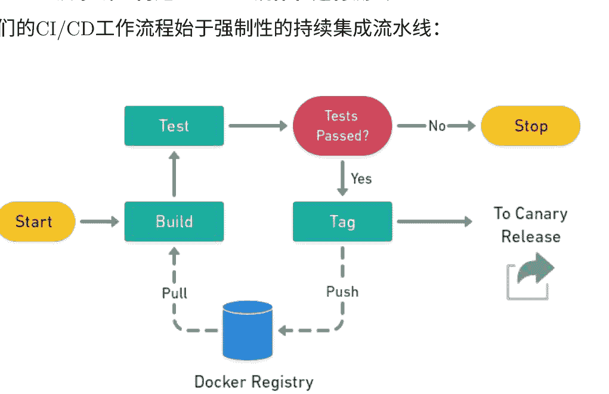

CI流水线执行以下步骤：

- Git检出：获取最新的源代码。
- Docker拉取：从CI Docker注册表获取最新可用的应用程序镜像（如果存在）。这个可选步骤可以减少后续步骤中的构建时间。
- Docker构建：创建Docker镜像。
- 测试：启动容器并在其中运行测试。
- Docker推送：如果所有测试通过，将接受的镜像推送到生产注册表。

在这个过程中，我们将使用Semaphore内置的Docker注册表。这比在CI/CD环境中使用云供应商的注册表更快更便宜。

### 4.3.2 CD流水线：金丝雀和稳定部署

在第2章中，我们学习了金丝雀和滚动部署。在第3章中，我们讨论了持续交付和持续部署。我们的CI/CD工作流结合了这两种实践。

金丝雀部署是新版本的有限发布。我们将其称为：金丝雀发布，而大多数用户仍在使用的是稳定发布。

我们可以通过将金丝雀Pod连接到其他Pod相同的负载均衡器来进行金丝雀部署。结果是，一部分用户流量的比例会进入金丝雀版本。例如，如果我们有九个稳定的Pod和一个金丝雀Pod，10%的用户将获得金丝雀发布。

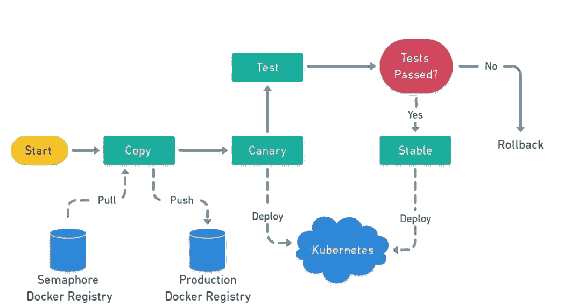

金丝雀发布执行以下步骤：

- 将镜像从Semaphore注册表复制到生产注册表。
- 金丝雀部署一个金丝雀Pod。
- 通过运行自动功能测试来测试金丝雀Pod是否正常工作。我们还可以选择进行手动QA测试。
- 稳定版本发布：如果测试通过，则更新其余的Pod。

让我们更详细地了解稳定版本发布的工作原理。

假设这是您的初始状态：您有三个正在运行版本为v1的Pod。

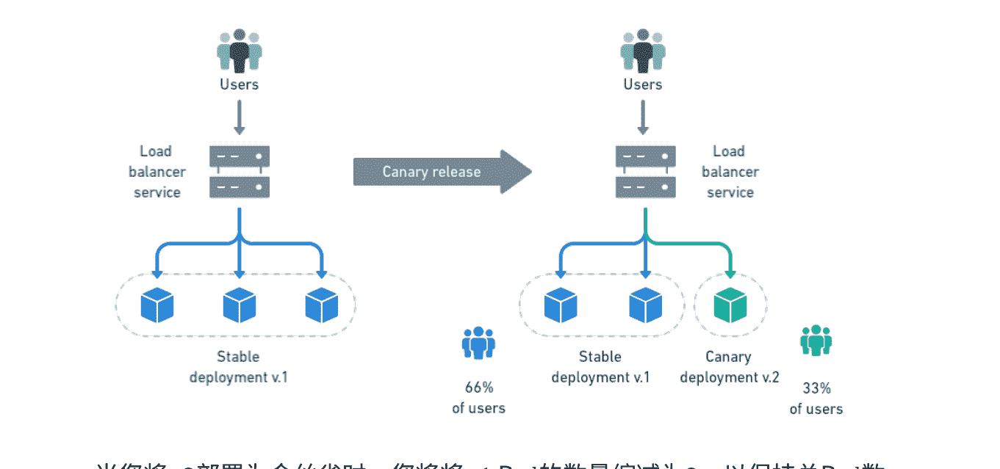

当您将v2部署为金丝雀时，您将将v1 Pod的数量缩减为2，以保持总Pod数量为3。

然后，您可以开始对稳定部署进行滚动更新到版本v2。逐个更新和重启所有Pod，直到它们全部运行在v2上，然后您可以摆脱金丝雀。

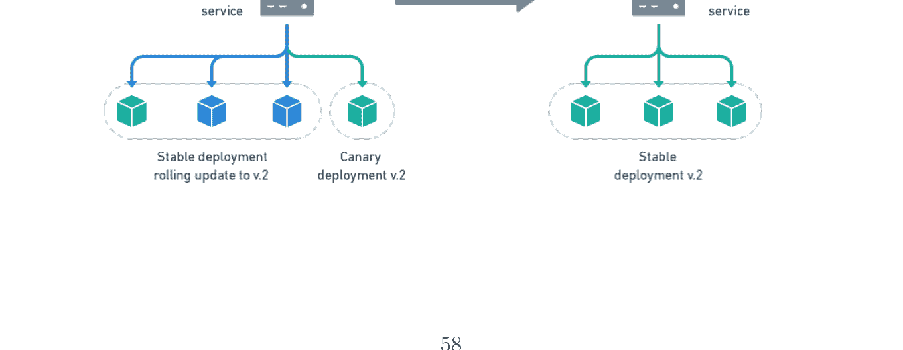

## 4.4 使用 Semaphore 实现 CI/CD 流水线

在本节中，我们将学习有关Semaphore以及如何使用它构建基于云的CI/CD流水线的知识。

### 4.4.1 信号量介绍

长期以来，寻找CI/CD工具的开发人员不得不在功能和易用性之间做出选择。

一方面，有Jenkins，它几乎可以做任何事情，但使用起来具有挑战性，并且需要专门的运维团队来配置、维护和扩展。

另一方面，一些托管服务允许开发人员推送他们的代码，而不必担心其他的过程。 然而，这些服务通常只能运行简单的构建和测试步骤。 它们经常无法满足更复杂的持续交付工作流程，这在使用容器时经常发生。

Semaphore (https://semaphoreci.com) 最初是一个简单的托管CI服务，但最终发展成支持使用容器的自定义持续交付流水线，并且仍然易于任何开发人员使用，而不仅仅是专门的运维团队。 因此，它消除了在规模上采用持续交付的所有技术障碍：

- 这是一个基于云的按需扩展的服务。
- 无需安装和维护任何软件。
- 它提供了一个可视化界面，可以快速建模自定义的CI/CD工作流程。
- 它是基于专用硬件而不是常见的云计算服务，因此是最快的CI/CD服务。
- 对于开源和小型私有项目，它是免费的。

使用Semaphore的主要好处是提高团队的生产力。 由于不需要雇佣支持人员或昂贵的基础设施，并且比其他解决方案更快地运行CI/CD工作流程，采用Semaphore的公司报告了非常高的41倍投资回报率7。

在本章中，我们将通过实际操作来了解Semaphore的特点。

> 7白皮书: The 41:1 ROI of Moving CI/CD to Semaphore (https://semaphoreci.com/resources/roi)

### 4.4.2 创建信号量账户

要开始使用Semaphore:

- 访问https://semaphoreci.com并点击使用你的GitHub账户注册。
- GitHub会要求你允许Semaphore访问你的个人信息。
同意此请求以便Semaphore可以为你创建一个账户。
- Semaphore将引导你完成创建组织的过程。
由于软件开发是一项团队活动，所有的Semaphore项目都属于一个组织。你的组织将拥有自己的域名，例如，awesomecode.semaphoreci.com。
- 你将被要求选择一个计划。在本章中，我们将使用企业计划，其中包含一个内置的私有Docker注册表。如果你使用的是免费或创业计划，你可以使用免费的公共注册表，如Docker Hub。最终的工作流程是相同的。
- 最后，你将会收到一个快速产品导览。

### 4.4.3 为演示仓库创建信号量项目

我们假设你之前已经将演示项目从https://github.com/semaphoreci-demos/semaphore-demo-cicd-kubernetesfork到了你的GitHub账户。

在Semaphore上，点击屏幕顶部的“新项目”按钮。然后，点击“选择仓库”。接下来，Semaphore将向您展示一个仓库列表，您可以从中选择作为项目源的仓库:

# Choose repository

Connect your repository to Semaphore

GitHub App | GitHub Personal Token

Connect the repository through GitHub App installation.

**semaphore-demo-cicd-kubernetes**

TomFern/semaphore-demo-cicd-kubernetes

**+ Give access to more repositories**
Jump to GitHub to allow access

在搜索框中开始输入 “semaphore-demo-cicd-kubernetes”，然后选择该仓库。

Semaphore将快速初始化项目。在幕后，它将设置好自动拉取最新代码所需的一切，无需您进行任何配置。

下一个屏幕允许您邀请协作者加入项目。Semaphore会镜像GitHub的访问权限，因此如果您稍后将某些人添加到GitHub仓库中，您可以在Semaphore的项目设置中“同步”它们。

点击 “继续工作流设置”。Semaphore会询问您是否要使用现有的流水线或从头开始创建一个。此时，您可以选择使用当前配置直接进入最终工作流。然而，在本章中，我们想要学习如何创建流水线，所以我们将重新开始。

# Well done, we found the existing configuration!

Looks like you already have .yml configuration in this project. What would you like to do?

I will use the existing configuration

We'll take you directly to the project, but don't forget to push to GitHub to see your work running there.

or

I want to configure this project from scratch

We'll take you through the usual setup process

点击选项以从头开始配置项目。

### 4.4.4 信号量工作流构建器

为了使创建项目的过程更加简单，Semaphore提供了流行框架和语言的起始工作流。 选择“构建Docker”工作流并点击运行该工作流。

Semaphore将立即启动工作流。 等待几秒钟，你的第一个Docker镜像就准备好了。恭喜！

## Use Build Docker starter workflow

由于我们还没有告诉Semaphore在哪里存储镜像，一旦作业结束，镜像就会丢失。我们将在下一步中纠正这个问题。

看到右上角的“编辑工作流”按钮了吗？ 点击它打开工作流构建器。

现在是一个很好的时机通过探索工作流构建器来学习Semaphore的基本概念。

#### 流水线

在工作流构建器中，流水线被表示为大的灰色框。 流水线将工作流组织成从左到右执行的块。 每个流水线通常都有一个特定的目标，例如测试、构建或部署。 流水线可以链接在一起形成复杂的工作流程。

#### 代理

代理是硬件和软件的组合，用于支持流水线。机器类型确定分配给虚拟机的CPU和内存的数量。

> 机器类型确定分配给虚拟机的CPU和内存的数量。

操作系统由环境类型和操作系统映像设置控制。

默认机器称为`e1-standard-2`，具有2个CPU，4GB RAM，并运行自定义的Ubuntu 18.04映像。

#### 作业和块

块和作业定义每个步骤的操作。 作业定义执行工作的命令。 块包含具有共同目标和共享设置的作业。

要查看所有可用的机器，请访问[https://docs.semaphoreci.com/ci-cd-environment/machine-types](https://docs.semaphoreci.com/ci-cd-environment/machine-types)

作业从其父块继承其配置。 块中的所有作业都在其各自的隔离环境中并行运行。 如果任何作业失败，流水线将停止并显示错误。

块按顺序运行。 一旦块中的所有作业完成，下一个作业开始。

### 4.4.5 持续集成流水线

我们在第3章讨论了CI/CD的好处。 在前一节中，我们创建了我们的第一个流水线。 在本节中，我们将扩展它以包含测试和存储图像的位置。

此时，您应该看到带有Docker构建起始工作流的工作流构建器。 点击构建块，以便我们可以看到它的工作原理。

作业中的每一行都是要执行的命令。 作业中的第一个命令是checkout，它是一个内置脚本，用于克隆正确版本的存储库。 下一个命令，docker build，使用我们的Dockerfile构建镜像。

注意：长命令已经使用反斜杠（\）分成两行或更多行以适应页面。 Semaphore期望每行一个命令，因此在输入时，请删除反斜杠和换行符。

用以下命令替换作业的内容：

```
checkout

docker login
-u $SEMAPHORE_REGISTRY_USERNAME
-p $SEMAPHORE_REGISTRY_PASSWORD $SEMAPHORE_REGISTRY_URL

docker pull
$SEMAPHORE_REGISTRY_URL/demo:latest || true

docker build
--cache-from $SEMAPHORE_REGISTRY_URL/demo:latest
-t $SEMAPHORE_REGISTRY_URL/demo:$SEMAPHORE_WORKFLOW_ID .

docker push
$SEMAPHORE_REGISTRY_URL/demo:$SEMAPHORE_WORKFLOW_ID
```

每个命令都有其目的：

- 1. 使用checkout克隆存储库。
- 2. 登录Semaphore私有Docker注册表。
- 3. 拉取标记为最新的Docker镜像。
- 4. 使用最新的代码构建更新版本的镜像。
- 5. 将新镜像推送到注册表。

细心的读者会注意到，我们引入了特殊的环境变量；这些变量在每个作业中都是预定义的。 以SEMAPHORE_REGISTRY_*开头的变量用于访问私有注册表。 此外，我们正在使用SEMAPHORE_WORKFLOW_ID，每次运行都保证唯一，用于给镜像打标签。

Semaphore的内置Docker注册表在企业计划下可用。 如果你使用的是免费、开源或创业计划，请使用像Docker Hub这样的外部服务。流水线会变慢，但工作流程是一样的。

完整的环境参考可以在[https://docs.semaphoreci.com/ci-cd-environment/environment-variables](https://docs.semaphoreci.com/ci-cd-environment/environment-variables)找到

现在我们有了一个可以测试的Docker镜像，让我们添加第二个块。点击+添加块。

测试块将有以下作业：

- 静态测试。
- 集成测试。
- 功能测试。

所有测试的一般顺序相同：

- 1. 从注册表中拉取镜像。
- 2. 启动容器。
- 3. 运行测试。

块可以有一个序言，在其中我们可以放置共享的初始化命令。在块的右侧打开序言部分，并输入以下命令，这些命令将在每个作业之前执行：

```
docker login
  -u $SEMAPHORE_REGISTRY_USERNAME
  -p $SEMAPHORE_REGISTRY_PASSWORD \
  $SEMAPHORE_REGISTRY_URL

docker pull
  $SEMAPHORE_REGISTRY_URL/demo:$SEMAPHORE_WORKFLOW_ID
```

接下来，将第一个作业重命名为“单元测试”，并输入以下命令，运行静态代码分析工具JSHint：

```
docker run -it
  $SEMAPHORE_REGISTRY_URL/demo:$SEMAPHORE_WORKFLOW_ID \
  npm run lint
```

接下来，点击下方的+添加另一个作业链接创建一个名为“功能测试”的新作业。输入以下命令：

```
bash
sem-service start postgres

docker run --net=host -it
    $SEMAPHORE_REGISTRY_URL/demo:$SEMAPHORE_WORKFLOW_ID
    npm run ping

docker run --net=host -it
    $SEMAPHORE_REGISTRY_URL/demo:$SEMAPHORE_WORKFLOW_ID
    npm run migrate
```

这个任务测试两个方面：容器是否能够连接到数据库（ping）并且能够创建表格（migrate）。显然，我们需要一个数据库来使这个工作正常运行；幸运的是，我们有sem-service，它可以让我们用一个命令启动数据库引擎，如MySQL、Postgres或MongoDB。

最后，添加一个名为“集成测试”的第三个任务，并输入以下命令：

```
bash
sem-service start postgres

docker run --net=host -it
    $SEMAPHORE_REGISTRY_URL/demo:$SEMAPHORE_WORKFLOW_ID
    npm run test
```

最后一个测试在src/database.test.js中运行代码，检查应用程序是否能够在数据库中写入和删除行。

在流水线中创建第三个块，并将其命名为“推送”。这个最后的任务将会将当前的Docker镜像标记为最新版本。在任务中输入以下命令：

```
docker login
-u $SEMAPHORE_REGISTRY_USERNAME
-p $SEMAPHORE_REGISTRY_PASSWORD $SEMAPHORE_REGISTRY_URL
```

```
docker pull
$SEMAPHORE_REGISTRY_URL/demo:$SEMAPHORE_WORKFLOW_ID
```

```
docker tag
$SEMAPHORE_REGISTRY_URL/demo:$SEMAPHORE_WORKFLOW_ID $SEMAPHORE_REGISTRY_URL/demo:latest
```

```
docker push
$SEMAPHORE_REGISTRY_URL/demo:latest
```

这样就完成了CI流水线的设置。

### 4.4.6 你的第一个构建

我们在几页中涵盖了很多内容；在这里，我们有机会稍作停顿，尝试一下CI流水线。点击右上角的“运行工作流”按钮，然后点击“开始”。

1 changed file

.semaphore/semaphore.yml +1 -1

Commit summary
Update Semaphore configuration

Branch
setup-semaphore

This will commit and push the configuration to GitHub and trigger the run on Semaphore.

几秒钟后，流水线将开始构建和测试容器。

## 4.5 Kubernetes 配置

本书将向您展示如何部署到托管在三个公共云提供商上的Kubernetes：Amazon AWS、Google Cloud Platform和DigitalOcean。稍作修改，该过程也适用于其他任何云或Kubernetes实例。

我们将...滚动更新。

### 4.5.1 DigitalOcean 集群

DigitalOcean提供了部署应用程序所需的一切：托管的Kubernetes、容器注册表和Postgres数据库。

创建Kubernetes集群的步骤如下：

- 在digitalocean.com上注册或登录您的账户。
- 创建一个新项目。
- 创建一个Kubernetes集群：选择最新版本并选择一个可用的区域。将您的集群命名为“semaphore-demo-cicd-kubernetes”。
- 在DigitalOcean正在处理集群时，转到API菜单并生成一个具有读写权限的个人访问令牌。

接下来，创建一个容器注册表，执行以下操作：

- 转到容器注册表。
- 点击创建。
- 设置注册表名称。名称在所有DigitalOcean客户中必须唯一。
- 选择免费的入门计划。

在Semaphore上，将DigitalOcean访问令牌存储为一个秘密：

- 1. 登录到id.semaphoreci.com上的您的组织。
- 2. 在左侧边栏中，在“配置”下选择“秘密”，然后点击“创建新秘密”按钮。
- 3. 秘密的名称是“do-key”。
- 4. 添加DO_ACCESS_TOKEN变量，并使用您的个人令牌设置其值。
- 5. 点击“保存秘密”。

### 4.5.2 Google Cloud 集群

Google Cloud将其服务称为Kubernetes Engine。要创建服务：

- 在cloud.google.com上注册或登录您的Google Cloud账户。
- 创建一个新项目。在项目ID中输入“semaphore-demo-cicd-kubernetes”
- 转到Kubernetes Engine > 集群并启用该服务。在可用区之一创建一个公共的自动驾驶集群。
- 将您的集群命名为“semaphore-demo-cicd-kubernetes”。
- 前往IAM > 服务账号。
- 生成一个账号基本 > 所有者角色。
- 点击菜单选择新角色，选择管理密钥 > 添加密钥。
- 生成并下载一个JSON访问密钥文件。

在Semaphore上，为您的Google Cloud访问密钥文件创建一个秘密：

- 1. 登录到id.semaphoreci.com上的您的组织。
- 2. 打开您的账号菜单，点击设置。前往秘密 > 新秘密。
- 3. 将秘密命名为“gcp-key”。
- 4. 添加此文件：/home/semaphore/gcp-key.json，并从您的计算机上传Google Cloud访问JSON。
- 5. 点击“保存秘密”。

### 4.5.3 AWS 集群

AWS将其服务称为弹性Kubernetes服务（EKS）。Docker私有注册表称为弹性容器注册表（ECR）。

在AWS上创建一个集群无疑是一项复杂的任务。如此复杂以至于有专门的工具可供使用：

- 在aws.amazon.com上注册或登录您的AWS账号。
- 选择一个可用的区域。
- 找到并进入 ECR服务。创建一个名为“semaphore-demo-cicd-kubernetes”的新私有仓库，并复制其地址。
- 在您的机器上安装 eksctl（从tekstctl.io获取）和awscli（从aws.amazon.com/cli获取）。
- 在AWS中找到 IAM控制台，并创建一个具有管理员权限的用户。获取其Access Key Id和Secret Access Key值。

打开终端并登录到AWS：

```
$ aws configure
AWS Access Key ID: 输入您的Access Key ID
AWS Secret Access Key: 输入您的Secret Access Key
Default region name: 输入一个区域
```

要创建一个由最便宜的机器类型组成的三节点集群，请使用以下命令：

```
$ eksctl create cluster \
  -t t2.nano -N 3 \
  --region YOUR_REGION \
  --name semaphore-demo-cicd-kubernetes
```

注意：为所有AWS服务选择相同的区域。

一旦完成，eksctl应该在$HOME/.kube/config处创建一个kubeconfig文件。检查eksctl的输出以获取更多详细信息。

在Semaphore上创建一个密钥来存储AWS秘密访问密钥和kubeconfig文件：

- 1. 登录到id.semaphoreci.com上的您的组织。
- 2. 在左侧边栏中，在“配置”下选择“秘密”，然后点击“创建新秘密”按钮。
- 3. 调用秘密“aws-key”。
- 4. 添加以下变量：
   - AWS_ACCESS_KEY_ID应该有你的AWS访问密钥ID字符串。
   - AWS_SECRET_ACCESS_KEY有AWS访问密钥字符串。
- 5. 添加以下文件：
   - /home/semaphore/aws-key.yml并上传eksctl之前创建的Kubeconfig文件。
- 6. 点击保存秘密。

## 4.6 数据库配置

我们需要一个数据库来存储数据。为此，我们将使用托管的PostgreSQL服务。

### 4.6.1 DigitalOcean 数据库

- 前往数据库。
- 创建一个PostgreSQL数据库。选择与集群运行相同的区域。
- 数据库准备好后，转到用户和数据库选项卡，创建一个名为“demo”的数据库和一个名为“demouser”的用户。
- 在概览选项卡中，记录下PostgreSQL的IP地址和端口。

### 4.6.2 Google Cloud 数据库

- 在控制台菜单上选择 SQL。
- 创建一个新的 PostgreSQL数据库实例。
- 选择与Kubernetes集群运行的相同的区域和区域。
- 打开自定义实例部分。
- 使用默认选项和自动分配的IP范围启用私有IP网络。
- 创建实例。

云数据库运行后：

- 打开左侧菜单，选择用户。 创建一个新的内置用户，名为“demouser”。
- 转到 数据库 并创建一个名为“demo”的新数据库。
- 在概览选项卡中（可以跳过入门部分），记录下数据库的IP地址和端口。

### 4.6.3 AWS 数据库

- 找到名为 RDS的服务。
- 创建一个PostgreSQL数据库（选择标准创建）并将其命名为“demo”。为 postgres账户输入一个安全密码。
- 选择其中一个可用的模板。 开发/测试选项非常适合演示应用程序。在连接下选择集群运行的所有VPC和子网（它们应该出现在eksctl的输出中）。
- 在可用性区域中，选择与Kubernetes集群运行的相同区域。
- 在连接性和安全性下，注意端点地址和端口。

### 4.6.4 在 Semaphore 上创建数据库密钥

数据库密钥对于所有云平台都是相同的。 创建一个用于存储数据库凭据的密钥对：

- 1. 登录到id.semaphoreci.com上的您的组织。

2. 在主页面上，在配置下选择秘密，并单击创建新秘密按钮。
3. 密钥对的名称是“db-params”。
4. 添加以下变量：
   - DB_HOST使用数据库主机名或私有IP。
   - DB_PORT指向数据库端口（默认为5432）。
   - DB_SCHEMA对于AWS应该被称为“postgres”。对于其他云平台，其值应为“demo”。
   - DB_USER用于数据库用户。
   - DB_PASSWORD使用密码。
   - DB_SSL对于DigitalOcean应为“true”。对于其他云平台可以为空。
5. 点击“保存秘密”。

## 4.7 金丝雀流水线

现在我们已经准备好准备金部署流水线的云服务。

我们在GitHub上的项目包括三个可供部署使用的参考流水线。它们应与之前描述的密钥对结合使用，可以直接使用。 有关详细信息，请查看项目中的.semaphore文件夹。

在本节中，您将学习如何从头开始在Semaphore上创建部署流水线。 我们将以DigitalOcean为例，但是对于其他云来说，流程基本相同。

### 4.7.1 创建推广和部署流水线

在Semaphore上，打开工作流构建器创建一个新的流水线。

使用+添加第一个推广按钮创建一个新的推广。 推广将流水线连接在一起，创建复杂的工作流。 让我们将新的流水线命名为“Canary”。

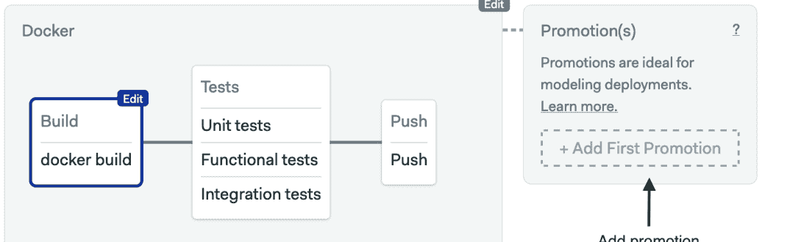

勾选启用自动推广框。现在我们可以为新的流水线定义以下自动启动条件：

```
result = 'passed' and (branch = 'master' or tag =~ '^hotfix*')
```

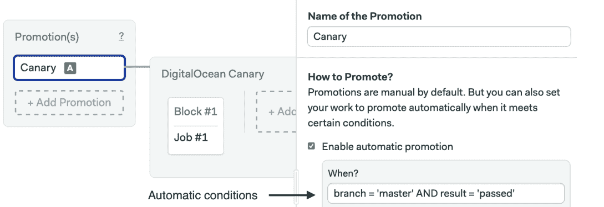

在推广选项下方，点击 + 添加环境变量创建一个流水线参数。参数化允许我们设置运行时值并重用流水线进行类似的任务。

我们要添加的参数将允许我们指定要部署的 Canary Pod 的数量。将变量名称设置为 CANARY_PODS，确保“这是一个必需参数”被选中，并在默认值中输入“1”。

#### Parameters

Pass parameters to the promoted pipeline.

#### Environment Variables

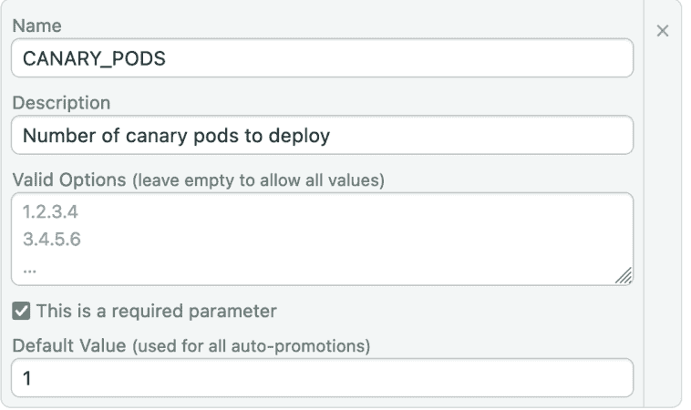

创建一个名为STABLE_PODS的第二个参数。 将默认值设置为“2”。

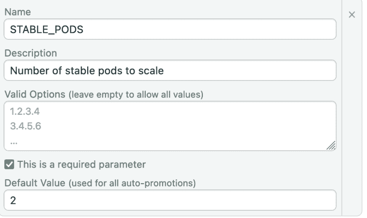

在新的流水线中，点击第一个块。 我们称之为“推送”。 推送块将之前构建的Docker镜像上传到私有容器注册表。 密钥和登录命令将根据云平台的选择而有所不同。

打开 *Secrets*部分并检查 do-key密钥。

在作业中输入以下命令：

```
docker login
  -u $SEMAPHORE_REGISTRY_USERNAME
  -p $SEMAPHORE_REGISTRY_PASSWORD
  $SEMAPHORE_REGISTRY_URL

docker pull
  $SEMAPHORE_REGISTRY_URL/demo:$SEMAPHORE_WORKFLOW_ID

docker tag
  $SEMAPHORE_REGISTRY_URL/demo:$SEMAPHORE_WORKFLOW_ID \
  registry.digitalocean.com/$REGISTRY_NAME/demo:$SEMAPHORE_WORKFLOW_ID

doctl auth init -t $DO_ACCESS_TOKEN
doctl registry login

docker push
  registry.digitalocean.com/$REGISTRY_NAME/demo:$SEMAPHORE_WORKFLOW_ID
```

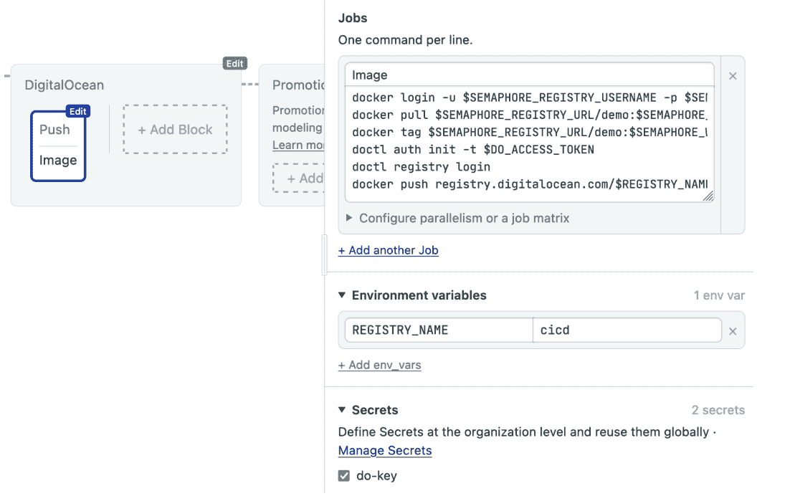

创建一个名为“部署”的新块并启用密钥：
- 使用云数据库的db-params；
- do-key是云特定的访问令牌.

打开环境变量部分:
- 创建一个名为CLUSTER_NAME的变量，其值为DigitalOcean集群的名称（semaphore-demo-cicd-kubernetes）
- 创建一个名为REGISTRY_NAME的变量，其值为DigitalOcean容器注册表的名称.

要连接到DigitalOcean集群，我们可以使用预安装的官方doctl工具。

将以下命令添加到作业中:

```bash
doctl auth init --access-token $DO_ACCESS_TOKEN
doctl kubernetes cluster kubeconfig save "${CLUSTER_NAME}"
doctl registry kubernetes-manifest | kubectl apply -f -
checkout
kubectl apply -f manifests/service.yml

./apply.sh
manifests/deployment.yml addressbook-canary $CANARY_PODS
registry.digitalocean.com/$REGISTRY_NAME/demo:$SEMAPHORE_WORKFLOW_ID

if kubectl get deployment addressbook-stable ; then
  kubectl scale --replicas=$STABLE_PODS deployment/addressbook-stable ; \
fi
```

这是金丝雀作业序列:
- 初始化集群配置。
- 生成容器服务凭证并导入到集群中。
- 使用 checkout 克隆GitHub存储库。
- 使用kubectl apply创建负载均衡器服务。
- 执行 apply.sh，创建金丝雀部署。部署中的Pod数量保持为$CANARY_PODS。
- 使用kubectl scale减小稳定部署的大小至$STABLE_PODS。


创建一个名为“功能测试”的第三个块，并启用 do-key密钥。重复环境变量。 这是管道中的最后一个块，它对金丝雀进行一些自动化测试。 通过结合kubectl get pod和kubectl exec，我们可以在Pod内部运行命令。

在作业中输入以下命令：

```bash
doctl auth init --access-token $DO_ACCESS_TOKEN
doctl kubernetes cluster kubeconfig save "${CLUSTER_NAME}"
doctl registry kubernetes-manifest | kubectl apply -f -
checkout
POD=$(kubectl get pod -l deployment=addressbook-canary -o name | head -n 1)
kubectl exec -it "$POD" -- npm run ping
kubectl exec -it "$POD" -- npm run migrate
```

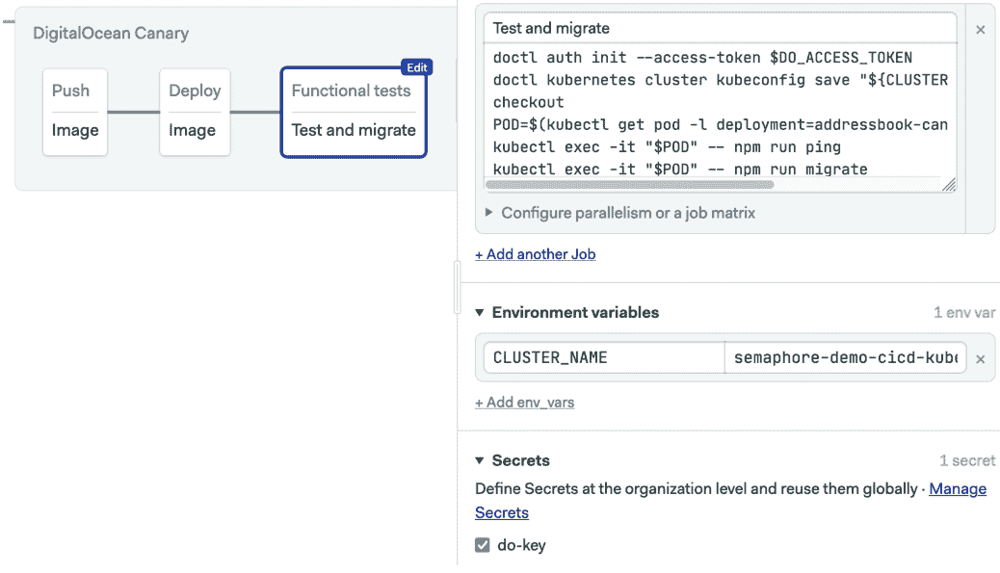

## 4.8 你的第一个发布

到目前为止，一切都很好。让我们看看我们现在的进展：我们构建了Docker镜像，并在测试后设置了一个单Pod的金丝雀部署流水线。在本节中，我们将扩展工作流程，添加一个稳定的部署流水线。

### 4.8.1 稳定部署流水线

稳定的流水线完成了部署周期。这个流水线没有引入任何新的东西；我们再次使用apply.sh脚本启动滚动更新，并使用kubectl delete清理金丝雀部署。

创建一个新的流水线（使用“添加推广”按钮），从金丝雀分支出来，并将其命名为“部署稳定版 (DigitalOcean)”。

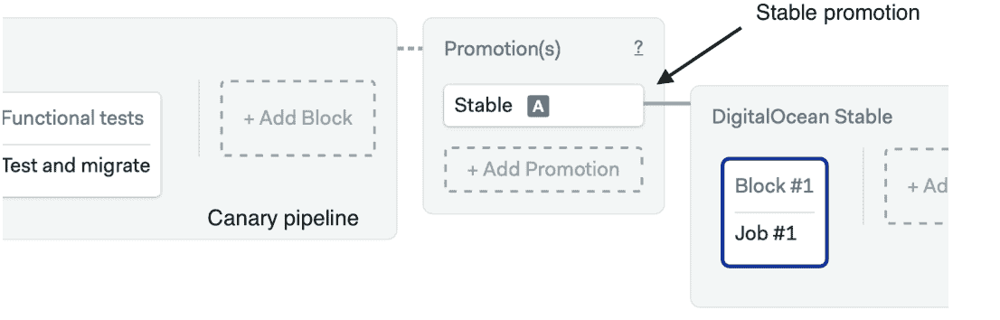

添加一个名为$STABLE_PODS的参数，默认值为“3”。

#### Parameters

Pass parameters to the promoted pipeline.

#### Environment Variables

| Field | Value |
|-------|-------|
| Name | STABLE_PODS |
| Description | Number of stable pods to run |
| Valid Options | 1.2.3.4<br>3.4.5.6<br>... |
| This is a required parameter | ✓ |
| Default Value | 3 |

创建“部署到Kubernetes”块，并使用do-key和db-params密钥。 同时，创建CLUSTER_NAME和REGISTRY_NAME变量，就像我们在上一步中所做的那样。

在作业命令框中，输入以下行以进行滚动部署并删除金丝雀Pod：

```
doctl auth init --access-token $DO_ACCESS_TOKEN
doctl kubernetes cluster kubeconfig save "${CLUSTER_NAME}"
doctl registry kubernetes-manifest | kubectl apply -f -
checkout
kubectl apply -f manifests/service.yml

./apply.sh
manifests/deployment.yml \
addressbook-stable $STABLE_PODS
registry.digitalocean.com/$REGISTRY_NAME/demo:$SEMAPHORE_WORKFLOW_ID

if kubectl get deployment addressbook-canary; then \
    kubectl delete deployment/addressbook-canary ; \
fi
```

```
Image
doctl auth init --access-token $DO_ACCESS_TOKEN
doctl kubernetes cluster kubeconfig save "${CLUSTER}"
doctl registry kubernetes-manifest | kubectl apply
checkout
kubectl apply -f manifests/service.yml
./apply.sh manifests/deployment.yml addressbook
if kubectl get deployment addressbook-canary; then

```

Configure parallelism or a job matrix

+ Add another Job

Environment variables

| Key | Value |
|-----|-------|
| CLUSTER_NAME | semaphore-demo-cicd-kube |
| REGISTRY_NAME | cicd |

+ Add env_vars

Secrets

Define Secrets at the organization level and reuse them globally · Manage Secrets

- db-params
- do-key

很好！我们已经完成了发布流程。

### 4.8.2 发布金丝雀

这是关键时刻。金丝雀是否能正常工作？ 点击运行工作流然后开始。

等待CI流程完成后，点击推广以启动金丝雀流程。 如下屏幕截图所示，手动启动推广可以自定义参数。

> 你可能想知道为什么金丝雀流程没有自动推广。 原因是我们将其设置为仅在主分支触发，并且默认情况下，工作流构建器将所有更改保存在名为setup-semaphore的单独分支上。

#### Promote to Canary?

| 字段 | 说明 | 值 |
| :--- | :--- | :--- |
| CANARY_PODS | Number of canary pods to deploy | 1 (required) |
| STABLE_PODS | Number of stable pods to scale | 2 (required) |

[按钮： Start promotion] [按钮： Nevermind]

按下 开始推广 以运行金丝雀流程。

#### DigitalOcean Canary

| 步骤 | 任务 | 耗时 | 状态 |
| :--- | :--- | :--- | :--- |
| Push | Image | 00:08 | ✓ 完成 |
| Deploy | Image | 00:13 | ✓ 完成 |
| Functional tests | Test and migrate | 00:44 | ✓ 完成 |

*总计耗时： 01:18*

完成后，我们可以检查金丝雀的运行情况。

```bash
$ kubectl get deployment
```

| 名称 | 准备就绪 | 可用 | 年龄 |
| :--- | :---: | :---: | :--- |
| addressbook-canary | 1/1 | 1 | 8分钟40秒 |

### 4.8.3 发布稳定版

与金丝雀部署一起，我们应该有一个仪表盘来监控错误、用户报告和性能指标，以与基线进行比较。 经过一定的时间，我们会做出一个继续或停止的决定。 金丝雀版本是否足够好以升级为稳定版本？ 如果是的话，部署将继续进行。 如果不是的话，在收集必要的错误报告和堆栈跟踪后，我们将回滚并重新组织。

假设我们决定继续。 那么继续点击推广按钮。 您可以调整要部署的最终Pod数量。 稳定的流水线应该在几秒钟内完成。

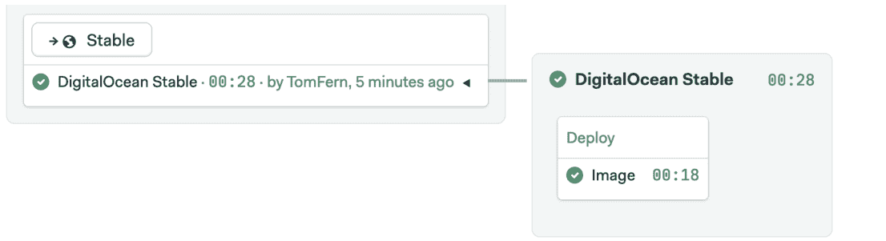

如果你足够快，你可以在块运行时同时看到现有的金丝雀和一个新的“地址簿稳定”部署。

```bash
$ kubectl get deployment
```

| 名称 | 准备就绪 | 可用 | 年龄 |
| :--- | :--- | :--- | :--- |
| addressbook-canary | 1/1 | 1 | 110秒 |
| addressbook-stable | 0/3 | 3 | 0 | 1秒 |

一个接一个，副本数量应该逐渐增加，直到达到目标值三个：

```bash
$ kubectl get deployment
```

| 名称 | 准备就绪 | 可用 | 年龄 |
| :--- | :--- | :--- | :--- |
| addressbook-canary | 1/1 | 1 | 114秒 |
| addressbook-stable | 2/3 | 3 | 2 | 5秒 |

完成后，金丝雀不再需要，所以它消失了：

```bash
$ kubectl get deployment
```

| 名称 | 准备就绪 | 可更新 | 可用 | 年龄 |
| :--- | :--- | :--- | :--- | :--- |
| addressbook-stable | 3/3 | 3 | 3 | 12秒 |

检查服务状态以查看外部IP：

```bash
$ kubectl get service
```

| 名称 | 类型 | 外部IP | 端口 |
| :--- | :--- | :--- | :--- |
| addressbook-lb | LoadBalancer | 35.225.210.248 | 80:30479/TCP |
| kubernetes | ClusterIP | <无> | 443/TCP |

我们可以使用`curl`直接测试API端点。例如，在通讯录中创建一个人：

```
$ curl -w "" -X PUT
  -d "firstName=Sammy&lastName=David Jr" \
  34.68.150.168/person

{
    "id": 1,
    "firstName": "Sammy",
    "lastName": "David Jr",
    "updatedAt": "2019-11-10T16:48:15.900Z",
    "createdAt": "2019-11-10T16:48:15.900Z"
}
```

要检索所有人，请尝试：

```
$ curl -w "" 34.68.150.168/all

[
    {
        "id": 1,
        "firstName": "Sammy",
        "lastName": "David Jr",
        "updatedAt": "2019-11-10T16:48:15.900Z",
        "createdAt": "2019-11-10T16:48:15.900Z"
    }
]
```

部署成功了；这可不是小事。恭喜！

### 4.8.4 回滚流水线

幸运的是，当涉及从错误中恢复时，Kubernetes和CI/CD是一个非常出色的团队。假设我们不喜欢金丝雀的表现，甚至更糟糕的是，在金丝雀部署流水线的末尾，功能测试失败了。在这种情况下，让系统自动返回到以前的状态会很棒，不是吗？点击一个按钮就能撤销更改，这会很方便，不是吗？这正是我们将在这一点上配置的，一个回滚流水线。

> 对于使用数据库的应用程序来说，这并不完全正确。对数据库的更改不会自动回滚。我们应该使用数据库备份和迁移脚本来管理升级。

再次打开工作流构建器并转到金丝雀流水线的末尾。创建一个新的推广分支，勾选启用自动推广框，并设置以下条件：

```
result = '失败'
```

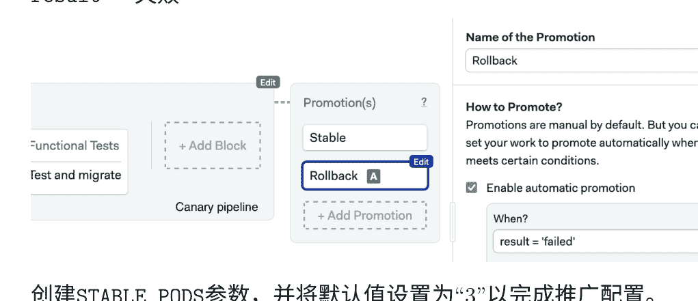

创建STABLE_PODS参数，并将默认值设置为“3”以完成推广配置。

回滚作业收集信息以帮助诊断问题。 创建一个名为“回滚金丝雀”的新块，导入 do-ctl密钥，并创建CLUSTER_NAME和REGISTRY_NAME。 在作业中输入以下行：

```
doctl auth init --access-token $DO_ACCESS_TOKEN
doctl kubernetes cluster kubeconfig save "${CLUSTER_NAME}"
doctl registry kubernetes-manifest | kubectl apply -f -
kubectl get all -o wide
kubectl get events
kubectl describe deployment addressbook-canary || true
POD=$(kubectl get pod -l deployment=addressbook-canary -o name | head -n 1)
kubectl logs "$POD" || true
```

```
if kubectl get deployment addressbook-stable ; then \
  kubectl scale --replicas=$STABLE_PODS \
  deployment/addressbook-stable; \
fi
```

```
if kubectl get deployment addressbook-canary; then \
  kubectl delete deployment/addressbook-canary ; \
fi
```

前四行打印出有关集群的信息。 最后两行，通过扩展稳定的部署并删除金丝雀来撤消更改。

```
doctl auth init --access-token $DO_ACCESS_TOKEN
doctl kubernetes cluster kubeconfig save "${CLUSTER}"
doctl registry kubernetes-manifest | kubectl apply
kubectl get all -o wide
kubectl get events
kubectl describe deployment addressbook-canary
POD=$(kubectl get pod -l deployment=addressbook-canary)
kubectl logs "$POD" || true
if kubectl get deployment addressbook-stable; then
if kubectl get deployment addressbook-canary; then
```

再次运行工作流程并进行金丝雀发布，但这次尝试通过点击其推广按钮进行回滚：

我们又回到了正常状态，呼！现在是时候检查作业日志，看看出了什么问题，并在再次合并到主分支之前修复它。

**但是，如果我们在部署稳定版本之后发现问题怎么办？**

让我们想象一下，一个缺陷悄悄地进入了生产环境。这种情况可能发生，也许有一些微妙的错误在几个小时或几天内没有被发现。或者也许一些错误没有被功能测试发现。现在为时已晚吗？我们可以回到之前的版本吗？

答案是肯定的，我们可以回到之前的版本，但需要手动干预。请记住，我们为每个Docker镜像打上了唯一的ID（SEMAPHORE_WORKFLOW_ID）。我们可以从Semaphore中重新推送最后一个良好版本的稳定部署流水线。如果Docker镜像不再存在于注册表中，我们可以使用右上角的 Rerun按钮重新生成它。

### 4.8.5 故障排除和技巧

即使是最好的计划也可能失败；在软件开发中，失败肯定是一个选择。也许金丝雀遇到了一些意外的错误，也许它有性能问题，或者我们将错误的分支合并到了主分支。重要的是（1）从中学到一些东西，（2）知道如何回到稳定的状态。

Kubectl可以为我们提供很多关于发生情况的见解。首先，了解集群上的资源的整体情况。

```
$ kubectl get all -o wide
```

使用describe命令可以显示任何或所有pod的详细信息：

```
$ kubectl describe <pod名称>
```

它也适用于部署：

```
$ kubectl describe deployment addressbook-stable
```

```
$ kubectl describe deployment addressbook-canary
```

还有服务：

```
$ kubectl describe service addressbook-lb
```

我们还可以使用以下命令查看集群上的事件日志：

```
$ kubectl get events
```

使用以下命令查看pod的日志输出：

```
$ kubectl logs <pod名称>
```

```
$ kubectl logs --previous <pod名称>
```

如果需要进入其中一个容器，只要pod正在运行，就可以启动一个shell：

```
$ kubectl exec -it <pod名称> -- sh
```

要从您的计算机访问pod网络，请使用port-forward命令将端口转发到本地，例如：

```
$ kubectl port-forward <pod名称> 8080:80
```

以下是一些常见的错误消息，你可能会遇到：

- 清单无效：通常意味着清单的YAML语法不正确。使用kubectl --dry-run或 --validate选项来验证清单。
- ImagePullBackOff或ErrImagePull：请求的镜像无效或未找到。检查镜像是否在注册表中，并且清单中的引用是否正确。
- CrashLoopBackOff：应用程序崩溃，Pod正在关闭。检查应用程序错误的日志。
- Pod永远不会离开 Pending状态：这可能意味着其中一个Kubernetes secrets丢失。
- 日志消息显示“容器不健康”：这可能表明Pod未通过探测。检查探测定义是否正确。
- 日志消息显示“资源不足”：这可能发生在集群的内存或CPU不足时。

## 4.9 总结

你已经学会了如何将CI/CD、Docker和Kubernetes组合成一个实际应用的拼图。在本章中，你已经将本书中学到的一切付诸实践：

- 如何在Semaphore CI/CD中设置流水线，并使用它们部署到云端。
- 如何构建Docker镜像，并借助Docker Compose启动开发环境。
- 如何在Kubernetes中进行金丝雀部署和滚动更新。
- 如何扩展部署，并在计划外出现问题时进行恢复。

每个部分都有其作用：Docker提供可移植性，Kubernetes提供编排功能，Semaphore CI/CD驱动测试和部署过程。

# 5 结束语

恭喜你，你已经完成了整本书的阅读。我们编写这本书的目标是帮助你交付出优秀的云原生应用。现在轮到你了-去创造一些了不起的东西吧!

## 5.1 与世界分享本书

请与你的同事、朋友和任何你认为可能从中受益的人分享这本书。

在Twitter上分享这本书：

> 通过@semaphoreci免费电子书学习使用Docker和Kubernetes进行CI/CD：https://bit.ly/3bJELLQ（点击推特！）

你还可以在Facebook上分享它，在LinkedIn上分享它，并给GitHub上的存储库点赞。

## 5.2 告诉我们您的想法

我们非常乐意听到您的反馈意见。阅读这本书，你学到了什么？跟随起来容易/难吗？在新版本中，您希望看到什么？

这本书是开源的，可以在https://github.com/semaphoreci/book-cicd-docker-kubernetes找到。

- 通过打开新问题来发送评论和反馈意见，提问和报告问题。
- 通过提交拉取请求来改进解释、代码片段等，为本书质量做出贡献。
- 私下向我们发送电子邮件至learn@semaphoreci.com。

## 5.3 关于信号量

Semaphore https://semaphoreci.com 可以帮助开发人员一键式持续构建、测试和部署代码。作为无服务器服务，它提供了最快速、企业级的CI/CD流水线。Semaphore已被全球数千家组织信任，也可以帮助您的团队更快地前进。
```